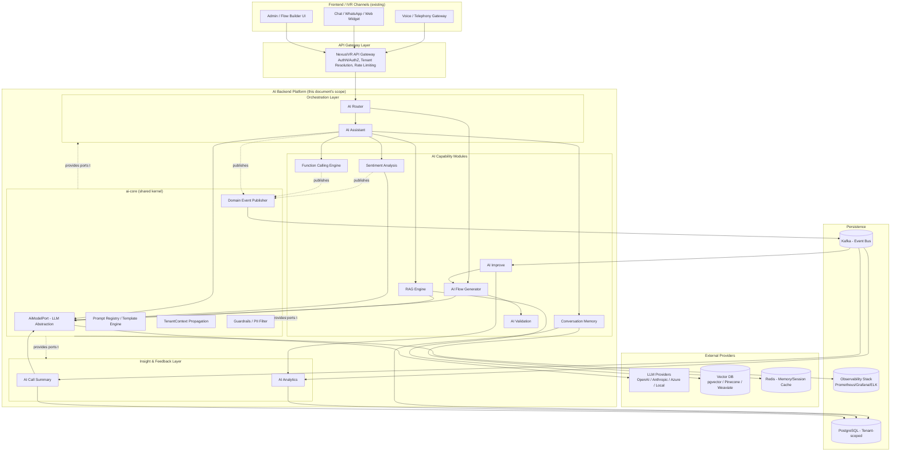
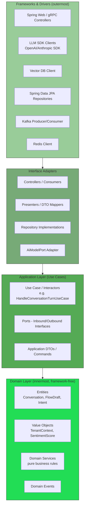
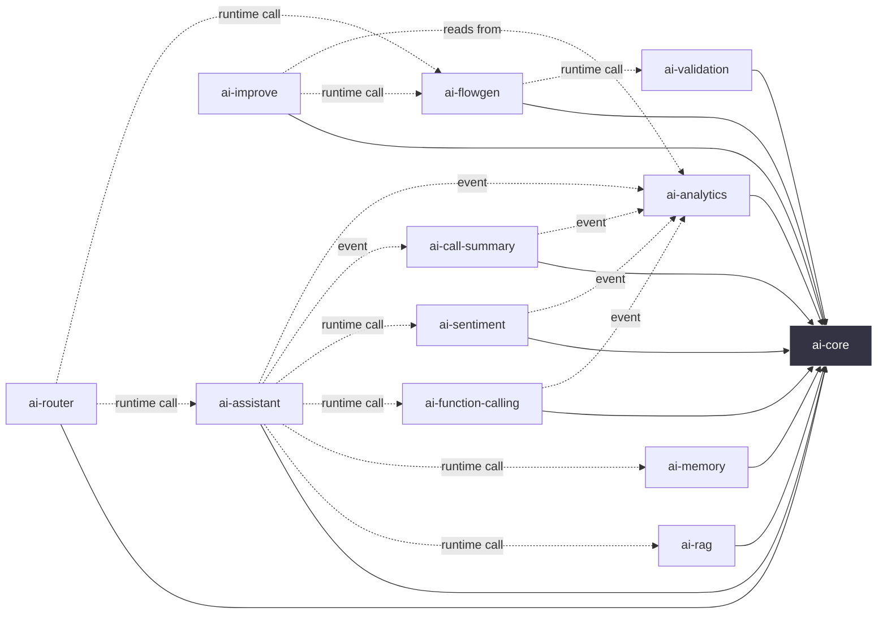
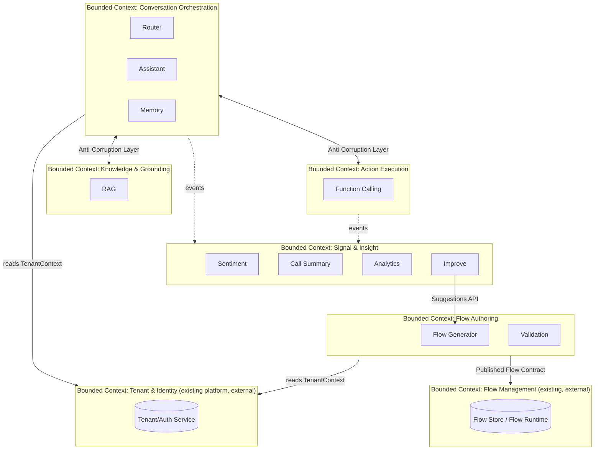
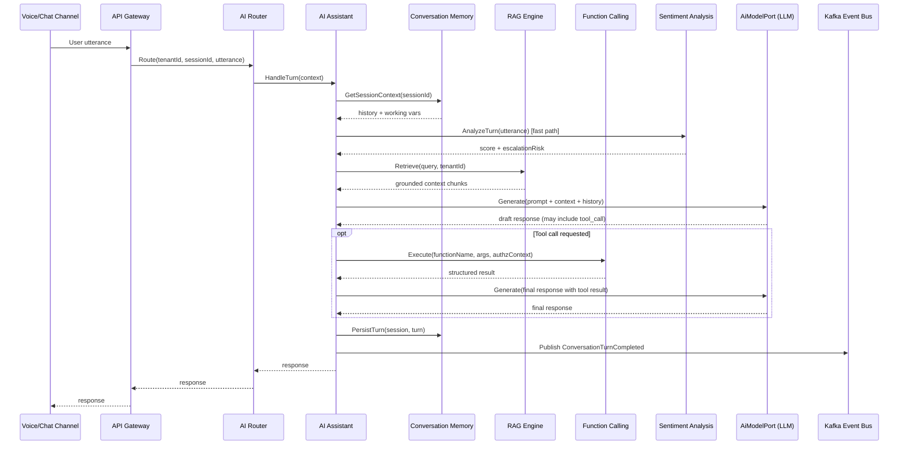
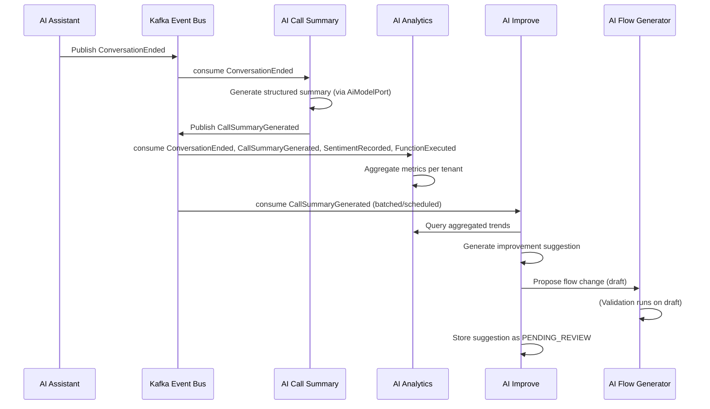
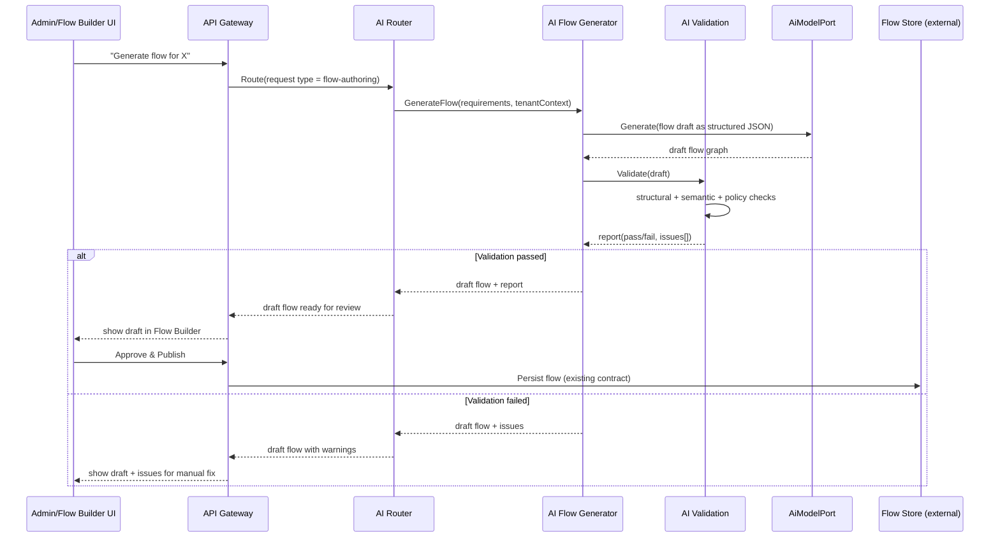

# NexusIVR — AI Backend Architecture

**Scope:** AI module only (backend). Frontend is out of scope and assumed complete.
**Status:** Architecture design — no implementation.
**Style:** Clean Architecture, modular monolith-first with clear seams for future service extraction, multi-tenant by design.

---

## 1. Design Principles

Before the diagrams, the decisions that shape everything below:

1. **Multi-tenancy is a cross-cutting concern, not a module.** Every module receives a `TenantContext` (tenant ID, plan tier, region, data-residency rules) and every persistence/query operation is tenant-scoped at the repository level, never left to callers to remember.
2. **Clean Architecture / Hexagonal boundaries.** Domain logic never depends on frameworks, LLM SDKs, or transport. Ports (interfaces) are owned by the domain/application layers; adapters (Spring, LLM clients, vector DBs, Kafka) implement them.
3. **LLM-provider agnosticism.** OpenAI, Anthropic, Azure OpenAI, local models — all sit behind a single `AiModelPort`. Swapping or A/B testing providers must never touch domain code.
4. **Modular monolith first, service-ready seams second.** Each AI capability (Router, RAG, Flow Generator, etc.) is built as an independently deployable Spring Boot module sharing a common `ai-core` kernel, so it can be split into a microservice later without a rewrite — only a deployment change.
5. **Event-driven where modules need to react, request/response where they need an answer.** Synchronous calls for "give me an answer now" (Assistant, Router, Function Calling). Asynchronous events for "something happened" (Analytics, Sentiment, Call Summary, model-improvement feedback loops).
6. **Everything observable and governed.** Every AI call is logged with prompt/response metadata (not necessarily raw PII), token cost, latency, tenant, and model version — because this is an enterprise platform and someone will eventually ask "why did the bot say that" in an audit.

---

## 2. High-Level Architecture



**Reading the diagram:** the **Orchestration Layer** (Router + Assistant) is the single entry point external channels talk to. It fans out to **Capability Modules**, which are stateless-ish workers that each do one job well. The **Insight & Feedback Layer** never sits in the hot path of a live conversation — it consumes events asynchronously off Kafka, so a slow analytics job can never add latency to a live call. Everything shares `ai-core`, which is where tenant context, LLM abstraction, and guardrails live exactly once.

---

## 3. Module Responsibilities

### 3.1 AI Router
**Purpose:** The traffic cop. Given an inbound event (utterance, DTMF, flow-builder request, admin action), decides *which* capability module(s) should handle it and in what order.
- Classifies intent at a coarse level: "this is a live conversation turn" vs. "this is a flow-authoring request" vs. "this is an analytics query."
- Applies tenant-level routing rules (e.g., Tenant A always routes financial intents to a human-fallback rule before the Assistant).
- Handles model/provider routing (cost-tier routing: cheap model for FAQ-like turns, premium model for complex reasoning) — a form of load/cost balancing, not just intent routing.
- Owns circuit-breaking and fallback chains (LLM provider down → fallback provider → static response).
- Does **not** hold conversation state and does **not** generate answers itself — it delegates.

### 3.2 AI Assistant
**Purpose:** The core conversational brain for a live IVR/chat turn.
- Orchestrates a single conversational turn end-to-end: pulls Conversation Memory, optionally queries RAG for grounding, optionally invokes Function Calling, applies Sentiment Analysis to adjust tone, and produces the final response via `AiModelPort`.
- Enforces guardrails (no hallucinated policy claims, tenant-specific tone/brand voice, escalation-to-human triggers).
- Emits a `ConversationTurnCompleted` domain event for downstream consumers (Summary, Analytics).

### 3.3 AI Flow Generator
**Purpose:** Turns natural-language or structured intent ("build me a flow for appointment rescheduling with SMS confirmation") into an executable IVR flow definition (the same flow schema the frontend Flow Builder edits).
- Consumes business requirements (text, existing flow as context, tenant's product catalog/FAQ).
- Produces a draft flow graph (nodes: prompt, decision, function-call, transfer, hangup).
- Hands the draft to **AI Validation** before it's ever persisted or shown to a human editor.
- Never writes directly to the flow store — always goes through the existing Flow domain's persistence boundary (owned by frontend/flow-management backend, not this module) via a published port/contract.

### 3.4 AI Improve
**Purpose:** Continuous-improvement loop. Looks at what already happened (via Analytics + Call Summary + flagged low-CSAT conversations) and proposes concrete changes.
- Suggests prompt-template tweaks, new FAQ/RAG documents to ingest, or flow edits ("40% of callers drop off at node X — consider adding a clarifying question").
- Operates asynchronously, off the Kafka event stream — never in the live-call path.
- Produces *suggestions*, not autonomous changes. Human-in-the-loop approval is a first-class concept (suggestions are stored with a `PENDING_REVIEW` state).

### 3.5 AI Validation
**Purpose:** Quality gate for anything AI-generated before it becomes live (flows, prompt templates, RAG documents, Improve suggestions).
- Structural validation (is the flow graph well-formed — no orphan nodes, no infinite loops).
- Semantic validation via LLM-as-judge (does this flow actually satisfy the stated business goal).
- Policy/compliance validation (no PII collection without consent node, required disclosures present for regulated tenants).
- Returns a validation report with pass/fail + reasons, never silently mutates content.

### 3.6 RAG (Retrieval-Augmented Generation)
**Purpose:** Grounds AI responses in tenant-specific knowledge (FAQs, product docs, policy documents, call transcripts).
- Ingestion pipeline: document → chunk → embed → store in tenant-partitioned vector index.
- Retrieval pipeline: query → embed → similarity search (tenant-scoped, always) → re-rank → return context.
- Supports hybrid search (keyword + vector) for enterprise accuracy requirements.
- Exposes both a synchronous "retrieve context for this query" API (used by Assistant) and an async ingestion API (used by document upload / Improve suggestions).

### 3.7 Conversation Memory
**Purpose:** Short-term (session) and long-term (customer history) memory for conversations.
- Short-term: current session's turn history, working variables, current flow-node state — backed by Redis for low latency, TTL'd.
- Long-term: summarized customer interaction history across sessions — backed by PostgreSQL, used to personalize future conversations ("last time you called about X...").
- Owns memory-window management (token budget trimming, summarization-on-overflow) so the Assistant never has to think about context-window math.

### 3.8 Function Calling
**Purpose:** Safe bridge between LLM tool-use requests and real business systems (CRM lookups, order status, payment initiation, appointment booking).
- Maintains a tenant-scoped **function registry**: which functions exist, their JSON schemas, and which backend/API each maps to.
- Executes the function call *outside* the LLM's trust boundary — validates arguments, applies authorization checks, executes against the real system, and returns a structured result back to the Assistant.
- Every execution is logged as an auditable event (who/what/when/tenant) — this is the module most likely to touch money or PII, so it gets the strictest guardrails.

### 3.9 Sentiment Analysis
**Purpose:** Real-time and post-call emotional/intent signal extraction.
- Real-time: per-turn sentiment score + escalation risk flag, consumed by the Assistant to adjust tone or trigger human handoff, and by the Router for priority queuing.
- Post-call: full-conversation sentiment trend, feeding Call Summary and Analytics.
- Model-agnostic: can run on a lightweight classifier for real-time (low latency) and a full LLM pass for post-call depth.

### 3.10 AI Call Summary
**Purpose:** Produces structured, human-readable summaries of completed conversations.
- Triggered asynchronously on `ConversationEnded` event.
- Output includes: summary text, resolution status, key entities discussed, action items, sentiment trend, and links back to any Function Calling actions taken.
- Persisted and made available to CRM/agent-desktop integrations and to Analytics.

### 3.11 AI Analytics
**Purpose:** Aggregate, tenant-level insight layer. Not a single conversation's view — the fleet view.
- Consumes events continuously (turns completed, summaries generated, sentiment scores, function-call outcomes, flow-generation/validation results).
- Produces metrics: containment rate, average handling time, sentiment trends, cost-per-conversation (token spend), model performance/drift, flow drop-off points.
- Exposes a read API for dashboards (existing frontend consumes this) and feeds **AI Improve** with the data it needs to make suggestions.

---

## 4. Clean Architecture Layers

Each AI capability module (Router, Assistant, RAG, etc.) follows the **same internal layering**, so any engineer who understands one module understands all of them.



**Dependency Rule:** arrows point inward only. L1 (Domain) has zero knowledge of Spring, Kafka, or any LLM SDK. L2 (Application/Use Cases) depends only on L1 and defines **ports** — interfaces like `AiModelPort`, `ConversationRepositoryPort`, `EventPublisherPort` — that L3 implements. This is what makes swapping OpenAI for Anthropic, or Kafka for another broker, a one-adapter change.

---

## 5. Package Structure

Java package layout for a single capability module (example: `ai-assistant`). All other capability modules (`ai-router`, `ai-rag`, `ai-flowgen`, etc.) mirror this exact structure for consistency.

```
com.nexusivr.ai.assistant
│
├── domain
│   ├── model                     // Entities & Value Objects: Conversation, Turn, TenantContext
│   ├── event                     // ConversationTurnCompleted, EscalationTriggered
│   ├── service                   // Pure domain logic, no framework deps
│   └── exception                 // Domain-specific exceptions
│
├── application
│   ├── usecase                   // HandleConversationTurnUseCase, EndConversationUseCase
│   ├── port
│   │   ├── in                    // Inbound ports (what use cases expose)
│   │   └── out                   // Outbound ports: AiModelPort, MemoryPort, RagPort, FunctionCallPort
│   ├── dto                       // Command/Query objects crossing the use-case boundary
│   └── mapper                    // Domain <-> DTO mapping
│
├── adapter
│   ├── in
│   │   ├── web                   // REST controllers (internal, gateway-facing)
│   │   └── messaging              // Kafka consumers triggering use cases
│   └── out
│       ├── ai                    // OpenAiModelAdapter, AnthropicModelAdapter (implements AiModelPort)
│       ├── persistence            // JPA repository adapters (implements out ports)
│       ├── memory                 // Redis/Postgres adapters for Conversation Memory port
│       ├── rag                    // Client adapter calling ai-rag module
│       └── messaging              // Kafka producers (implements EventPublisherPort)
│
├── config
│   ├── BeanConfig.java
│   ├── TenantContextConfig.java
│   └── ResilienceConfig.java      // Circuit breakers, retries, timeouts
│
└── AiAssistantApplication.java    // Spring Boot entry point (module can run standalone or embedded)
```

**Shared kernel** (referenced by every module as a dependency, never the other way around):

```
com.nexusivr.ai.core
│
├── tenant           // TenantContext, TenantContextHolder, TenantAwareRepository base
├── model             // AiModelPort, PromptTemplate, ModelInvocationResult
├── prompt            // PromptRegistry, PromptTemplateEngine (versioned templates per tenant)
├── guardrails        // PiiFilter, ContentPolicyEnforcer, OutputSanitizer
├── event             // DomainEvent base classes, EventPublisherPort
├── observability      // AiCallMetrics, TracingContext, CostTracker
└── security           // AuthzContext, FunctionExecutionPolicy
```

---

## 6. Folder Structure (Repository / Physical Layout)

Reflecting a multi-module Maven/Gradle monorepo — one deployable artifact per module, one shared kernel, independently versionable.

```
nexusivr-ai-backend/
│
├── ai-core/                        # Shared kernel — no other module's business logic lives here
│   ├── src/main/java/com/nexusivr/ai/core/...
│   └── build.gradle
│
├── ai-router/
│   ├── src/main/java/com/nexusivr/ai/router/...
│   ├── src/test/java/...
│   └── build.gradle
│
├── ai-assistant/
│   ├── src/main/java/com/nexusivr/ai/assistant/...
│   ├── src/test/java/...
│   └── build.gradle
│
├── ai-flowgen/
│   └── ... (same structure)
│
├── ai-validation/
│   └── ...
│
├── ai-rag/
│   ├── src/main/java/com/nexusivr/ai/rag/...
│   │   ├── domain/
│   │   ├── application/
│   │   ├── adapter/
│   │   │   ├── out/embedding/       // Embedding model adapter
│   │   │   ├── out/vectorstore/     // pgvector / Pinecone / Weaviate adapters
│   │   │   └── in/ingestion/        // Document ingestion consumers
│   │   └── config/
│   └── build.gradle
│
├── ai-memory/
│   └── ...
│
├── ai-function-calling/
│   ├── src/main/java/com/nexusivr/ai/functioncalling/...
│   │   └── adapter/out/registry/    // Per-tenant function schema registry
│   └── build.gradle
│
├── ai-sentiment/
│   └── ...
│
├── ai-call-summary/
│   └── ...
│
├── ai-analytics/
│   └── ...
│
├── ai-improve/
│   └── ...
│
├── ai-gateway/                     # Thin API gateway module for external channel entry (optional; may be existing infra)
│   └── ...
│
├── build.gradle                    # Root multi-module build
├── settings.gradle                 # Module registration
├── docker-compose.yml              # Local dev: Postgres, Redis, Kafka, vector DB
└── docs/
    ├── architecture/                # This document + ADRs
    └── contracts/                   # Shared event schemas (Avro/JSON Schema), OpenAPI specs
```

**Why this shape:** every module is buildable and testable in isolation, `ai-core` is the only shared compile-time dependency, and inter-module runtime communication happens over well-defined contracts (`docs/contracts`), not shared database tables or shared mutable state.

---

## 7. Dependency Flow



**Rules encoded in this diagram:**
- **Compile-time dependency** (solid arrows): every module depends on `ai-core`. No capability module ever depends on another capability module at compile time.
- **Runtime dependency** (dotted "runtime call"): cross-module calls happen through published REST/gRPC contracts or an internal client SDK generated from those contracts — never by importing another module's internal classes.
- **Event dependency** (dotted "event"): the Insight layer (Summary, Analytics) and the Improve loop depend on modules *only* through Kafka topics/schemas, never direct calls. This is what keeps analytics from ever becoming a bottleneck for live conversations.
- No cycles anywhere. `ai-analytics` and `ai-improve` are always downstream, never upstream, of a live conversation.

---

## 8. Domain Boundaries (Bounded Contexts)



**Key boundary decisions:**
- **Conversation Orchestration** is the core domain — it owns the concept of a live "Conversation" and "Turn." No other context is allowed to define its own version of these concepts; they consume Orchestration's published events/DTOs instead.
- **Flow Authoring** (Flow Generator + Validation) is a *supporting* domain that produces artifacts consumed by the existing **Flow Management** system, which is explicitly out of this module's ownership — integration happens through a published contract, treated as an Anti-Corruption Layer boundary so a change in the Flow Store's schema doesn't ripple into AI code.
- **Signal & Insight** is a generic/reporting domain — it's allowed to read from everyone (via events) but nothing is allowed to depend on it for a decision inside a live conversation.
- **Tenant & Identity** is assumed to be an existing platform capability; the AI module treats it as an external context and only ever reads a resolved `TenantContext`, never manages tenants itself.

---

## 9. Communication Between Modules

Three communication styles are used, each intentionally:

| Style | Used for | Why |
|---|---|---|
| **Synchronous REST/gRPC** | Router → Assistant, Assistant → RAG/Memory/FunctionCalling/Sentiment, FlowGen → Validation | Caller needs an answer before it can proceed in the same user-facing turn. Low latency budget (typically <2–3s total for a voice turn). |
| **Asynchronous events (Kafka)** | Assistant/Sentiment/FunctionCalling → Summary/Analytics/Improve | Consumer doesn't block producer; producer doesn't care if/when it's processed; enables replay and multiple consumers per event. |
| **Internal client SDK (generated from OpenAPI/gRPC contracts)** | All sync inter-module calls | Keeps call sites type-safe without letting modules share internal domain classes. |

### 9.1 Live Conversation Turn (Synchronous Path)



### 9.2 Post-Call Insight Loop (Asynchronous Path)



### 9.3 Flow Authoring (Synchronous, Admin-triggered)



---

## 10. Multi-Tenancy Cross-Cutting Design

Since this is explicitly an **enterprise multi-tenant** platform, this deserves its own short section rather than being buried as a footnote.

- **TenantContext propagation:** resolved once at the API Gateway (from auth token/subdomain/header) and propagated through every downstream call — sync calls via a header/metadata, async events via a mandatory `tenantId` field on every event envelope.
- **Data isolation:** row-level tenant scoping in PostgreSQL (enforced by a base `TenantAwareRepository` in `ai-core`, not left to each query author), tenant-partitioned vector indexes in RAG, tenant-namespaced Redis keys in Memory.
- **Prompt/model isolation:** `PromptRegistry` in `ai-core` resolves templates per-tenant (brand voice, language, compliance disclaimers) with a global default fallback.
- **Cost & quota isolation:** `CostTracker` in `ai-core` attributes every LLM call's token spend to a tenant, feeding both Analytics dashboards and hard per-tenant rate/budget limits enforced at the Router.
- **Configuration isolation:** which LLM provider/model, which guardrail policies, which function-calling permissions — all tenant-configurable, resolved through a tenant-config service (existing platform capability, consumed as a port).

---

## 11. Future Extensibility

The seams deliberately left open:

1. **Service extraction.** Because each module is already a self-contained Spring Boot app with its own package, its own `build.gradle`, and only talks to others through REST/gRPC contracts or Kafka, any module can be pulled out of the monorepo into its own deployment/repo/team without touching a single other module's code — only the deployment topology changes.
2. **New LLM providers.** New adapter implementing `AiModelPort` in `ai-core`'s adapter set; zero change to any use case.
3. **New capability modules.** E.g. a future **AI Voice Biometrics** or **AI Compliance Auditor** module plugs in the same way: depends on `ai-core`, exposes a contract, optionally subscribes to the Kafka event bus. No existing module needs to know it exists unless it chooses to consume its events.
4. **Multi-modal expansion.** `AiModelPort` is intentionally modeled around a generic `ModelInvocationRequest/Result` rather than "text in, text out," so voice (STT/TTS), image, or video model calls can be added as new port variants without redesigning the Assistant's orchestration logic.
5. **A/B testing & canary models.** Router's model-routing responsibility (§3.1) is the natural home for traffic-splitting experiments — route 5% of a tenant's traffic to a new model version, measure via Analytics, promote or roll back.
6. **Human-in-the-loop everywhere.** Flow Generator, Validation, and Improve all produce *drafts/suggestions*, never autonomous production changes — this pattern is reusable for any future "AI proposes, human disposes" capability.
7. **Regulatory/data-residency variants.** Because tenant config already drives model/provider selection and data storage isn't hardcoded, adding an EU-only or on-prem-LLM tenant tier is a configuration exercise, not an architecture change.

---

## 12. Summary Table

| Module | Layer | Sync/Async | Depends On (runtime) | Emits Events |
|---|---|---|---|---|
| AI Router | Orchestration | Sync | Assistant, FlowGen | — |
| AI Assistant | Orchestration | Sync | Memory, RAG, FuncCalling, Sentiment | ConversationTurnCompleted, ConversationEnded |
| AI Flow Generator | Capability | Sync | Validation | FlowDraftGenerated |
| AI Validation | Capability | Sync | — | FlowValidated |
| RAG | Capability | Sync (query) / Async (ingest) | Vector DB | DocumentIngested |
| Conversation Memory | Capability | Sync | Redis, Postgres | — |
| Function Calling | Capability | Sync | External business systems | FunctionExecuted |
| Sentiment Analysis | Capability | Sync (real-time) / Async (post-call) | — | SentimentRecorded |
| AI Call Summary | Insight | Async | — | CallSummaryGenerated |
| AI Analytics | Insight | Async | — | — |
| AI Improve | Insight | Async | Analytics, FlowGen | ImprovementSuggested |

---

This document defines architecture and contracts only. Next steps once approved: ADRs per module for LLM provider selection, event schema definitions in `docs/contracts`, and a phased implementation roadmap (Orchestration + RAG + Memory first, Insight layer second, Flow Authoring third).
