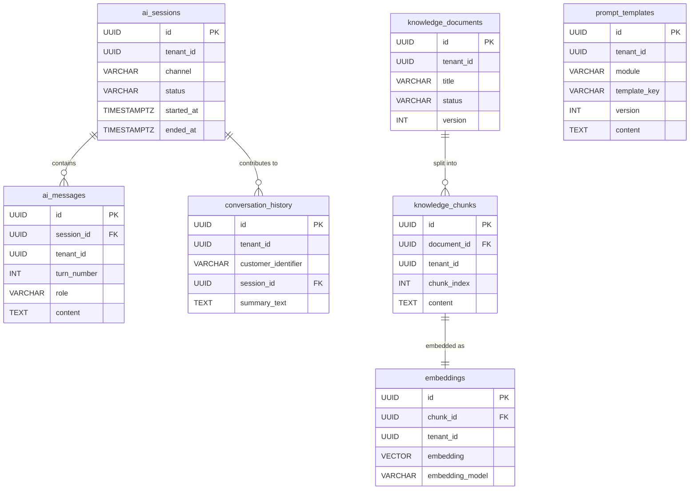

# NexusIVR AI Module — MVP Database Design (PostgreSQL)

**Scope:** 7 tables — the minimum needed to ship AI Chat + Conversation History + RAG + Prompt Templates, multi-tenant from day one. This is a deliberate subset of the full 12-table design: `intent_logs`, `function_logs`, `call_summary`, `flow_generations`, and `analytics` are cut entirely for v1, not stubbed — they can be added later as independent tables with zero changes to the tables below, since none of them were ever an FK dependency *of* this core set.

Designed for PostgreSQL 15+ with the `pgvector` extension (0.5+, for HNSW).

---

## 1. Conventions (unchanged from the full design, kept for forward-compatibility)

- **Surrogate keys:** `id UUID DEFAULT gen_random_uuid()` on every table.
- **Tenant scoping:** `tenant_id UUID NOT NULL` on every table except `prompt_templates` (nullable — `NULL` means a global default template).
- **Timestamps:** `TIMESTAMPTZ` everywhere.
- **Flexible attributes:** `JSONB`, not `JSON`.
- **Soft enums:** `VARCHAR` + `CHECK`, not native Postgres `ENUM` — cheaper to extend later.
- **`updated_at`:** one shared trigger function, reused per table.

Keeping these conventions identical to the full design means upgrading from MVP → full schema later is additive (new tables, new columns with defaults) rather than a rewrite.

---

## 2. Entity-Relationship Diagram



`prompt_templates` is intentionally drawn with no FK lines into the session graph — it's tenant-scoped but has an independent lifecycle (prompt authoring vs. conversation runtime), same reasoning as the full design.

---

## 3. Relationships Summary

| Parent | Child | Cardinality | On Delete | Why |
|---|---|---|---|---|
| `ai_sessions` | `ai_messages` | 1:N | CASCADE | A message has no meaning outside the session it belongs to. |
| `ai_sessions` | `conversation_history` | 1:N (optional) | SET NULL | Long-term memory must outlive the session that produced it. |
| `knowledge_documents` | `knowledge_chunks` | 1:N | CASCADE | Chunks have no independent lifecycle from their document. |
| `knowledge_chunks` | `embeddings` | 1:1 | CASCADE | An embedding is meaningless without the chunk it represents; enforced via `UNIQUE(chunk_id)`. |

`prompt_templates` has no foreign keys into the conversational graph, by design — it's a managed asset, not a child record of any one conversation.

---

## 4. Per-Table Design

### 4.1 `ai_sessions`
The root aggregate — one row per chat/voice/thread session.

| Column | Type | Notes |
|---|---|---|
| `id` | UUID | PK |
| `tenant_id` | UUID | NOT NULL |
| `channel` | VARCHAR(20) | CHECK: `VOICE`/`CHAT`/`WHATSAPP`/`WEB_WIDGET`/`SMS` |
| `external_reference_id` | VARCHAR(255) | Provider's own call/thread ID |
| `customer_identifier` | VARCHAR(255) | Hashed/tokenized, never raw PII |
| `status` | VARCHAR(20) | CHECK: `ACTIVE`/`ENDED`/`ABANDONED`/`ERROR` |
| `started_at` | TIMESTAMPTZ | NOT NULL, default `now()` |
| `ended_at` | TIMESTAMPTZ | Nullable; `ended_at >= started_at` enforced |
| `metadata` | JSONB | Free-form (campaign id, entry point, etc.) |
| `created_at` / `updated_at` | TIMESTAMPTZ | Standard audit columns |

### 4.2 `ai_messages`
Append-only, turn-by-turn transcript — the raw material AI Chat and Conversation History both read from.

| Column | Type | Notes |
|---|---|---|
| `id` | UUID | PK |
| `session_id` | UUID | FK → `ai_sessions.id`, CASCADE |
| `tenant_id` | UUID | NOT NULL (denormalized for query convenience) |
| `turn_number` | INT | Unique per session |
| `role` | VARCHAR(20) | CHECK: `USER`/`ASSISTANT`/`SYSTEM` |
| `content` | TEXT | NOT NULL |
| `model_used` | VARCHAR(100) | Nullable — which LLM produced this turn (assistant turns only) |
| `tokens_input` / `tokens_output` | INT | Nullable, basic cost tracking |
| `metadata` | JSONB | |
| `created_at` | TIMESTAMPTZ | |

### 4.3 `conversation_history` (optional, per spec — included)
Cross-session, distilled memory per customer, kept distinct from the raw per-session transcript in `ai_messages`.

| Column | Type | Notes |
|---|---|---|
| `id` | UUID | PK |
| `tenant_id` | UUID | NOT NULL |
| `customer_identifier` | VARCHAR(255) | NOT NULL — cross-session join key |
| `session_id` | UUID | FK → `ai_sessions.id`, SET NULL |
| `summary_text` | TEXT | NOT NULL |
| `created_at` | TIMESTAMPTZ | |

### 4.4 `knowledge_documents`
Source-of-truth registry for ingested RAG material, before chunking.

| Column | Type | Notes |
|---|---|---|
| `id` | UUID | PK |
| `tenant_id` | UUID | NOT NULL |
| `title` | VARCHAR(500) | NOT NULL |
| `source_type` | VARCHAR(20) | CHECK: `UPLOAD`/`URL`/`API`/`MANUAL` |
| `source_uri` | TEXT | |
| `status` | VARCHAR(20) | CHECK: `PENDING`/`INGESTING`/`INGESTED`/`FAILED` |
| `version` | INT | Default `1` |
| `checksum` | VARCHAR(64) | SHA-256, dedup key |
| `created_at` / `updated_at` | TIMESTAMPTZ | |

### 4.5 `knowledge_chunks`
The actual unit of retrieval — RAG always operates at chunk, never whole-document, granularity.

| Column | Type | Notes |
|---|---|---|
| `id` | UUID | PK |
| `document_id` | UUID | FK → `knowledge_documents.id`, CASCADE |
| `tenant_id` | UUID | NOT NULL (denormalized) |
| `chunk_index` | INT | Order within document |
| `content` | TEXT | NOT NULL |
| `token_count` | INT | |
| `created_at` | TIMESTAMPTZ | |

### 4.6 `embeddings` (pgvector)
Vector representation of each chunk, kept as its own table so the embedding model/dimension can evolve independently and the ANN index sits on a lean table.

| Column | Type | Notes |
|---|---|---|
| `id` | UUID | PK |
| `chunk_id` | UUID | FK → `knowledge_chunks.id`, UNIQUE, CASCADE |
| `tenant_id` | UUID | NOT NULL (denormalized — avoids a join on every ANN query) |
| `embedding_model` | VARCHAR(100) | Tracks which model produced this vector |
| `embedding` | VECTOR(1536) | Dimension pinned per deployment (adjust to your model) |
| `created_at` | TIMESTAMPTZ | |

**Best practice:** always filter by `tenant_id` in the `WHERE` clause of a similarity query *before* the ANN index runs — never retrieve top-K globally and filter afterward.

### 4.7 `prompt_templates`
Prompts as a managed, versioned, tenant-customizable asset — not a string literal in code.

| Column | Type | Notes |
|---|---|---|
| `id` | UUID | PK |
| `tenant_id` | UUID | **Nullable** — `NULL` = global default |
| `module` | VARCHAR(50) | CHECK: `ASSISTANT`/`RAG`/`SUMMARY` (extend as new modules ship) |
| `template_key` | VARCHAR(150) | NOT NULL |
| `version` | INT | Default `1` |
| `content` | TEXT | NOT NULL |
| `variables` | JSONB | Declared placeholders |
| `is_active` | BOOLEAN | Default `true` |
| `created_at` / `updated_at` | TIMESTAMPTZ | |

---

## 5. Index Strategy Summary

| Pattern | Approach |
|---|---|
| "Give me tenant X's recent/active records" | Composite B-tree leading with `tenant_id`, e.g. `(tenant_id, created_at DESC)` or `(tenant_id, status)` |
| Vector similarity search | `HNSW` index with `vector_cosine_ops` on `embeddings.embedding` |
| Ordered transcript reads | `UNIQUE(session_id, turn_number)` |
| Preventing duplicate document ingestion | Partial unique index on `(tenant_id, checksum)` |
| Enforcing uniqueness with a nullable column | Two partial unique indexes on `prompt_templates` (one `WHERE tenant_id IS NOT NULL`, one `WHERE tenant_id IS NULL`) — a plain `UNIQUE` constraint treats every `NULL` as distinct and would silently allow duplicate global templates |

---

## 6. SQL Scripts

### 6.1 Extensions & shared trigger

```sql
-- 000_extensions_and_helpers.sql
CREATE EXTENSION IF NOT EXISTS "pgcrypto";   -- gen_random_uuid()
CREATE EXTENSION IF NOT EXISTS "vector";     -- pgvector

CREATE OR REPLACE FUNCTION set_updated_at()
RETURNS TRIGGER AS $$
BEGIN
    NEW.updated_at = now();
    RETURN NEW;
END;
$$ LANGUAGE plpgsql;
```

### 6.2 `ai_sessions`

```sql
-- 001_ai_sessions.sql
CREATE TABLE ai_sessions (
    id                     UUID PRIMARY KEY DEFAULT gen_random_uuid(),
    tenant_id              UUID NOT NULL,
    channel                VARCHAR(20) NOT NULL
        CHECK (channel IN ('VOICE','CHAT','WHATSAPP','WEB_WIDGET','SMS')),
    external_reference_id  VARCHAR(255),
    customer_identifier    VARCHAR(255),
    status                 VARCHAR(20) NOT NULL DEFAULT 'ACTIVE'
        CHECK (status IN ('ACTIVE','ENDED','ABANDONED','ERROR')),
    started_at             TIMESTAMPTZ NOT NULL DEFAULT now(),
    ended_at               TIMESTAMPTZ,
    metadata               JSONB NOT NULL DEFAULT '{}'::jsonb,
    created_at             TIMESTAMPTZ NOT NULL DEFAULT now(),
    updated_at             TIMESTAMPTZ NOT NULL DEFAULT now(),
    CONSTRAINT chk_ai_sessions_ended_after_started
        CHECK (ended_at IS NULL OR ended_at >= started_at)
);

CREATE INDEX idx_ai_sessions_tenant_status
    ON ai_sessions (tenant_id, status);

CREATE INDEX idx_ai_sessions_tenant_started_at
    ON ai_sessions (tenant_id, started_at DESC);

CREATE INDEX idx_ai_sessions_tenant_customer
    ON ai_sessions (tenant_id, customer_identifier);

CREATE UNIQUE INDEX uq_ai_sessions_tenant_external_ref
    ON ai_sessions (tenant_id, external_reference_id)
    WHERE external_reference_id IS NOT NULL;

CREATE TRIGGER trg_ai_sessions_updated_at
    BEFORE UPDATE ON ai_sessions
    FOR EACH ROW EXECUTE FUNCTION set_updated_at();
```

### 6.3 `ai_messages`

```sql
-- 002_ai_messages.sql
CREATE TABLE ai_messages (
    id             UUID PRIMARY KEY DEFAULT gen_random_uuid(),
    session_id     UUID NOT NULL REFERENCES ai_sessions(id) ON DELETE CASCADE,
    tenant_id      UUID NOT NULL,
    turn_number    INT NOT NULL,
    role           VARCHAR(20) NOT NULL
        CHECK (role IN ('USER','ASSISTANT','SYSTEM')),
    content        TEXT NOT NULL,
    model_used     VARCHAR(100),
    tokens_input   INT,
    tokens_output  INT,
    metadata       JSONB NOT NULL DEFAULT '{}'::jsonb,
    created_at     TIMESTAMPTZ NOT NULL DEFAULT now(),
    CONSTRAINT uq_ai_messages_session_turn UNIQUE (session_id, turn_number)
);

CREATE INDEX idx_ai_messages_session_turn
    ON ai_messages (session_id, turn_number);

CREATE INDEX idx_ai_messages_tenant_created_at
    ON ai_messages (tenant_id, created_at DESC);

CREATE INDEX idx_ai_messages_content_fts
    ON ai_messages USING GIN (to_tsvector('english', content));
```

### 6.4 `conversation_history`

```sql
-- 003_conversation_history.sql
CREATE TABLE conversation_history (
    id                    UUID PRIMARY KEY DEFAULT gen_random_uuid(),
    tenant_id             UUID NOT NULL,
    customer_identifier   VARCHAR(255) NOT NULL,
    session_id            UUID REFERENCES ai_sessions(id) ON DELETE SET NULL,
    summary_text          TEXT NOT NULL,
    created_at            TIMESTAMPTZ NOT NULL DEFAULT now()
);

CREATE INDEX idx_conversation_history_tenant_customer
    ON conversation_history (tenant_id, customer_identifier, created_at DESC);
```

### 6.5 `knowledge_documents`

```sql
-- 004_knowledge_documents.sql
CREATE TABLE knowledge_documents (
    id           UUID PRIMARY KEY DEFAULT gen_random_uuid(),
    tenant_id    UUID NOT NULL,
    title        VARCHAR(500) NOT NULL,
    source_type  VARCHAR(20) NOT NULL
        CHECK (source_type IN ('UPLOAD','URL','API','MANUAL')),
    source_uri   TEXT,
    status       VARCHAR(20) NOT NULL DEFAULT 'PENDING'
        CHECK (status IN ('PENDING','INGESTING','INGESTED','FAILED')),
    version      INT NOT NULL DEFAULT 1,
    checksum     VARCHAR(64),
    created_at   TIMESTAMPTZ NOT NULL DEFAULT now(),
    updated_at   TIMESTAMPTZ NOT NULL DEFAULT now()
);

CREATE INDEX idx_knowledge_documents_tenant_status
    ON knowledge_documents (tenant_id, status);

CREATE UNIQUE INDEX uq_knowledge_documents_tenant_checksum
    ON knowledge_documents (tenant_id, checksum)
    WHERE checksum IS NOT NULL;

CREATE TRIGGER trg_knowledge_documents_updated_at
    BEFORE UPDATE ON knowledge_documents
    FOR EACH ROW EXECUTE FUNCTION set_updated_at();
```

### 6.6 `knowledge_chunks`

```sql
-- 005_knowledge_chunks.sql
CREATE TABLE knowledge_chunks (
    id            UUID PRIMARY KEY DEFAULT gen_random_uuid(),
    document_id   UUID NOT NULL REFERENCES knowledge_documents(id) ON DELETE CASCADE,
    tenant_id     UUID NOT NULL,
    chunk_index   INT NOT NULL,
    content       TEXT NOT NULL,
    token_count   INT,
    created_at    TIMESTAMPTZ NOT NULL DEFAULT now(),
    CONSTRAINT uq_knowledge_chunks_document_index UNIQUE (document_id, chunk_index)
);

CREATE INDEX idx_knowledge_chunks_tenant
    ON knowledge_chunks (tenant_id);

CREATE INDEX idx_knowledge_chunks_content_fts
    ON knowledge_chunks USING GIN (to_tsvector('english', content));
```

### 6.7 `embeddings`

```sql
-- 006_embeddings.sql
CREATE TABLE embeddings (
    id               UUID PRIMARY KEY DEFAULT gen_random_uuid(),
    chunk_id         UUID NOT NULL UNIQUE REFERENCES knowledge_chunks(id) ON DELETE CASCADE,
    tenant_id        UUID NOT NULL,
    embedding_model  VARCHAR(100) NOT NULL,
    embedding        VECTOR(1536) NOT NULL,
    created_at       TIMESTAMPTZ NOT NULL DEFAULT now()
);

CREATE INDEX idx_embeddings_tenant
    ON embeddings (tenant_id);

CREATE INDEX idx_embeddings_vector_hnsw
    ON embeddings USING hnsw (embedding vector_cosine_ops);
```

### 6.8 `prompt_templates`

```sql
-- 007_prompt_templates.sql
CREATE TABLE prompt_templates (
    id            UUID PRIMARY KEY DEFAULT gen_random_uuid(),
    tenant_id     UUID,  -- NULL = global default
    module        VARCHAR(50) NOT NULL
        CHECK (module IN ('ASSISTANT','RAG','SUMMARY')),
    template_key  VARCHAR(150) NOT NULL,
    version       INT NOT NULL DEFAULT 1,
    content       TEXT NOT NULL,
    variables     JSONB NOT NULL DEFAULT '{}'::jsonb,
    is_active     BOOLEAN NOT NULL DEFAULT true,
    created_at    TIMESTAMPTZ NOT NULL DEFAULT now(),
    updated_at    TIMESTAMPTZ NOT NULL DEFAULT now()
);

-- Partial unique indexes because a plain UNIQUE constraint treats every
-- NULL tenant_id as distinct, which would allow duplicate global templates.
CREATE UNIQUE INDEX uq_prompt_templates_tenant_scoped
    ON prompt_templates (tenant_id, module, template_key, version)
    WHERE tenant_id IS NOT NULL;

CREATE UNIQUE INDEX uq_prompt_templates_global
    ON prompt_templates (module, template_key, version)
    WHERE tenant_id IS NULL;

CREATE INDEX idx_prompt_templates_active
    ON prompt_templates (module, template_key)
    WHERE is_active = true;

CREATE TRIGGER trg_prompt_templates_updated_at
    BEFORE UPDATE ON prompt_templates
    FOR EACH ROW EXECUTE FUNCTION set_updated_at();
```

---

## 7. Migration Order

```
sql/
├── 000_full_mvp_schema_combined.sql
└── migrations/
    ├── 000_extensions_and_helpers.sql
    ├── 001_ai_sessions.sql
    ├── 002_ai_messages.sql
    ├── 003_conversation_history.sql
    ├── 004_knowledge_documents.sql
    ├── 005_knowledge_chunks.sql
    ├── 006_embeddings.sql
    └── 007_prompt_templates.sql
```

Run in numeric order — each file only depends on tables created by an earlier-numbered file (`ai_messages` needs `ai_sessions`; `knowledge_chunks` needs `knowledge_documents`; `embeddings` needs `knowledge_chunks`).

---

## 8. Path to the Full Design (v2+)

Nothing here needs to be reshaped to grow into the full 12-table model later:

- **`call_summary`** — add as a new table with a 1:1 FK into `ai_sessions` (CASCADE), no change to existing tables.
- **`intent_logs` / `function_logs`** — add as new tables with optional FKs (`SET NULL`) into `ai_sessions`/`ai_messages`.
- **`flow_generations`** — add as a fully independent tenant-scoped table, same pattern as `prompt_templates`.
- **`analytics`** — add as an independent fact table populated from an event stream once dashboards are needed.
- **Partitioning** — if `ai_messages` volume grows large, convert to `PARTITION BY RANGE (created_at)` later; no application-facing column changes required.

This MVP schema is a true subset, not a simplification that would need rework — v1 and v2 share the same primitives (UUID PK, `tenant_id` on every table, `TIMESTAMPTZ`, `JSONB`, soft enums via `CHECK`).
