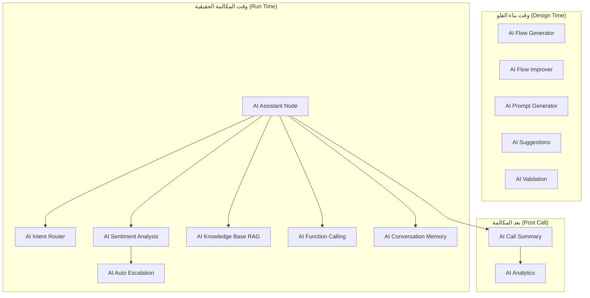
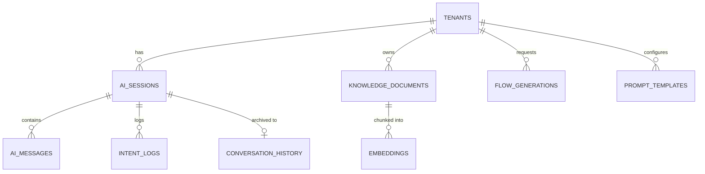

# 🧠 NexusIVR — خطة تنفيذ كاملة لموديول الذكاء الاصطناعي (AI Module)

> الدليل ده مخصص للفريق الهندسي بتاع NexusIVR كـ **خطة تنفيذ (Implementation Roadmap)** لكل حاجة متعلقة بالـ AI في المشروع. الهدف مش شرح نظري، الهدف إنك تقدر تفتح الملف ده وتعرف بالظبط: إيه اللي محتاج يتبني، بأنهي ترتيب، بأنهي تكنولوجيا، وإزاي كل قطعة بتتظبط مع القطعة اللي جنبها. مفيش كود هنا خالص — ده Engineering Plan بحت.

**الفريق**: Lead Architecture Document
**النطاق**: AI Module بس (مش باقي أجزاء الباك إند)
**الحالة الحالية**: الفرونت إند فيه UI جاهز لمعظم الميزات دي (زرار AI Generate, AI Improve, AI Assistant Node...) بس **كل حاجة Mock حاليًا، مفيش أي تكامل AI حقيقي**

---

## 📑 جدول المحتويات

1. نظرة عامة على كل ميزات الـ AI
2. AI Assistant Node
3. AI Router (Natural Language IVR)
4. AI Flow Generator
5. AI Improve
6. AI Validation
7. AI Knowledge Base (RAG)
8. AI Conversation Memory
9. AI Backend Architecture
10. الـ APIs
11. الداتابيز
12. مهام الفرونت إند
13. مهام الباك إند (مراحل التنفيذ)
14. التكنولوجيات المقترحة
15. الـ Checklist النهائي

---

## 1. نظرة عامة على كل ميزات الـ AI

قبل ما ندخل في تفاصيل كل ميزة، لازم تكون الصورة الكبيرة واضحة قدامك. النظام فيه **14 مكوّن AI** مختلف، كل واحد له غرض مختلف تمامًا رغم إن كلهم بيستخدموا LLM في الآخر.

| # | الميزة | الغرض الأساسي | بتتفعّل فين |
|---|---|---|---|
| 1 | **AI Assistant Node** | محادثة صوتية حرة (NLP) بديلة لقوائم DTMF جوه الفلو نفسه | أثناء مكالمة حقيقية، لما التنفيذ يوصل لنود AI Assistant |
| 2 | **AI Intent Router** | فهم قصد المتصل من كلامه وتوجيهه مباشرة بدون قوائم | بداية المكالمة أو في أي نقطة بدل DTMF Menu |
| 3 | **AI Flow Generator** | توليد فلو IVR كامل من وصف نصي حر | زرار "AI Generate" في IVR Builder / صفحة AI Assistant |
| 4 | **AI Flow Improver** | تحليل فلو موجود واقتراح تحسينات | زرار "AI Improve" |
| 5 | **AI Prompt Generator** | توليد نصوص TTS/System Prompts مناسبة لكل Node تلقائيًا | مساعدة أثناء تعبئة حقول الـ Node |
| 6 | **AI Suggestions** | اقتراحات سريعة أثناء بناء الفلو (Bottom Panel) | باستمرار أثناء التعديل على الفلو |
| 7 | **AI Validation** | فحص جودة الفلو على مستوى UX، مش بس البنية | زرار Validate (طبقة إضافية فوق Graph Validation) |
| 8 | **AI Conversation Memory** | تذكّر سياق المكالمة/المحادثة عبر أدوار الكلام المختلفة | أي مكان فيه محادثة (AI Node, AI Assistant Page) |
| 9 | **AI Analytics** | تحليل بيانات المكالمات المؤتمتة بالـ AI (نسبة النجاح، التصعيد...) | صفحة Reports |
| 10 | **AI Call Summary** | تلخيص المكالمة تلقائيًا بعد انتهائها | بعد انتهاء أي مكالمة مرّت بنود AI |
| 11 | **AI Sentiment Analysis** | رصد مشاعر المتصل (غضب/رضا) أثناء المكالمة | داخل AI Assistant Node أثناء التنفيذ |
| 12 | **AI Auto Escalation** | تحويل تلقائي لموظف بشري لما الـ AI يحس إنه مش قادر يساعد أو المتصل غضبان | داخل AI Assistant Node |
| 13 | **AI Knowledge Base (RAG)** | إجابة أسئلة العملاء من مستندات الشركة (PDF) بس، مش من معرفة عامة | داخل AI Assistant Node لما محتاج معلومة محددة من الشركة |
| 14 | **AI Function Calling** | خلي الـ LLM "ينفذ أفعال" فعلية (زي حجز موعد، تحقق من رصيد) مش بس يرد بنص | داخل AI Assistant Node وAI Router |

### 1.1 خريطة العلاقة بين الميزات



> 🎯 **أهم فرق لازم تفهمه من الأول**: نص الميزات دي بتشتغل **وقت تصميم الفلو** (Design Time — الفرونت إند شغال، مفيش مكالمة حقيقية)، والنص التاني بيشتغل **وقت مكالمة حقيقية** (Run Time — Latency بيبقى حرج جدًا هنا، أي تأخير المتصل هيحسه فعليًا في سماعته).


---

## 2. AI Assistant Node

ده أعقد Node في المشروع كله، لأنه المكان الوحيد اللي فيه **محادثة صوتية حية ثنائية الاتجاه** أثناء مكالمة حقيقية. خلينا نفككه لكل جزء.

### 2.1 التغييرات المطلوبة في الفرونت إند

| العنصر | الوضع الحالي | المطلوب |
|---|---|---|
| حقول الإعداد في Properties Panel | موجودة بصريًا (Model, System Prompt, Max Turns, Sentiment Analysis, Auto-Escalate) لكن Uncontrolled | لازم تتحول لـ Controlled Inputs وتتربط فعليًا بـ `node.data` |
| اختيار الـ Knowledge Base | غير موجود | Dropdown لاختيار أي مستند/مجموعة مستندات (RAG Collection) الـ Node ده هيستخدمها |
| اختيار الـ Functions المسموحة | غير موجود | Multi-select لتحديد أي "أفعال" (Function Calling) الـ AI مسموح ينفذها من الـ Node ده (زي `check_balance`, `book_appointment`) |
| معاينة صوت (Voice Preview) | غير موجود | زرار "Test Voice" يجرب TTS بصوت مختار قبل ما ينشر الفلو |
| Fallback Node Selector | غير موجود | تحديد أنهي Node يروح له لو الـ AI فشل أو المستخدم عايز يتحول لموظف |

### 2.2 منطق الباك إند (Backend Logic)

الفكرة الأساسية: الـ Node ده مش "استدعاء واحد للـ LLM وخلاص" — هو **حلقة محادثة (Conversation Loop)** بتتكرر لحد `Max Turns` أو لحد ما يوصل لقرار (`resolved` أو `escalate`).

```
[1] المكالمة توصل لنود AI Assistant
        │
        ▼
[2] الباك إند يبني/يسترجع Session ID لهذه المكالمة
        │
        ▼
[3] تشغيل صوت افتتاحي (لو موجود) — "أهلًا، إزاي أقدر أساعدك؟"
        │
        ▼
┌────────────── LOOP (لحد Max Turns أو قرار نهائي) ──────────────┐
│  [4] استماع لكلام المتصل (Audio Stream)                          │
│  [5] STT: تحويل الصوت لنص                                        │
│  [6] (لو مفعّل) Sentiment Analysis على النص                       │
│  [7] بناء الـ Prompt: System Prompt + Conversation History         │
│      + RAG Context (لو الـ Node مربوط بـ Knowledge Base)          │
│  [8] استدعاء LLM (ممكن يرجّع نص عادي أو Function Call)            │
│  [9] لو LLM طلب Function Call → نفّذ الفعل (Function Calling)      │
│      وارجع النتيجة للـ LLM يكمل بيها                              │
│  [10] TTS: تحويل رد الـ LLM النهائي لصوت                          │
│  [11] تشغيل الصوت للمتصل                                          │
│  [12] تحديث الـ Conversation Memory بالدور الجديد                  │
│  [13] فحص: وصلنا resolved/escalate ولا نكمل اللوب؟                │
└──────────────────────────────────────────────────────────────┘
        │
        ▼
[14] توجيه المكالمة لمخرج "Resolved" أو "Escalate" حسب النتيجة
```

### 2.3 قاعدة البيانات (تفصيل خاص بالـ Node ده — الجداول العامة في الفصل 11)

الجداول الأساسية اللي الـ Node ده بيتفاعل معاها وقت التنفيذ: `ai_sessions`, `ai_messages`, `conversation_history` (تفصيل كامل بالفصل 11).

### 2.4 الـ APIs المطلوبة

راجع الفصل 10 للتفصيل الكامل، أهمهم هنا:
- `POST /ai/chat` — الاستدعاء الأساسي لكل دور محادثة
- `POST /ai/rag/query` — لو الـ Node محتاج معلومة من مستندات الشركة
- `POST /ai/function-call` — تنفيذ فعل معين
- `POST /ai/analyze-sentiment` — تحليل مشاعر دور معين

### 2.5 شكل الـ JSON للـ Node config (لا كود، وصف Schema فقط)

الحقول المتوقعة جوه `data` بتاعة الـ Node ده:
- `model` (نص) — اسم الموديل المستخدم
- `systemPrompt` (نص طويل)
- `maxTurns` (رقم)
- `sentimentAnalysisEnabled` (Boolean)
- `autoEscalateOnFrustration` (Boolean)
- `knowledgeBaseId` (مرجع اختياري لمجموعة مستندات RAG)
- `allowedFunctions` (قائمة أسماء functions مسموحة)
- `fallbackNodeId` (مرجع لـ Node بديل عند الفشل)

### 2.6 Conversation Flow (تدفق المحادثة من منظور المتصل)

```
المتصل: "أنا عايز أعرف مواعيد العيادة بكرة"
   │
   ▼
STT → "I want to know tomorrow's clinic schedule"
   │
   ▼
LLM بيحلل النص، يكتشف إنه محتاج Function Call اسمها get_schedule(date)
   │
   ▼
الباك إند بينفذ الـ Function (استعلام داتابيز/API خارجي)
   │
   ▼
النتيجة بترجع للـ LLM، وهو بيصيغها كرد طبيعي
   │
   ▼
TTS → صوت
   │
   ▼
المتصل بيسمع: "العيادة بكرة شغالة من 9 الصبح لحد 5 المغرب"
```

### 2.7 STT (Speech-to-Text)
- **الدور**: تحويل صوت المتصل الحي (Audio Stream من الـ PBX) لنص فوري.
- **اعتبار مهم**: لازم يدعم **Streaming** (مش ملف كامل بعد ما المتصل يخلص كلام) عشان الـ Latency يبقى مقبول — لو استنينا المتصل يخلص كلامه بالكامل ثم نبعت للـ STT، هيحس بفجوة زمنية محرجة.
- **تحديات**: لهجات مختلفة، ضوضاء خلفية، لغة عربي/إنجليزي مختلطة (Code-Switching) شائعة جدًا في مكالماتنا.

### 2.8 TTS (Text-to-Speech)
- **الدور**: تحويل رد الـ LLM النصي لصوت طبيعي.
- **اعتبار مهم**: كتير من مزودي TTS بيدعموا **Streaming Synthesis** — يعني تبدأ تشغيل أول جزء من الصوت وهو لسه بيولّد الباقي، بدل ما تستنى الملف كامل.
- الصوت المُولّد ممكن يتخزن (Caching) لو نفس النص هيتكرر كتير (زي جمل ثابتة معينة).

### 2.9 LLM (Large Language Model)
- **الدور**: "المخ" اللي بيفهم قصد المتصل وبيقرر يرد إزاي أو ينفذ إيه.
- **اعتبار مهم**: لازم يدعم **Function Calling / Structured Outputs** بشكل موثوق، عشان تقدر تربطه بأفعال حقيقية (حجز موعد، تحقق من رصيد) مش بس محادثة حرة.

### 2.10 Memory (الذاكرة)
- كل دور كلام (Turn) بيتضاف لسجل المحادثة (Conversation History) المرتبط بالـ Session الحالية.
- الـ History ده بيتبعت كـ Context مع كل استدعاء جديد للـ LLM عشان "يفتكر" اللي اتقال قبل كده في نفس المكالمة.
- تفصيل كامل في الفصل 8.

### 2.11 Streaming
- الاستدعاء المثالي للـ LLM في سياق مكالمة حية **لازم يكون Streaming** (مش ننتظر الرد كامل) — عشان نقدر نبدأ TTS على أول جزء من الرد وهو لسه بيتولّد، فيقل الـ Latency الكلي اللي المتصل بيحسه.
- ده بيتطلب معمارية Async بالكامل في الباك إند (مش Blocking Calls).

### 2.12 Error Handling
| الحالة | السلوك المتوقع |
|---|---|
| STT فشل يفهم الصوت | اطلب من المتصل يعيد الكلام مرة واحدة، لو فشل تاني → Escalate |
| LLM Timeout | شغّل صوت انتظار قصير ("لحظة من فضلك...") وحاول تاني، لو فشل → Fallback Node |
| Function Call فشل (زي API خارجي واقع) | رجّع رسالة واضحة للـ LLM إن الفعل فشل عشان يصيغ رد مناسب للمتصل، ومتوقفش المكالمة فجأة |
| RAG مفيش نتيجة مطابقة | الـ LLM يقول بوضوح إنه معندوش معلومة، ويقترح تحويل لموظف بدل ما "يختلق" إجابة (Hallucination) |
| تجاوز Max Turns من غير حل | توجيه إجباري لـ Escalate |

### 2.13 إزاي الـ Node ده بيتنفذ فعليًا أثناء مكالمة حية (ملخص)

```
Asterisk (PBX) ──audio stream──▶ Backend Bridge ──▶ STT ──▶ LLM Loop
                                                                  │
Asterisk (PBX) ◀──audio stream── Backend Bridge ◀── TTS ◀────────┘
```

الباك إند هنا بيلعب دور "الجسر" بين الصوت الخام اللي جاي من الـ PBX وبين الطبقة الذكية (STT/LLM/TTS)، وده أكتر جزء حساس تقنيًا في المشروع كله من ناحية الـ Real-Time Performance.

---

## 3. AI Router (Natural Language IVR)

### 3.1 الفكرة الأساسية

بدل ما المتصل يسمع "اضغط 1 للحجز، 2 للطوارئ، 3 للفواتير"، يقدر يقول عادي "أنا عايز الفواتير" والنظام يفهمه ويوجّهه مباشرة — من غير ما يمر بأي DTMF Menu خالص.

```
المتصل: "I want Billing"
        │
        ▼
   AI يفهم القصد (Intent Detection)
        │
        ▼
   توجيه مباشر لـ Billing Queue
```

### 3.2 Intent Detection (اكتشاف القصد)

- الباك إند بياخد النص (من STT) ويبعته للـ LLM (أو موديل تصنيف نصوص مخصص أخف وأسرع) مع قائمة الـ **Intents المتاحة** في الفلو الحالي (زي: `billing`, `emergency`, `appointment`, `agent`).
- الموديل بيرجّع: الـ Intent الأقرب + **Confidence Score** (نسبة ثقة من 0 لـ 1).

### 3.3 Confidence Score — إزاي بنستخدمه؟

| نطاق الثقة | القرار |
|---|---|
| فوق حد عالي (مثلاً 85%+) | توجيه مباشر فورًا من غير أي تأكيد |
| نطاق متوسط (مثلاً 50%-85%) | اسأل المتصل تأكيد: "تقصد الفواتير؟ قول أيوه أو لأ" |
| تحت حد منخفض (أقل من 50%) | اعتبره **Unknown Intent** — Fallback |

### 3.4 Fallback و Unknown Intents

لو الـ AI مش عارف يحدد قصد المتصل:
1. أول مرة: اطلب توضيح ("ممكن توضح أكتر إنت عايز تتكلم في إيه؟")
2. تاني مرة لو لسه مش واضح: ارجع لـ DTMF Menu التقليدي كـ Fallback نهائي (يعني الفلو المصمم أصلاً لازم يفضل موجود كخط دفاع ثاني)
3. لو حتى الـ DTMF فشل: Escalate لموظف بشري

### 3.5 Retry Logic

```
[محاولة 1: فهم القصد]
        │  فشل (Low Confidence)
        ▼
[محاولة 2: اطلب توضيح صريح]
        │  فشل تاني
        ▼
[التحول لـ DTMF Menu التقليدي (Fallback الأخير قبل الموظف البشري)]
        │  المتصل ماضغطش حاجة برضو
        ▼
[Escalate → تحويل لموظف]
```

### 3.6 إزاي ده بيظهر جوه IVR Builder

المطلوب إضافة **Node جديد** اسمه (مقترح) **"AI Router"** — مختلف عن AI Assistant Node لأنه مش بيعمل محادثة كاملة، هو بس بيسمع جملة واحدة ويوجّه بناءً عليها.

**التصميم المقترح للـ Node ده في الفرونت إند:**
- بدل ما يكون عنده مخارج ثابتة (زي DTMF Menu اللي عنده Key1, Key2...)، الـ Output Ports بتاعته بتتولّد **ديناميكيًا** حسب الـ Intents اللي المستخدم عرّفها.
- في Properties Panel: جدول قابل للتوسيع (زي DTMF Menu Key Mappings) بس بدل "Key → Node"، بيبقى "Intent Name + أمثلة جمل (Training Phrases) → Node".
- Output إضافي ثابت اسمه "Unknown/Fallback" لازم يكون موجود دايمًا.

**مثال توضيحي للإعداد (Config شكله، مش كود):**
- Intent: `billing` — أمثلة: "I want billing", "فلوسي", "الفاتورة بتاعتي" → Output → Billing Queue Node
- Intent: `emergency` — أمثلة: "urgent", "حالة طوارئ" → Output → Emergency Transfer Node
- Fallback → DTMF Menu Node (نفس الفلو التقليدي كخط أمان)

### 3.7 لماذا مهم إن الـ Fallback دايمًا يوصل لـ DTMF التقليدي؟

عشان **الموثوقية (Reliability)**. الذكاء الاصطناعي ممكن يفشل أو يبقى بطيء أو الخدمة الخارجية توقع مؤقتًا — النظام لازم "يتدرج للأسفل" (Graceful Degradation) لطريقة تقليدية بسيطة موثوقة بدل ما المكالمة تتقفل أو تعلق.

---

## 4. AI Flow Generator

### 4.1 الفكرة

المستخدم بيكتب وصف حر بالعربي أو الإنجليزي (زي "أنا عايز IVR لمستشفى")، والنظام بيرجّع فلو كامل جاهز يترسم تلقائيًا على الكانفس.

```
المستخدم يكتب:
"I need a Hospital IVR"
        │
        ▼
Backend يبني Prompt هيكلي للـ LLM
        │
        ▼
LLM يرجّع Flow JSON (nodes + edges)
        │
        ▼
Backend يتحقق من صحة الـ JSON (Schema + Graph Validation)
        │
        ▼
Frontend يستقبل الـ JSON ويرسم الـ Nodes تلقائيًا على الكانفس
```

### 4.2 الـ Prompt Engineering

الباك إند **مش بيبعت** كلام المستخدم للـ LLM زي ما هو. لازم يلفّه جوه **System Prompt هيكلي** بيوضح:
1. قائمة كل أنواع الـ Nodes المتاحة في النظام (الـ 20 نوع) ووصف كل واحد.
2. الشكل المطلوب بالظبط للـ JSON الناتج (نفس الـ Schema اللي اتفقنا عليه في الفصل 4 من دليل الباك إند العام).
3. قيود إجبارية: "لازم يكون فيه Start Node واحد بالظبط"، "كل Node لازم يكون متصل"، "استخدم أسماء Nodes منطقية وواضحة".
4. أمثلة (Few-Shot Examples) لفلوهات بسيطة صحيحة سابقة، عشان الموديل "يتعلم" الأسلوب المطلوب.

### 4.3 لماذا Structured Outputs / Function Calling هنا أساسي؟

لو سبنا الموديل يرد بنص حر وبعدين حاولنا "نستخرج" الـ JSON منه (Regex أو حاجة زي كده)، هنقع في مشاكل كتير (JSON ناقص، فواصل زيادة، تنسيق غلط). الحل الصحيح: استخدام ميزة **Structured Output / JSON Mode / Function Calling** المدعومة في أغلب مزودي LLM الحاليين، واللي بتضمن إن الرد **يطابق Schema محدد مسبقًا بالظبط** (زي JSON Schema رسمي).

### 4.4 الباك إند — الخطوات

```
[1] استقبال البرومبت من المستخدم عبر POST /ai/generate-flow
        │
        ▼
[2] بناء الـ System Prompt الكامل (تعليمات + Schema + أمثلة)
        │
        ▼
[3] استدعاء الـ LLM بـ Structured Output مضبوط على الـ Flow JSON Schema
        │
        ▼
[4] استقبال الـ JSON الناتج
        │
        ▼
[5] تشغيل نفس Validation Engine المستخدم للفلوهات العادية
    (فحص Start موجود، مفيش Nodes معلّقة...)
        │
        ▼
[6] لو الـ Validation فشلت: إما نطلب من الـ LLM يصلح (Retry مع رسالة الخطأ كـ Context إضافي)
    أو نرجّع خطأ واضح للفرونت إند
        │
        ▼
[7] لو نجحت: رجّع الـ JSON للفرونت إند + Metadata
    (عدد الـ Nodes، درجة التعقيد التقديرية...)
```

### 4.5 اعتبار مهم: Self-Correction Loop

من أفضل الممارسات إن الباك إند **ميرضاش بأول رد من الموديل على طول** — لو الـ Validation طلعت أخطاء، يبعت للموديل نفس الـ JSON اللي هو ولّده + قائمة الأخطاء بالظبط، ويطلب منه يصلحها. ده بيرفع نسبة نجاح التوليد بشكل كبير جدًا، مقارنة بمحاولة واحدة بس.

### 4.6 الـ JSON Schema المتوقع كناتج

نفس الـ Schema العام اللي اتفقنا عليه للفلو (موثق بالتفصيل في دليل الباك إند العام، الفصل 4.5) — يعني الـ AI Generator **بيلتزم بنفس الـ Contract** اللي أي فلو تاني في النظام بيتبعه، مفيش Schema خاص بيه.

---

## 5. AI Improve

### 5.1 الفكرة

المستخدم عنده فلو موجود بالفعل (سواء بناه يدويًا أو بالـ AI)، وعايز الـ AI "يراجعه" ويقترح تحسينات.

### 5.2 الفرق بين AI Improve و AI Validation (الفصل 6)

| | AI Improve | AI Validation |
|---|---|---|
| **الهدف** | اقتراحات تحسين اختيارية | تنبيهات جودة (تحذيرات مش أخطاء بنيوية) |
| **يوقف Publish؟** | لأ خالص | لأ (دي Warnings زيادة فوق الـ Graph Validation) |
| **بيتفعّل إمتى** | عند الطلب (زرار AI Improve) | تلقائيًا مع كل Validate |

### 5.3 أمثلة على ما يكتشفه AI Improve

| المشكلة | مثال | الاقتراح |
|---|---|---|
| Missing End node | مسار بينتهي من غير End Call | "أضف End Call node بعد X" |
| Disconnected node | Node موجود بس مالوش أي اتصال | "احذف الـ Node ده أو وصّله" |
| No timeout | DTMF Menu من غير Timeout محدد | "أضف Timeout مناسب (5-8 ثواني)" |
| Too many transfers | مسار فيه أكتر من Agent Transfer متتالي | "ده ممكن يربك المتصل، فكر تدمجهم أو تستخدم Queue بدل التحويل المباشر" |
| Large menu | DTMF Menu عنده أكتر من 5-6 خيارات | "القوائم الطويلة بتتعب المتصل، فكر تقسمها لقوائم فرعية" |

### 5.4 كيف يعمل تقنيًا

```
[1] المستخدم يضغط "AI Improve"
        │
        ▼
[2] الباك إند يسحب الفلو الكامل (nodes + edges) بصيغة JSON
        │
        ▼
[3] يبني Prompt للـ LLM يحتوي:
    - الفلو كامل
    - قائمة "أنماط المشاكل الشائعة" اللي عايزينه يدور عليها
    - تعليمات بصيغة الرد (قائمة اقتراحات منظمة)
        │
        ▼
[4] LLM يرجّع قائمة Suggestions (كل واحدة: وصف + Node المتأثر + إجراء مقترح)
        │
        ▼
[5] الفرونت إند يعرضهم في تبويب "AI Suggestions" (Bottom Panel)
    مع زرار "Apply" لكل اقتراح
```

> 💡 **نصيحة هندسية**: ابدأ بقواعد **Deterministic** (زي مثال Missing End Node) تتفحص بكود عادي (بدون LLM أصلًا)، ووفّر استدعاء الـ LLM للحالات اللي فعلًا محتاجة "فهم" (زي "هل ترتيب الأسئلة في الفلو ده منطقي من ناحية تجربة المستخدم؟"). ده هيوفر تكلفة وزمن استجابة كبير.

---

## 6. AI Validation

### 6.1 الفرق عن الـ Graph Validation العادي

الـ **Graph Validation** (اللي شرحناه في دليل الباك إند العام) بيفحص **البنية** — هل الفلو "صحيح" رياضيًا؟ (Start موجود، مفيش Node معلّق، مفيش IDs مكررة).

الـ **AI Validation** بيفحص **الجودة والتجربة (UX Quality)** — هل الفلو "كويس" من ناحية تجربة المستخدم، حتى لو بنيويًا سليم 100%؟ ده فحص مش ممكن يتعمل بقواعد ثابتة بسيطة، محتاج "فهم" — ولو حاولنا نعمله بقواعد ثابتة هيبقى محدود جدًا.

### 6.2 أمثلة فحوصات AI Validation

| الفحص | مثال المشكلة | ليه مهم |
|---|---|---|
| **Bad UX** | ترتيب أسئلة غريب (زي تسأل رقم الحساب قبل ما تقول إنت في أنهي قسم) | بيربك المتصل |
| **Dead ends** | مسار بيوصل لنقطة "مفيش منها طريق واضح للمتصل" (حتى لو بنيويًا فيه Edge، لكن منطقيًا تايه) | تجربة سيئة |
| **Infinite loops** | حلقة بين Nodes بترجع لنفسها بدون تقدم واضح للمتصل | ممكن يفضل المتصل عالق لدقائق |
| **Too many menu levels** | قائمة فرعية جوه قائمة فرعية جوه قائمة فرعية (3+ مستويات) | صعب المتصل يفتكر مكانه في الشجرة |
| **Long greeting** | رسالة ترحيب أطول من 20-30 ثانية | المتصلين بيقفلوا أو بيضغطوا مفاتيح عشوائية قبل ما تخلص |
| **Weak prompts** | نص TTS غامض أو غير واضح (زي "اضغط الزرار المناسب" من غير توضيح إيه هو) | بيربك المتصل يعرف يعمل إيه |

### 6.3 كيف يعمل تقنيًا

نفس فكرة AI Improve تقريبًا (استدعاء LLM بالفلو كامل + قائمة معايير الفحص)، بس بيتفعّل **تلقائيًا** كطبقة إضافية فوق نتيجة Validate العادية، ونتيجته بتتحط في نفس تبويب Validate مع تصنيف واضح إنها "AI-detected" مختلفة عن "Structural".

### 6.4 اعتبار مهم: Cost & Latency

استدعاء LLM على كل فلو كل مرة يدوس المستخدم Validate ممكن يبقى مكلف وبطيء لو الفلو كبير. **الحل المقترح**:
- شغّل الـ AI Validation **عند الطلب فقط** (مش تلقائي مع كل تعديل بسيط)، أو
- استخدم **Debouncing** (يعني استنى المستخدم يوقف عن التعديل لثواني قليلة الأول قبل ما تستدعي)، أو
- شغّلها **Async** في الخلفية وارجع بالنتيجة لما تخلص (بدل ما توقف المستخدم مستني)

---

## 7. AI Knowledge Base (RAG)

### 7.1 الفكرة الأساسية

كل شركة (Tenant) — مستشفى، بنك، شركة تأمين، جامعة — عندها مستندات خاصة بيها (سياسات، أسعار، مواعيد، شروط). عايزين الـ AI Assistant Node يرد على أسئلة المتصلين **من المستندات دي بالذات فقط**، مش من معرفته العامة (عشان نتجنب معلومات غلط أو مش دقيقة لشركة بعينها — Hallucination).

**RAG** = Retrieval-Augmented Generation، يعني: "قبل ما تولّد رد، ارجع دور على المعلومة الصح في المستندات، وبعدين ولّد الرد بناءً عليها".

### 7.2 خطوة بخطوة: من رفع الـ PDF لحد الإجابة

```
المرحلة 1: التحضير (بتحصل مرة واحدة لكل مستند، وقت الرفع)
────────────────────────────────────────────────────
[1] المستخدم يرفع ملف PDF (مثلاً: "قائمة أسعار الكشف - مستشفى ميريديان")
        │
        ▼
[2] Chunking: تقسيم المستند لقطع نصية صغيرة (Chunks)
    (مش المستند كامل مرة واحدة — كل chunk حوالي 200-500 كلمة مع تداخل بسيط بينهم)
        │
        ▼
[3] Embedding: تحويل كل chunk لمتجه رقمي (Vector) يمثل "معنى" النص
    (باستخدام Embedding Model متخصص)
        │
        ▼
[4] تخزين كل Vector + النص الأصلي بتاعه في Vector Database


المرحلة 2: الاسترجاع والرد (بتحصل كل مرة فيه سؤال من متصل)
────────────────────────────────────────────────────
[5] سؤال المتصل بييجي كنص (بعد STT)
        │
        ▼
[6] تحويل السؤال نفسه لـ Vector (بنفس الـ Embedding Model)
        │
        ▼
[7] Retrieval: البحث في Vector Database عن أقرب N قطع نصية
    (تشابه رياضي بين المتجهات — Cosine Similarity غالبًا)
        │
        ▼
[8] بناء Prompt للـ LLM يحتوي:
    - سؤال المتصل
    - القطع النصية اللي رجعت (Context)
    - تعليمات صارمة: "رد بس من المعلومات المرفقة، لو مش موجودة قول معرفش"
        │
        ▼
[9] LLM يولّد رد بناءً على الـ Context ده بس
        │
        ▼
[10] الرد يتحول لصوت (TTS) ويترجع للمتصل
```

### 7.3 Chunking — إزاي نقسّم الملف صح؟

- **حجم الـ Chunk**: صغير أوي (كلمتين) = مفيش سياق كافي. كبير أوي (صفحة كاملة) = بيجيب معلومات زيادة مش لازمة وبيكلف Tokens أكتر. الحل الوسط الشائع: 200-500 كلمة تقريبًا.
- **Overlap (تداخل)**: لازم يكون فيه تداخل بسيط بين كل Chunk واللي بعده (زي 10-15%)، عشان لو معلومة مهمة اتقطعت عند حد Chunk، متضيعش.
- **Chunking حسب البنية**: الأفضل تقسم حسب العناوين/الفقرات الطبيعية في المستند (مش تقطيع عشوائي كل X كلمة)، عشان كل Chunk يفضل له معنى متكامل.

### 7.4 Embedding

- الـ Embedding Model بيحوّل أي نص (قصير أو طويل نسبيًا) لمصفوفة أرقام (Vector) بطول ثابت (زي 1536 رقم مثلاً).
- النصوص اللي "معناها قريب من بعض" بيبقى الـ Vectors بتاعتها قريبة من بعض رياضيًا في الفضاء متعدد الأبعاد ده.
- لازم تستخدم **نفس** الـ Embedding Model لتحويل المستندات وقت الرفع، ولتحويل سؤال المتصل وقت البحث — لو استخدمت موديلين مختلفين، المقارنة هتبقى غلط تمامًا.

### 7.5 Vector Database

قاعدة بيانات متخصصة في تخزين الـ Vectors والبحث السريع فيها بالتشابه (مش بالمطابقة التامة زي SQL العادي). تفصيل الخيارات في الفصل 14.

### 7.6 الـ Prompt النهائي (شكله المنطقي)

```
System: إنت مساعد {اسم الشركة}. رد بس من المعلومات المرفقة تحت.
        لو السؤال مش موجود في المعلومات دي، قول بوضوح إنك معرفش
        واقترح تحويل لموظف بشري. متخترعش معلومات.

Context (من الاسترجاع):
"مواعيد العيادة الخارجية: السبت للخميس 9 صباحًا - 5 مساءً"
"رسوم الكشف العادي: 300 جنيه، رسوم الاستشارة: 500 جنيه"

سؤال المتصل: "الكشف بكام؟"
```

### 7.7 Memory مع RAG

لازم الـ RAG يشتغل **مع** الـ Conversation Memory (الفصل 8) مش بدلها. يعني كل سؤال جديد من المتصل، بنستخدم الاسترجاع (Retrieval) عشان نجيب المعلومة الصح، **وبرضو** بنحط سياق المحادثة اللي فاتت (عشان لو المتصل قال "وإيه كمان؟" نفهم إنه بيكمل على نفس الموضوع).

### 7.8 عزل البيانات بين الشركات (Multi-Tenancy في RAG)

⚠️ **نقطة حرجة جدًا للأمان**: مستندات كل شركة (Tenant) لازم تكون **معزولة تمامًا** عن باقي الشركات في الـ Vector Database. لازم كل عملية بحث (Retrieval) تتفلتر إجباريًا بـ `tenant_id`، عشان محدش يقدر (حتى بالغلط) يسأل ويطلع معلومة من مستندات شركة تانية.

---

## 8. AI Conversation Memory

### 8.1 ليه محتاجين "ذاكرة" أصلًا؟

الـ LLM بطبيعته **Stateless** — كل مرة تستدعيه، هو "مش فاكر" أي حاجة قالها أو اتقالتله قبل كده، إلا لو إنت بنفسك بعتّله كل التاريخ ده مرة كل مرة. الذاكرة هي المسؤولية اللي بتضمن استمرارية المحادثة.

### 8.2 Short-Term Memory (ذاكرة قصيرة المدى)

- بتغطي **مكالمة واحدة بس** (Session واحدة).
- كل دور كلام (Turn) — سواء من المتصل أو من الـ AI — بيتضاف لقائمة بالترتيب الزمني.
- كل استدعاء جديد للـ LLM بياخد القائمة دي كاملة (أو آخر N دور، لو المحادثة طويلة جدًا) كـ Context.

### 8.3 Conversation Context — إيه اللي بيتحط فيه بالظبط؟

- تاريخ الأدوار (مين قال إيه بالترتيب)
- أي متغيرات استُخرجت أثناء المكالمة (زي رقم حساب المتصل لو قاله بدري في المكالمة)
- نتيجة أي Function Calls سابقة في نفس المكالمة (عشان الـ LLM ميسألش نفس السؤال تاني)

### 8.4 Session ID

كل مكالمة بتاخد **معرّف فريد (Session ID)** بيتولد لحظة ما المكالمة توصل لأول Node فيه AI. كل حاجة متعلقة بالمكالمة دي (History, Variables, Sentiment Scores) بتتربط بالـ Session ID ده.

### 8.5 Redis — ليه محتاجينه هنا بالذات؟

الذاكرة قصيرة المدى دي محتاجة **قراءة وكتابة فائقة السرعة** (كل دور كلام في المكالمة بيحصل فيه قراءة وكتابة، وأي تأخير هيتحس فعليًا في المكالمة الحية). قاعدة بيانات SQL تقليدية أبطأ من اللازم للسيناريو ده. **Redis** (In-Memory Data Store) هو الحل الأنسب:
- سرعة وصول فورية تقريبًا (Microseconds)
- بيدعم **TTL (Time To Live)** — يعني تقدر تخلي الذاكرة "تنتهي صلاحيتها" تلقائيًا بعد فترة (زي 30 دقيقة بعد انتهاء المكالمة)، فمش هيتراكم داتا قديمة للأبد

### 8.6 الداتابيز (للتخزين الدائم)

بعد ما المكالمة تخلص، الذاكرة المؤقتة اللي كانت في Redis لازم "تترحّل" (Persist) لقاعدة بيانات دائمة (PostgreSQL) عشان:
- تفصيل كامل للمكالمة يفضل موجود للأبد (للـ Reports وCall History)
- تستخدم كـ **Long-Term Memory** لو احتجنا نتذكر معلومات عن نفس المتصل عبر مكالمات مختلفة (مستقبلًا)

### 8.7 مخطط الرحلة الكاملة للذاكرة

```
[بداية المكالمة]
        │
        ▼
[إنشاء Session ID جديد في Redis]
        │
        ▼
┌── أثناء المكالمة ──┐
│  كل دور كلام:        │
│  اقرا من Redis        │
│  ابعت للـ LLM         │
│  اكتب الرد في Redis    │
└─────────────────────┘
        │
        ▼
[نهاية المكالمة]
        │
        ▼
[ترحيل الـ Session كاملة من Redis → PostgreSQL (جدول conversation_history)]
        │
        ▼
[انتهاء صلاحية الـ Session في Redis تلقائيًا (TTL)]
```

### 8.8 History (السجل الكامل)

بعد ما تترحّل المكالمة للداتابيز الدائمة، بيبقى عندنا **سجل كامل** لكل محادثة حصلت — ده اللي بنستخدمه في:
- **AI Call Summary** (الفصل 1، الميزة رقم 10) — تلخيص المكالمة
- **AI Analytics** — تحليل أنماط المكالمات بمرور الوقت
- مراجعة يدوية من فريق الجودة (Quality Assurance)

---

## 9. AI Backend Architecture

### 9.1 الرسم الكامل لتدفق مكالمة صوتية حية من البداية للنهاية

```
┌─────────────┐
│   Caller     │   المتصل بيتكلم في التليفون
└──────┬───────┘
       │  صوت خام عبر الشبكة الهاتفية
       ▼
┌─────────────┐
│  Asterisk     │   الـ PBX بيستقبل المكالمة، بيبدأ ينفذ الفلو المنشور
│  (PBX)        │   لما يوصل لنود AI Assistant، بيبدأ يبعت الصوت (Audio Stream)
└──────┬───────┘   للباك إند بتاعنا
       │  Audio Stream (RTP/WebSocket)
       ▼
┌─────────────┐
│  Java         │   الباك إند بيستقبل الـ Stream، وبيبقى "المايسترو" اللي
│  Backend      │   بينسق باقي الخطوات كلها
│  (Bridge)     │
└──────┬───────┘
       │
       ▼
┌─────────────┐
│  STT          │   تحويل صوت المتصل لنص (Streaming)
│  Service      │
└──────┬───────┘
       │  نص المتصل
       ▼
┌─────────────┐
│  LLM          │   فهم النص + بناء الرد (مع RAG Context لو محتاج،
│  Service      │   ومع الـ Conversation Memory من Redis)
└──────┬───────┘
       │
       ▼
┌─────────────┐
│  Intent        │   (لو محتاج) تحديد قصد المتصل لتوجيه المكالمة
│  Detection     │   لقسم/طابور معين
└──────┬───────┘
       │
       ▼
┌─────────────┐
│  Business      │   تنفيذ أي منطق فعلي مطلوب (Function Calling):
│  Logic         │   حجز موعد، استعلام رصيد، تحديث بيانات...
└──────┬───────┘
       │  رد نصي نهائي
       ▼
┌─────────────┐
│  TTS          │   تحويل الرد لصوت (Streaming)
│  Service      │
└──────┬───────┘
       │  صوت
       ▼
┌─────────────┐
│  Asterisk     │   تشغيل الصوت للمتصل عبر نفس القناة الصوتية
│  (PBX)        │
└──────┬───────┘
       │
       ▼
┌─────────────┐
│   Caller     │   المتصل بيسمع الرد
└─────────────┘
```

### 9.2 شرح كل خطوة من منظور معماري

| المرحلة | الدور | اعتبار تقني رئيسي |
|---|---|---|
| **Asterisk** | بوابة الصوت — بيحول المكالمة الهاتفية التقليدية لـ Stream رقمي يقدر الباك إند يتعامل معاه | لازم دعم صريح لبروتوكول نقل الصوت الحي (RTP أو WebSocket bridge) |
| **Java Backend (Bridge)** | المنسّق (Orchestrator) — بيدير التدفق الكامل بين كل الخدمات | لازم يكون **Async بالكامل** (Non-blocking)، وإلا هيبقى فيه تأخير محسوس |
| **STT Service** | تحويل الصوت لنص | يفضّل يكون Streaming، ودعم اللغة/اللهجة المطلوبة |
| **LLM Service** | الفهم واتخاذ القرار | يدعم Streaming + Function Calling |
| **Intent Detection** | توجيه مبني على الفهم | ممكن يكون جزء من نفس استدعاء الـ LLM (باستخدام Structured Output) بدل استدعاء منفصل، لتقليل الـ Latency |
| **Business Logic** | تنفيذ فعلي في أنظمة الشركة | لازم Timeout واضح ومعالجة أخطاء قوية (الفصل 2.12) |
| **TTS Service** | تحويل الرد لصوت | يفضّل Streaming Synthesis |

### 9.3 اعتبار الـ Latency الكلي

كل خطوة من الخطوات دي بتضيف وقت. المتصل ملوش صبر أكتر من ثانية-ثانيتين سكوت قبل ما يحس إن فيه "حاجة غلط". لازم:
- كل الاستدعاءات تكون **Async** ومتوازية لما ممكن (مش كل حاجة بالترتيب تنتظر اللي قبلها لو مش لازم)
- استخدام **Streaming** في كل مرحلة ممكنة (STT streaming, LLM streaming, TTS streaming) بدل انتظار كل مرحلة تخلص بالكامل قبل ما التالية تبدأ

---

## 10. الـ APIs

جدول شامل لكل الـ Endpoints المطلوبة لموديول الـ AI، مع شكل الـ Request/Response لكل واحد (وصف الـ Schema، مش كود).

### 10.1 `POST /ai/chat`
**الغرض**: استدعاء دور محادثة واحد داخل AI Assistant Node أثناء مكالمة حية.

**Request:**
```json
{
  "sessionId": "sess-abc123",
  "flowId": "flow-hospital-main",
  "nodeId": "node-ai-1",
  "userMessage": "أنا عايز أعرف مواعيد العيادة",
  "callerContext": { "callerNumber": "+201234567890" }
}
```

**Response:**
```json
{
  "sessionId": "sess-abc123",
  "assistantReply": "العيادة شغالة من السبت للخميس، 9 الصبح لحد 5 المغرب.",
  "decision": "continue",
  "functionCalled": null,
  "sentiment": "neutral",
  "turnNumber": 2
}
```
*(قيم `decision` الممكنة: `continue`, `resolved`, `escalate`)*

### 10.2 `POST /ai/router`
**الغرض**: تحديد قصد المتصل وتوجيهه (AI Router Node).

**Request:**
```json
{
  "sessionId": "sess-abc123",
  "flowId": "flow-bank-main",
  "nodeId": "node-router-1",
  "userMessage": "I want to talk about my bill",
  "availableIntents": ["billing", "emergency", "agent"]
}
```

**Response:**
```json
{
  "detectedIntent": "billing",
  "confidenceScore": 0.91,
  "decision": "route",
  "targetNodeId": "node-queue-billing"
}
```
*(قيم `decision` الممكنة: `route`, `confirm_needed`, `unknown`)*

### 10.3 `POST /ai/generate-flow`
**الغرض**: توليد فلو كامل من وصف نصي (AI Flow Generator).

**Request:**
```json
{
  "tenantId": "tenant-meridian",
  "prompt": "I need a Hospital IVR with billing and emergency options",
  "language": "en"
}
```

**Response:**
```json
{
  "status": "success",
  "flow": {
    "nodes": [ "...raw flow node objects..." ],
    "edges": [ "...raw flow edge objects..." ]
  },
  "summary": "Generated a 9-node hospital IVR flow with billing, emergency, and appointment routing.",
  "validation": { "errors": [], "warnings": [] }
}
```

### 10.4 `POST /ai/improve-flow`
**الغرض**: تحليل فلو موجود واقتراح تحسينات (AI Improve).

**Request:**
```json
{
  "flowId": "flow-hospital-main",
  "flow": { "nodes": [ "..." ], "edges": [ "..." ] }
}
```

**Response:**
```json
{
  "suggestions": [
    {
      "id": "sugg-1",
      "type": "missing_end_node",
      "message": "المسار من Voicemail node مش متوصل بـ End Call node.",
      "affectedNodeId": "node-voicemail-1",
      "suggestedAction": "connect_to_end_call"
    }
  ]
}
```

### 10.5 `POST /ai/validate`
**الغرض**: فحص جودة UX إضافي فوق الـ Graph Validation العادي (AI Validation).

**Request:**
```json
{
  "flowId": "flow-hospital-main",
  "flow": { "nodes": [ "..." ], "edges": [ "..." ] }
}
```

**Response:**
```json
{
  "aiFindings": [
    {
      "severity": "warning",
      "category": "long_greeting",
      "message": "رسالة الترحيب مدتها التقديرية 35 ثانية — يفضّل تقصيرها لأقل من 20 ثانية.",
      "nodeId": "node-greeting-1"
    }
  ]
}
```

### 10.6 `POST /ai/rag/query`
**الغرض**: استرجاع إجابة من مستندات الشركة (Knowledge Base).

**Request:**
```json
{
  "tenantId": "tenant-meridian",
  "knowledgeBaseId": "kb-hospital-pricing",
  "question": "الكشف بكام؟",
  "sessionId": "sess-abc123"
}
```

**Response:**
```json
{
  "answer": "رسوم الكشف العادي 300 جنيه.",
  "sourceChunks": [
    { "documentId": "doc-pricing-2026", "chunkId": "chunk-14", "similarityScore": 0.88 }
  ],
  "hasAnswer": true
}
```

### 10.7 `POST /ai/summarize`
**الغرض**: تلخيص مكالمة بعد انتهائها (AI Call Summary).

**Request:**
```json
{ "callId": "call-99871", "sessionId": "sess-abc123" }
```

**Response:**
```json
{
  "summary": "المتصل سأل عن مواعيد وأسعار الكشف، وتم الرد بنجاح من غير الحاجة لتحويل لموظف.",
  "outcome": "resolved_by_ai",
  "topicsDiscussed": ["clinic_hours", "pricing"]
}
```

### 10.8 `POST /ai/analyze-sentiment`
**الغرض**: تحليل مشاعر دور كلام معين أثناء المكالمة.

**Request:**
```json
{ "sessionId": "sess-abc123", "text": "أنا مستني من نص ساعة ومحدش بيرد عليا!" }
```

**Response:**
```json
{
  "sentiment": "negative",
  "frustrationScore": 0.82,
  "recommendation": "escalate"
}
```

### 10.9 `POST /ai/function-call`
**الغرض**: تنفيذ فعل حقيقي طلبه الـ LLM أثناء المحادثة (Function Calling).

**Request:**
```json
{
  "sessionId": "sess-abc123",
  "functionName": "check_patient_balance",
  "arguments": { "patientId": "12345" }
}
```

**Response:**
```json
{
  "functionName": "check_patient_balance",
  "result": { "balance": 450, "currency": "EGP" },
  "status": "success"
}
```

### 10.10 ملخص جدولي لكل الـ Endpoints

| Endpoint | الغرض | يُستدعى وقت |
|---|---|---|
| `POST /ai/chat` | دور محادثة واحد | مكالمة حية |
| `POST /ai/router` | تحديد قصد وتوجيه | مكالمة حية |
| `POST /ai/generate-flow` | توليد فلو من نص | تصميم الفلو |
| `POST /ai/improve-flow` | اقتراح تحسينات | تصميم الفلو |
| `POST /ai/validate` | فحص جودة UX | تصميم الفلو |
| `POST /ai/rag/query` | إجابة من مستندات | مكالمة حية |
| `POST /ai/summarize` | تلخيص مكالمة | بعد المكالمة |
| `POST /ai/analyze-sentiment` | تحليل مشاعر | مكالمة حية |
| `POST /ai/function-call` | تنفيذ فعل حقيقي | مكالمة حية |
| `POST /ai/knowledge-base/upload` *(مقترح إضافي)* | رفع مستند جديد للـ RAG | إعداد مسبق |
| `GET /ai/analytics/summary` *(مقترح إضافي)* | إحصائيات أداء الـ AI | صفحة Reports |

---

## 11. الداتابيز

### 11.1 نظرة عامة



### 11.2 جدول `ai_sessions`
كل مكالمة (أو محادثة) فيها تفاعل AI بتبقى ليها Session مستقلة.
| العمود | النوع | ملاحظات |
|---|---|---|
| id | UUID | Primary Key (Session ID) |
| tenant_id | UUID | FK → tenants |
| call_id | UUID | FK → calls (nullable لو مش مرتبطة بمكالمة، زي صفحة AI Assistant) |
| flow_id | UUID | FK → flows |
| node_id | VARCHAR | أي Node بدأ الجلسة |
| status | VARCHAR | `active` / `resolved` / `escalated` / `expired` |
| started_at | TIMESTAMP | |
| ended_at | TIMESTAMP | nullable |

### 11.3 جدول `ai_messages`
كل دور كلام (Turn) في أي Session.
| العمود | النوع | ملاحظات |
|---|---|---|
| id | UUID | Primary Key |
| session_id | UUID | FK → ai_sessions |
| role | VARCHAR | `caller` / `assistant` / `system` |
| content | TEXT | النص الفعلي |
| function_call | JSONB | nullable — لو الدور ده كان فيه Function Call |
| sentiment | VARCHAR | nullable |
| created_at | TIMESTAMP | |

### 11.4 جدول `intent_logs`
سجل كل مرة الـ AI Router حاول يحدد قصد (سواء نجح أو لأ) — مهم جدًا للتحليل والتحسين المستمر.
| العمود | النوع | ملاحظات |
|---|---|---|
| id | UUID | Primary Key |
| session_id | UUID | FK → ai_sessions |
| user_utterance | TEXT | الجملة الأصلية اللي قالها المتصل |
| detected_intent | VARCHAR | nullable لو Unknown |
| confidence_score | DECIMAL | |
| decision | VARCHAR | `routed` / `confirmed` / `fallback` / `unknown` |
| created_at | TIMESTAMP | |

### 11.5 جدول `conversation_history`
الأرشيف الدائم بعد ما الـ Session تخلص (ترحيل من Redis).
| العمود | النوع | ملاحظات |
|---|---|---|
| id | UUID | Primary Key |
| session_id | UUID | FK → ai_sessions, UNIQUE |
| full_transcript | JSONB | كل الـ Messages بالترتيب |
| summary | TEXT | نتيجة AI Call Summary |
| outcome | VARCHAR | `resolved_by_ai` / `escalated` / `abandoned` |
| archived_at | TIMESTAMP | |

### 11.6 جدول `knowledge_documents`
مستندات RAG المرفوعة لكل شركة.
| العمود | النوع | ملاحظات |
|---|---|---|
| id | UUID | Primary Key |
| tenant_id | UUID | FK → tenants |
| knowledge_base_id | UUID | تجميع منطقي (زي "أسعار"، "سياسات") |
| file_name | VARCHAR | |
| file_url | TEXT | مكان تخزين الملف الأصلي (S3) |
| status | VARCHAR | `processing` / `ready` / `failed` |
| uploaded_by | UUID | FK → users |
| uploaded_at | TIMESTAMP | |

### 11.7 جدول `embeddings`
القطع النصية (Chunks) بعد التقسيم، مع الإشارة لمكان تخزين الـ Vector الفعلي.
| العمود | النوع | ملاحظات |
|---|---|---|
| id | UUID | Primary Key |
| document_id | UUID | FK → knowledge_documents |
| chunk_index | INT | ترتيب القطعة داخل المستند |
| chunk_text | TEXT | النص الأصلي (للعرض والتتبع) |
| vector_ref | VARCHAR | مرجع الـ Vector في قاعدة الـ Vector DB (أو العمود نفسه لو pgvector) |
| created_at | TIMESTAMP | |

> 💡 لو استخدمت **pgvector** (إضافة على PostgreSQL)، ممكن تدمج `embeddings` كعمود `vector` مباشرة في نفس الجدول ده بدل قاعدة بيانات منفصلة تمامًا — تفصيل أكتر في الفصل 14.

### 11.8 جدول `flow_generations`
سجل كل مرة استُخدم فيها AI Flow Generator.
| العمود | النوع | ملاحظات |
|---|---|---|
| id | UUID | Primary Key |
| tenant_id | UUID | FK → tenants |
| prompt | TEXT | البرومبت اللي كتبه المستخدم |
| generated_flow_json | JSONB | الناتج الكامل |
| was_applied | BOOLEAN | هل المستخدم فعلًا ضغط "Apply to Canvas"؟ |
| created_by | UUID | FK → users |
| created_at | TIMESTAMP | |

### 11.9 جدول `prompt_templates`
القوالب الثابتة (System Prompts) المستخدمة في كل استدعاء AI — بدل ما تكون Hardcoded في الكود، تتخزن وتتعدل من غير Deploy جديد.
| العمود | النوع | ملاحظات |
|---|---|---|
| id | UUID | Primary Key |
| name | VARCHAR | زي `flow_generator_system_prompt`, `ai_router_system_prompt` |
| template_text | TEXT | النص بمتغيرات قابلة للاستبدال |
| version | INT | |
| is_active | BOOLEAN | |
| updated_at | TIMESTAMP | |

---

## 12. مهام الفرونت إند

### 12.1 Must Have (لازم تتعمل قبل أي إطلاق حقيقي)

| المهمة | الوصف |
|---|---|
| ربط حقول AI Assistant Node فعليًا | تحويل الـ Inputs من Uncontrolled لـ Controlled، وربطها بـ `node.data` |
| استدعاء `POST /ai/generate-flow` فعليًا | زرار AI Generate يبعت Request حقيقي بدل الرد الوهمي بـ setTimeout |
| رسم الفلو الناتج تلقائيًا على الكانفس | تحويل الـ JSON الراجع لـ nodes/edges فعلية في الـ State |
| استدعاء `POST /ai/improve-flow` فعليًا | زرار AI Improve وربطه بتبويب AI Suggestions |
| عرض حالات Loading/Error للـ AI Panel | Spinner حقيقي أثناء الانتظار، ورسالة واضحة لو الطلب فشل (Timeout, Rate Limit) |
| واجهة رفع مستندات RAG | شاشة/تبويب جديد لرفع PDF واختيار Knowledge Base لكل Node |
| عرض نتائج AI Validation في تبويب Validate | تمييز بصري واضح بين "Structural" و"AI-detected" |

### 12.2 Nice to Have (تحسينات مهمة بس مش حرجة للإطلاق الأول)

| المهمة | الوصف |
|---|---|
| AI Router كـ Node جديد في الـ Node Library | مع تصميم الـ Output Ports الديناميكية (الفصل 3.6) |
| زرار "Test Voice" لمعاينة TTS | قبل نشر الفلو، اسمع شكل الصوت الفعلي |
| مؤشر Confidence Score بصري | في تبويب Simulate/Preview، اعرض نسبة الثقة لو الفلو فيه AI Router |
| Streaming Chat UI في صفحة AI Assistant | عرض رد الـ AI وهو "بيتكتب" حرف حرف (زي ChatGPT) بدل انتظار الرد كامل |
| Analytics Dashboard خاص بالـ AI | رسوم بيانية لنسبة Resolved by AI vs Escalated |

### 12.3 Future Features (مستقبلية، بعد استقرار الأساسيات)

| المهمة | الوصف |
|---|---|
| AI Prompt Generator تلقائي | اقتراح System Prompt مناسب تلقائيًا حسب نوع الصناعة (مستشفى/بنك...) |
| Multi-language RAG | دعم استرجاع من مستندات بلغات متعددة في نفس الـ Knowledge Base |
| A/B Testing لـ AI Prompts | تجربة أكتر من نسخة System Prompt ومقارنة الأداء |
| Visual Function Builder | واجهة بصرية لتعريف Functions جديدة (Function Calling) بدون كتابة كود |

---

## 13. مهام الباك إند (مراحل التنفيذ)

### Phase 1 — الأساسيات (Design-Time AI بس، مفيش مكالمات حية لسه)
- إعداد الاتصال بمزوّد LLM واحد (اختر واحد بس في البداية، وسّع بعدين)
- بناء `POST /ai/generate-flow` بأبسط شكل (بدون Self-Correction Loop لسه)
- بناء `POST /ai/improve-flow`
- بناء جداول `flow_generations`, `prompt_templates`
- **علامة النجاح**: تقدر تكتب وصف نصي وتاخد فلو JSON صحيح شغال

### Phase 2 — تحسين جودة التوليد
- إضافة Validation Engine integration (نفس الـ Validator بتاع الفلو العادي)
- إضافة Self-Correction Loop (لو الناتج غلط، اطلب تصحيح)
- بناء `POST /ai/validate` (AI Validation طبقة إضافية)
- **علامة النجاح**: نسبة نجاح توليد فلو صحيح من أول أو تاني محاولة تتجاوز 90%

### Phase 3 — RAG Foundation
- اختيار وإعداد Vector Database
- بناء Pipeline الرفع: Upload → Chunking → Embedding → Storage
- بناء `POST /ai/rag/query` (بدون ربطه بمكالمة حية لسه — اختبره كـ API مستقل الأول)
- بناء جداول `knowledge_documents`, `embeddings`
- **علامة النجاح**: ترفع PDF وتسأل سؤال عادي (مش أثناء مكالمة) وتاخد إجابة صحيحة من محتواه

### Phase 4 — Real-Time Voice Pipeline (الجزء الأصعب تقنيًا)
- بناء الـ Bridge بين Asterisk والباك إند (استقبال/إرسال Audio Stream)
- تكامل STT (Streaming)
- تكامل TTS (Streaming)
- بناء `POST /ai/chat` وربطه بكل ده
- إعداد Redis للـ Conversation Memory
- **علامة النجاح**: مكالمة اختبارية بسيطة، تتكلم فعليًا مع الـ AI Assistant Node وتاخد رد صوتي مفهوم بزمن استجابة مقبول (أقل من 2-3 ثواني)

### Phase 5 — AI Router
- بناء `POST /ai/router` واستخدام Structured Output لتحديد الـ Intent
- بناء منطق الـ Confidence Score والـ Fallback (الفصل 3)
- بناء جدول `intent_logs`
- **علامة النجاح**: تقول جملة حرة والنظام يوجهك صح من غير DTMF

### Phase 6 — Function Calling + Business Logic
- تعريف أول 2-3 Functions حقيقية (زي `check_balance`, `book_appointment`)
- بناء `POST /ai/function-call` وربطه بالـ LLM Loop
- **علامة النجاح**: تقدر تطلب فعل حقيقي (زي معرفة رصيدك) والـ AI ينفذه فعليًا مش يرد بنص عام

### Phase 7 — Sentiment + Auto Escalation
- بناء `POST /ai/analyze-sentiment`
- ربط نتيجة التحليل بمنطق الـ Auto Escalation جوه AI Assistant Node
- **علامة النجاح**: مكالمة اختبارية فيها كلام غاضب تتحول تلقائيًا لموظف بشري

### Phase 8 — Memory الكاملة + Post-Call Processing
- استكمال ترحيل الـ Session من Redis لـ PostgreSQL
- بناء `POST /ai/summarize`
- بناء جدول `conversation_history`
- **علامة النجاح**: بعد أي مكالمة، تلاقي تلخيص تلقائي جاهز في Call History

### Phase 9 — Analytics
- بناء Aggregation Queries لأداء الـ AI (نسبة Resolved vs Escalated، متوسط عدد الأدوار، متوسط زمن الاستجابة)
- ربطها بصفحة Reports في الفرونت إند
- **علامة النجاح**: Dashboard حقيقي بيعرض أداء الـ AI عبر الوقت

> 🎯 **ملحوظة على الترتيب**: الترتيب ده مقصود ومش عشوائي — بدأنا بالـ AI اللي "مش لازم يكون Real-Time" (توليد فلو، تحسينه) عشان تبني ثقة في التكامل الأساسي مع الـ LLM الأول، قبل ما تدخل في تعقيد الـ Real-Time Voice Pipeline اللي هو أصعب جزء تقنيًا في المشروع كله.

---

## 14. التكنولوجيات المقترحة

| الاحتياج | الخيارات المقترحة | ليه بتترشح |
|---|---|---|
| **LLM (المحادثة، التوليد، الفهم)** | OpenAI (GPT-4o), Anthropic Claude, Google Gemini | الثلاثة بيدعموا Structured Output/Function Calling بشكل قوي؛ اختر حسب التكلفة والـ Latency المتاح لك، والتزامك بمزوّد الـ AI اللي التينانت مختاره في Settings |
| **STT (تحويل صوت لنص)** | Deepgram, OpenAI Whisper, Azure Speech | **Deepgram** ممتاز للـ Streaming وزمن استجابة منخفض جدًا (مناسب للمكالمات الحية). **Whisper** دقة عالية لكن أبطأ لو مش Streaming. **Azure Speech** خيار قوي لو عندك تكامل موجود بالفعل مع Azure |
| **TTS (تحويل نص لصوت)** | ElevenLabs, Azure Speech, Amazon Polly | **ElevenLabs** أصوات طبيعية جدًا وواقعية، بس تكلفة أعلى. **Azure/Polly** أرخص وموثوقة لأصوات "مقبولة جدًا" مش بالضرورة الأكتر طبيعية |
| **Conversation Memory (قصيرة المدى)** | Redis | سرعة استثنائية + دعم TTL جاهز، الخيار شبه الوحيد المنطقي للحالة دي |
| **قاعدة البيانات الرئيسية** | PostgreSQL | نفس قاعدة البيانات المستخدمة في باقي المشروع، أفضل للتناسق المعماري |
| **Vector Database (لـ RAG)** | pgvector (إضافة على PostgreSQL), Qdrant, Milvus | **pgvector** أبسط حل لو عايز تقلل عدد الأنظمة المختلفة (بيشتغل جوه نفس PostgreSQL بتاعك أصلًا) — ممتاز كبداية. **Qdrant** خفيف وسريع جدًا لو حجم المستندات كبر أوي واحتجت أداء متخصص. **Milvus** للحجم الضخم جدًا (Enterprise Scale) — على الأغلب زيادة عن حجم مشروع تخرج |
| **RAG Orchestration Framework** | LangChain, LlamaIndex | **LlamaIndex** مبني أساسًا حوالين RAG وده بالظبط احتياجك (Chunking, Indexing, Retrieval جاهزين). **LangChain** أشمل وأعم (مناسب لو عايز تبني فيه كمان الـ Agent/Function Calling Logic في نفس الوقت) |
| **Backend AI Integration Layer (Java)** | Spring AI, استدعاء REST مباشر لمزوّد الـ LLM | **Spring AI** (لو الباك إند Spring Boot أصلًا) بيوفر Abstraction موحّد فوق مزودين مختلفين، ومفيد لو محتاج تبدّل المزوّد بسهولة لاحقًا. الاستدعاء المباشر (REST Client عادي) أبسط للبداية وأقل Dependencies |

### 14.1 توصية عملية للبداية (Starter Stack)

لو عايز تبدأ بأقل تعقيد ممكن وتوسع تدريجيًا:

| الطبقة | الاختيار المقترح للبداية |
|---|---|
| LLM | مزوّد واحد بس (اختر اللي فريقك أكتر خبرة بيه) |
| STT | Deepgram (أسهل تكامل Streaming) |
| TTS | Azure Speech أو Polly (تكلفة معقولة، جودة كويسة) |
| Memory | Redis |
| Vector DB | pgvector (تقليل عدد الأنظمة المنفصلة) |
| RAG Framework | LlamaIndex |

---

## 15. الـ Checklist النهائي

استخدم القائمة دي كخارطة طريق عملية يوميًا — علّم كل بند بحالته.

### 15.1 Design-Time AI (وقت بناء الفلو)

- ☐ Not Started / ☐ In Progress / ☐ Completed — إعداد الاتصال بمزوّد LLM أساسي
- ☐ Not Started / ☐ In Progress / ☐ Completed — بناء `POST /ai/generate-flow`
- ☐ Not Started / ☐ In Progress / ☐ Completed — ربط Validation Engine بالـ Flow Generator
- ☐ Not Started / ☐ In Progress / ☐ Completed — إضافة Self-Correction Loop
- ☐ Not Started / ☐ In Progress / ☐ Completed — بناء `POST /ai/improve-flow`
- ☐ Not Started / ☐ In Progress / ☐ Completed — بناء `POST /ai/validate` (AI Validation)
- ☐ Not Started / ☐ In Progress / ☐ Completed — الفرونت إند: ربط زرار AI Generate فعليًا
- ☐ Not Started / ☐ In Progress / ☐ Completed — الفرونت إند: ربط زرار AI Improve فعليًا
- ☐ Not Started / ☐ In Progress / ☐ Completed — الفرونت إند: عرض AI Findings في تبويب Validate

### 15.2 Knowledge Base (RAG)

- ☐ Not Started / ☐ In Progress / ☐ Completed — اختيار وإعداد Vector Database
- ☐ Not Started / ☐ In Progress / ☐ Completed — بناء Pipeline الرفع (Upload → Chunk → Embed → Store)
- ☐ Not Started / ☐ In Progress / ☐ Completed — بناء `POST /ai/rag/query`
- ☐ Not Started / ☐ In Progress / ☐ Completed — التأكد من عزل البيانات بين الشركات (Multi-Tenancy)
- ☐ Not Started / ☐ In Progress / ☐ Completed — الفرونت إند: واجهة رفع مستندات

### 15.3 Real-Time Voice AI

- ☐ Not Started / ☐ In Progress / ☐ Completed — بناء الـ Bridge بين Asterisk والباك إند
- ☐ Not Started / ☐ In Progress / ☐ Completed — تكامل STT (Streaming)
- ☐ Not Started / ☐ In Progress / ☐ Completed — تكامل TTS (Streaming)
- ☐ Not Started / ☐ In Progress / ☐ Completed — إعداد Redis للـ Conversation Memory
- ☐ Not Started / ☐ In Progress / ☐ Completed — بناء `POST /ai/chat`
- ☐ Not Started / ☐ In Progress / ☐ Completed — الفرونت إند: ربط حقول AI Assistant Node فعليًا

### 15.4 AI Router

- ☐ Not Started / ☐ In Progress / ☐ Completed — بناء `POST /ai/router`
- ☐ Not Started / ☐ In Progress / ☐ Completed — منطق Confidence Score + Fallback
- ☐ Not Started / ☐ In Progress / ☐ Completed — بناء جدول `intent_logs`
- ☐ Not Started / ☐ In Progress / ☐ Completed — الفرونت إند: إضافة AI Router كـ Node جديد في المكتبة

### 15.5 Function Calling & Business Logic

- ☐ Not Started / ☐ In Progress / ☐ Completed — تعريف أول Functions حقيقية (2-3 على الأقل)
- ☐ Not Started / ☐ In Progress / ☐ Completed — بناء `POST /ai/function-call`
- ☐ Not Started / ☐ In Progress / ☐ Completed — الفرونت إند: Multi-select لاختيار Functions المسموحة لكل Node

### 15.6 Sentiment & Escalation

- ☐ Not Started / ☐ In Progress / ☐ Completed — بناء `POST /ai/analyze-sentiment`
- ☐ Not Started / ☐ In Progress / ☐ Completed — ربط النتيجة بمنطق Auto Escalation

### 15.7 Memory & Post-Call Processing

- ☐ Not Started / ☐ In Progress / ☐ Completed — ترحيل Session من Redis لـ PostgreSQL
- ☐ Not Started / ☐ In Progress / ☐ Completed — بناء `POST /ai/summarize`
- ☐ Not Started / ☐ In Progress / ☐ Completed — بناء جدول `conversation_history`

### 15.8 Analytics

- ☐ Not Started / ☐ In Progress / ☐ Completed — Aggregation Queries لأداء الـ AI
- ☐ Not Started / ☐ In Progress / ☐ Completed — الفرونت إند: AI Analytics Dashboard

### 15.9 Database (كل الجداول)

- ☐ Not Started / ☐ In Progress / ☐ Completed — `ai_sessions`
- ☐ Not Started / ☐ In Progress / ☐ Completed — `ai_messages`
- ☐ Not Started / ☐ In Progress / ☐ Completed — `intent_logs`
- ☐ Not Started / ☐ In Progress / ☐ Completed — `conversation_history`
- ☐ Not Started / ☐ In Progress / ☐ Completed — `knowledge_documents`
- ☐ Not Started / ☐ In Progress / ☐ Completed — `embeddings`
- ☐ Not Started / ☐ In Progress / ☐ Completed — `flow_generations`
- ☐ Not Started / ☐ In Progress / ☐ Completed — `prompt_templates`

---

## 📌 خلاصة نهائية

موديول الـ AI في NexusIVR مش "ميزة واحدة" — هو **منظومة متكاملة من 14 قطعة مترابطة**، بعضها بيشتغل وقت التصميم (سريع نسبيًا، فيه مساحة للخطأ) وبعضها بيشتغل وقت مكالمة حية (لازم يكون سريع وموثوق جدًا، مفيش مساحة تقريبًا للتأخير). ابدأ دايمًا بالـ **Design-Time AI** الأول (Flow Generator, Flow Improver) عشان تبني خبرة حقيقية مع الـ LLM integration بمخاطر أقل، وبعدين انتقل للـ **Real-Time Voice Pipeline** اللي هو التحدي التقني الحقيقي في المشروع كله. الـ RAG والـ Function Calling والـ Sentiment Analysis كلهم بيتبنوا **فوق** الأساس ده، مش قبله.

بالتوفيق في بناء أهم جزء في مشروع تخرجك! 🚀🧠
