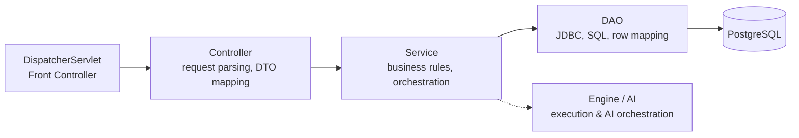
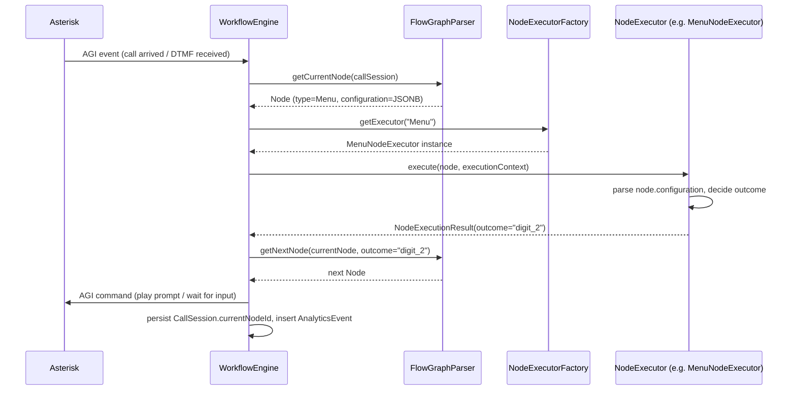
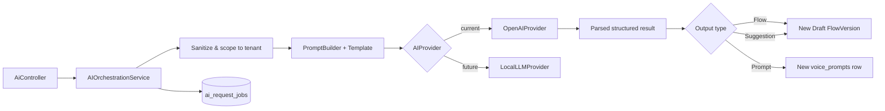
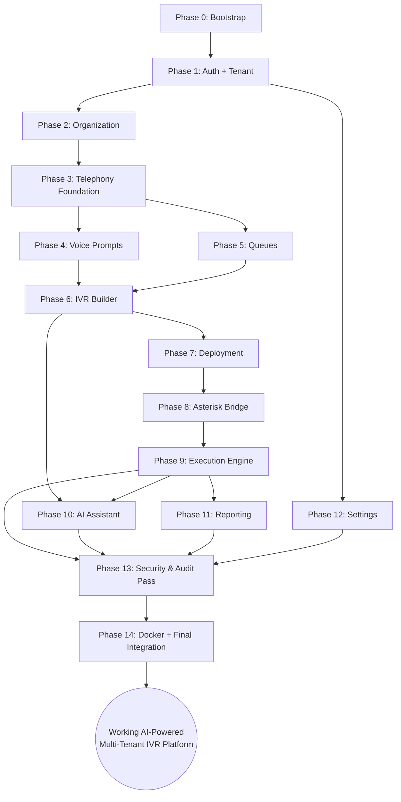

# NexusIVR — Backend Implementation Roadmap
### Core Java · Servlets · JDBC · DAO Pattern — From Zero to a Running AI-Powered IVR Platform

> **Stack confirmation:** this roadmap is built around **Core Java, Servlets, and hand-written JDBC/DAO** — no Spring, no ORM. Every architectural pattern below (dependency injection, routing, validation, exception handling) is something you build yourself, on purpose, because that transparency is the point of doing it this way for a graduation project. This document assumes the SRS, DDD, Logical/Physical Database Design, ERD, System Flow Diagram, and the React+TypeScript frontend (14 pages) already exist and are the source of truth for *what* the system does — this document is about *how* and *in what order* you build the backend that makes it real.

---

## 0. How to Use This Document

This is a planning document, not code. It's organized so you can work through it top to bottom once (Sections 1–5 are the architecture you design *before* writing anything), then use Section 6 (the Phases) as your actual week-by-week execution checklist. Every phase is self-contained: by the end of it, something real works end-to-end and you can demo it, even if the UI behind it is still a placeholder for later phases.

The single rule that should override any local decision you make while implementing: **never let a later phase's needs force you to redesign an earlier phase's contracts.** If Phase 6 (IVR Builder) makes you want to change how Phase 1 (Auth) issues tokens, stop and ask why — it usually means a boundary was drawn in the wrong place.

---

## 1. Backend Architecture Design

### 1.1 Package & Folder Structure

```text
src/main/java/com/nexusivr/
├── bootstrap/
│   ├── AppContextListener.java        # ServletContextListener — composition root, wires everything at startup
│   ├── DataSourceProvider.java        # HikariCP connection pool setup
│   └── ServiceRegistry.java           # holds singleton instances of every Service, resolved by Controllers
│
├── web/
│   ├── DispatcherServlet.java         # the ONE front controller, mapped to /api/*
│   ├── Router.java                    # route table: (HTTP method, path pattern) -> Controller method reference
│   ├── RouteContext.java              # parsed path params, query params, body, authenticated principal
│   └── filters/
│       ├── AuthenticationFilter.java  # verifies JWT, populates RouteContext.principal
│       ├── CorsFilter.java
│       └── RequestLoggingFilter.java
│
├── controller/
│   ├── AuthController.java
│   ├── TenantController.java
│   ├── UserController.java
│   ├── DepartmentController.java
│   ├── EmployeeController.java
│   ├── SipExtensionController.java
│   ├── DidController.java
│   ├── VoicePromptController.java
│   ├── CallQueueController.java
│   ├── IvrFlowController.java
│   ├── FlowVersionController.java
│   ├── DeploymentController.java
│   ├── CallSessionController.java
│   ├── ReportController.java
│   ├── AiController.java
│   ├── AuditLogController.java
│   └── SettingsController.java
│
├── service/
│   ├── AuthenticationService.java
│   ├── AuthorizationService.java
│   ├── TenantService.java
│   ├── UserService.java
│   ├── OrganizationService.java        # departments + employees
│   ├── SipExtensionService.java
│   ├── TelephonyService.java           # trunks + DIDs
│   ├── VoicePromptService.java
│   ├── QueueService.java
│   ├── FlowDesignService.java          # ivr_flows + flow_versions CRUD
│   ├── FlowValidationService.java
│   ├── FlowVersioningService.java
│   ├── DeploymentService.java
│   ├── CallRoutingService.java
│   ├── ExecutionEngineService.java     # see Section 2
│   ├── QueueRoutingService.java
│   ├── RecordingService.java
│   ├── ReportingService.java
│   ├── AnalyticsAggregationService.java
│   ├── AIOrchestrationService.java     # see Section 3
│   └── AuditService.java
│
├── dao/
│   ├── TenantDAO.java
│   ├── UserDAO.java
│   ├── RoleDAO.java
│   ├── DepartmentDAO.java
│   ├── EmployeeDAO.java
│   ├── SipExtensionDAO.java
│   ├── DidDAO.java
│   ├── VoicePromptDAO.java
│   ├── CallQueueDAO.java
│   ├── QueueMembershipDAO.java
│   ├── IvrFlowDAO.java
│   ├── FlowVersionDAO.java
│   ├── NodeDAO.java
│   ├── ConnectionDAO.java
│   ├── DeploymentDAO.java
│   ├── CallSessionDAO.java
│   ├── CallDetailRecordDAO.java
│   ├── AnalyticsEventDAO.java
│   ├── AIRequestJobDAO.java
│   └── AuditLogDAO.java
│
├── model/                              # plain Java objects mirroring DB rows (one per table)
│   ├── Tenant.java
│   ├── User.java
│   ├── FlowVersion.java
│   ├── Node.java
│   ├── CallSession.java
│   └── ... (one per table)
│
├── dto/
│   ├── request/                        # inbound request payload shapes
│   └── response/                       # outbound response payload shapes
│
├── engine/                             # the IVR execution engine — see Section 2
│   ├── NodeExecutor.java               # interface (Strategy)
│   ├── NodeExecutorFactory.java        # Factory Pattern
│   ├── executors/
│   │   ├── GreetingNodeExecutor.java
│   │   ├── MenuNodeExecutor.java
│   │   ├── QueueNodeExecutor.java
│   │   ├── TransferNodeExecutor.java
│   │   ├── BusinessHoursNodeExecutor.java
│   │   ├── PlayAudioNodeExecutor.java
│   │   ├── RecordNodeExecutor.java
│   │   ├── HangupNodeExecutor.java
│   │   ├── HttpRequestNodeExecutor.java
│   │   ├── AiNodeExecutor.java
│   │   ├── ConditionNodeExecutor.java
│   │   ├── DatabaseLookupNodeExecutor.java
│   │   └── WebhookNodeExecutor.java
│   ├── FlowGraphParser.java
│   ├── ExecutionContext.java
│   └── WorkflowEngine.java
│
├── ai/                                  # see Section 3
│   ├── AIProvider.java                  # interface — provider-agnostic
│   ├── providers/
│   │   ├── OpenAIProvider.java
│   │   └── LocalLLMProvider.java        # future
│   ├── PromptBuilder.java
│   ├── templates/
│   │   ├── FlowGenerationTemplate.java
│   │   ├── PromptGenerationTemplate.java
│   │   └── ImprovementSuggestionTemplate.java
│   └── ConversationMemoryStore.java
│
├── security/
│   ├── JwtUtil.java
│   ├── PasswordHasher.java
│   └── Principal.java                   # authenticated user + tenant + roles, carried per-request
│
├── validation/
│   ├── Validator.java                   # base interface
│   └── validators/                      # one per DTO that needs non-trivial validation
│
├── exception/
│   ├── ApplicationException.java        # base
│   ├── ValidationException.java
│   ├── NotFoundException.java
│   ├── UnauthorizedException.java
│   ├── ForbiddenException.java
│   ├── ConflictException.java
│   └── ExceptionMapper.java             # exception type -> HTTP status + ApiResponse
│
├── common/
│   ├── ApiResponse.java                 # { success, data, error, timestamp }
│   ├── PageRequest.java / PageResult.java
│   └── JsonMapper.java                  # thin wrapper over Jackson ObjectMapper
│
└── util/
    ├── UuidUtil.java
    ├── DateTimeUtil.java
    └── SqlHelper.java                   # small helpers for building WHERE tenant_id = ? consistently
```

### 1.2 Naming Conventions

| Element | Convention | Example |
|---|---|---|
| Controllers | `<Resource>Controller` | `IvrFlowController` |
| Services | `<Domain>Service` | `FlowValidationService` |
| DAOs | `<Table>DAO` | `FlowVersionDAO` |
| Models | Singular noun matching table | `FlowVersion` (table `flow_versions`) |
| Request DTOs | `<Action><Resource>Request` | `CreateFlowVersionRequest` |
| Response DTOs | `<Resource>Response` | `FlowVersionResponse` |
| Exceptions | `<Reason>Exception` | `FlowValidationException` |
| Node Executors | `<NodeType>NodeExecutor` | `QueueNodeExecutor` |
| SQL constants | UPPER_SNAKE inside DAO | `SELECT_BY_TENANT_AND_ID` |
| DB columns → Java fields | `snake_case` → `camelCase`, mapped explicitly in DAO row-mapper methods | `tenant_id` → `tenantId` |

### 1.3 Layered Architecture Overview



Each layer only talks to the layer directly below it. A Controller never touches a DAO directly, and a DAO never contains business logic — it only knows how to turn a `Model` into rows and back. This is the same discipline the Physical Database Design already assumes ("child tables should only ever be written through their owning aggregate root's service").

### 1.4 Dependency Injection — Manual Composition Root

With no Spring container, dependency wiring happens explicitly, once, at application startup, inside `AppContextListener` (a `ServletContextListener`):

1. Build the `DataSource` (HikariCP pool) from environment variables.
2. Construct every DAO, passing it the shared `DataSource`.
3. Construct every Service, passing it the DAOs (and other Services) it depends on, via **constructor injection** — the same pattern Spring uses internally, just written by hand.
4. Construct every Controller, passing it the Services it needs.
5. Register every Controller's routes into the `Router`.
6. Store the `Router` in the `ServletContext` so `DispatcherServlet` can retrieve it per-request.

This is called a **Composition Root** pattern: all wiring lives in exactly one place, so adding a new Service or Controller never means hunting through the codebase for where to register it.

### 1.5 Data Access Layer — DAO Pattern over JDBC

- One DAO class per **Aggregate Root** table (matching the Physical Database Design's module boundaries exactly) — never one DAO per every table blindly; child tables of an aggregate (e.g., `nodes`, `connections` under `flow_versions`) are accessed **only** through their owning aggregate's DAO, never given an independent DAO.
- Every DAO method that reads or writes tenant-scoped data takes `tenantId` as an explicit parameter and includes it in the `WHERE` clause — never optional, never inferred silently.
- Use `PreparedStatement` exclusively — never string-concatenated SQL, to eliminate SQL injection risk entirely.
- Each DAO owns a private row-mapping method (`mapRow(ResultSet rs)`) that converts a `ResultSet` row into the corresponding `Model` object — this is the one place column names and Java field names meet.
- Connections are always obtained from the shared pool and released (`try-with-resources`) — never held across a Service call.

### 1.6 Service Layer

Services hold **all** business logic: validation of business rules (not input shape — that's Section 1.9), orchestration across multiple DAOs, and enforcement of aggregate consistency rules from the Logical Database Design (e.g., "only one Draft Flow Version per Flow", "exactly one Active Deployment per DID"). A Service method should read like the business rule it implements, e.g. `FlowVersioningService.publish(flowVersionId)` internally calls `FlowValidationService.validate(...)` first, then `FlowVersionDAO.updateStatus(...)`, then `AuditService.record(...)` — all inside one explicit JDBC transaction (manual `connection.setAutoCommit(false)` / `commit()` / `rollback()` in a try/catch, since there's no `@Transactional` to do it for you).

### 1.7 Presentation Layer — Front Controller Pattern

Rather than one Servlet per resource (which sprawls fast) or one Servlet per action (explicitly rejected for IVR nodes, and a bad idea everywhere else too), NexusIVR uses **one Servlet total**: `DispatcherServlet`, mapped to `/api/*`.

- At startup, every `Controller` registers its routes into the `Router`: a table of `(HTTP method, path pattern) → handler method reference`, e.g. `POST /api/ivr-flows/{flowId}/versions/{versionId}/publish → FlowVersionController::publish`.
- On every request, `DispatcherServlet` asks the `Router` to match the incoming method+path, extracts path parameters (`{flowId}`, `{versionId}`) into a `RouteContext`, and invokes the matched handler.
- The handler (a plain method on a `Controller` class) parses the request body into a request DTO, calls the appropriate Service, and returns a response DTO wrapped in `ApiResponse`.

This gives you Spring-MVC-like routing ergonomics without a framework, and it means adding a new endpoint is "add a method + register a route," never "add a new `web.xml` entry."

### 1.8 Exception Handling & Global Response Envelope

Every response — success or failure — is wrapped in the same `ApiResponse<T>` envelope:

```text
{ "success": true|false, "data": <T|null>, "error": { "code", "message" } | null, "timestamp": "..." }
```

`DispatcherServlet` wraps every route invocation in a single try/catch. Custom exceptions carry their own HTTP status mapping via `ExceptionMapper`:

| Exception | HTTP Status | When thrown |
|---|---|---|
| `ValidationException` | 400 | Request payload fails DTO validation |
| `UnauthorizedException` | 401 | Missing/invalid JWT |
| `ForbiddenException` | 403 | Valid JWT, insufficient permission |
| `NotFoundException` | 404 | Entity doesn't exist / not in caller's tenant |
| `ConflictException` | 409 | Business rule violation (e.g., publishing a Flow Version that's already Published) |
| Anything unexpected | 500 | Logged with full stack trace, response body never leaks internals |

This single try/catch in `DispatcherServlet` is your hand-written equivalent of Spring's `@ControllerAdvice` — it's the one place exception-to-HTTP-status mapping lives.

### 1.9 Validation Strategy

Two distinct kinds of validation, kept deliberately separate:

1. **Shape/input validation** (is the JSON well-formed, are required fields present, are types correct, are strings within length limits) — done by a `Validator` implementation per request DTO, invoked at the very start of the Controller method, before any Service is called. Throws `ValidationException` on failure.
2. **Business rule validation** (is this Flow graph structurally valid, does this Employee already have an active Extension) — done inside the Service layer, because it requires database state, not just the shape of the incoming request.

### 1.10 Logging Strategy

Use SLF4J + Logback (framework-agnostic, works identically with or without Spring). `RequestLoggingFilter` logs method, path, tenant ID, and duration for every request. Every Service logs at `INFO` for state-changing operations and `WARN`/`ERROR` for failures, always including `tenantId` and, where relevant, `callSessionId` as structured fields — this is what makes production debugging in a multi-tenant system tractable.

### 1.11 JWT Security Design

- `AuthenticationService.login()` verifies credentials and issues a signed JWT (via `JwtUtil`, backed by a library such as `java-jwt`) containing `userId`, `tenantId`, and role codes as claims, with a short expiry.
- `AuthenticationFilter` (a `javax.servlet.Filter` registered on `/api/*`, excluding `/api/auth/login`) verifies the token's signature and expiry on every request, and — if valid — populates a `Principal` object attached to the `RouteContext`, so every downstream Controller/Service knows *who* is calling and *which tenant* they belong to without re-parsing the token.
- No server-side session state is required for validation itself (JWT is stateless), but the `sessions` table still exists to support explicit logout/revocation checks.

### 1.12 Role-Based Access Control Design

`AuthorizationService.requirePermission(principal, permissionCode)` is called explicitly at the start of every Controller method that mutates data (and many that read it). It loads the caller's roles → permissions (via `RoleDAO`/`role_permissions`) and throws `ForbiddenException` if the required permission isn't present. This check is **never** left to the frontend — every protected action is re-checked server-side, exactly as required by the DDD's Access Control business rules.

### 1.13 Tenant Isolation Design

Enforced at three layers, matching the Physical Database Design exactly:

1. **DAO layer** — every tenant-scoped query requires `tenantId` as a parameter; there is no DAO method that queries "all rows" without it.
2. **Controller layer** — `tenantId` used in a query is *always* taken from the authenticated `Principal` (derived from the JWT), **never** from a request body or query parameter — this is the single most important rule in the entire backend, because it's what prevents a malicious or buggy client from ever requesting another tenant's data.
3. **Database layer** — PostgreSQL Row-Level Security as the final backstop, in case a DAO method is ever written incorrectly.

---

## 2. IVR Execution Engine Architecture

This is the most architecturally important part of the backend, and the part explicitly designed to avoid "one Controller/Servlet per node type."

### 2.1 Core Components

| Component | Responsibility |
|---|---|
| **`FlowGraphParser`** | Loads a `FlowVersion`'s `nodes` and `connections` rows from the DAOs and assembles them into an in-memory graph structure (`Map<nodeId, Node>` + adjacency via connections), done once per call and cached, since a Published Flow Version is immutable. |
| **`ExecutionContext`** | A per-call, mutable object carrying the current `CallSession`, the current `Node`, variables collected during execution (e.g., DTMF input, API responses), and a handle to the Asterisk channel for issuing call-control commands. |
| **`NodeExecutor`** (interface) | The **Strategy Pattern** contract: `NodeExecutionResult execute(Node node, ExecutionContext context)`. One implementation per node type. |
| **`NodeExecutorFactory`** | The **Factory Pattern**: given a `Node`'s `nodeType`, returns the correct `NodeExecutor` implementation. Internally just a `Map<String, NodeExecutor>` populated at startup — adding a new node type never means touching the factory's logic, only registering one more entry. |
| **`WorkflowEngine`** | The orchestrator: given a `CallSession`, repeatedly asks `NodeExecutorFactory` for the executor matching the current node, calls `execute()`, inspects the result to determine the next node (via `FlowGraphParser`'s connection lookup), updates `CallSession.currentNodeId`, and logs an `AnalyticsEvent` — until a terminal result (Hangup, error with no fallback, or Queue/Transfer handoff) is reached. |

### 2.2 How Nodes Are Executed



### 2.3 How Connections Are Followed

Each `Connection` row has `source_node_id`, `target_node_id`, and an optional `condition_label`. After a `NodeExecutor` returns a result, `WorkflowEngine` asks `FlowGraphParser` for the connection whose `source_node_id` matches the current node **and** whose `condition_label` matches the result's outcome (e.g., `"2"` for a menu digit, or `"success"`/`"failure"` for an API Request node). If no matching connection exists, the engine follows the node's configured **fallback path** rather than terminating the call — this is a hard requirement carried over from the DDD's Execution & Telephony business rules.

### 2.4 How JSON Configuration Is Parsed

`Node.configuration` is stored as JSONB and loaded as a raw `String`/`JsonNode` by `NodeDAO`. Each `NodeExecutor` is solely responsible for interpreting its own node type's configuration shape — `MenuNodeExecutor` knows how to read a digit map, `HttpRequestNodeExecutor` knows how to read an endpoint/method/timeout, and so on. **No shared code ever assumes a particular configuration shape** — this isolation is exactly why adding a new node type never requires touching existing executors.

### 2.5 How New Node Types Are Added Later

1. Add the new code to the `lkp_node_type` lookup table (no migration).
2. Write one new class implementing `NodeExecutor` (e.g., `WebhookNodeExecutor`).
3. Register it in `NodeExecutorFactory`'s startup map: `factory.register("Webhook", new WebhookNodeExecutor(...))`.
4. Done. No changes to `WorkflowEngine`, `FlowGraphParser`, `DispatcherServlet`, or any other executor.

This is the entire value of Factory + Strategy here: **the engine's core loop never changes, no matter how many node types exist.**

---

## 3. AI Layer Architecture

### 3.1 Core Components

| Component | Responsibility |
|---|---|
| **`AIProvider`** (interface) | Provider-agnostic contract: `generateText(prompt)`, `generateSpeech(text, locale)`. |
| **`OpenAIProvider`** | Current implementation, wraps OpenAI's REST API. |
| **`LocalLLMProvider`** | Future implementation (e.g., wrapping a self-hosted model) — swappable with zero change to any Service that depends on `AIProvider`. |
| **`PromptBuilder`** | Assembles the final prompt sent to the provider, combining a `PromptTemplate` with runtime context (tenant industry type, prior conversation turns, sanitized analytics data). |
| **Prompt Templates** | `FlowGenerationTemplate`, `PromptGenerationTemplate`, `ImprovementSuggestionTemplate` — versioned, reviewable text templates, kept separate from code so they can be tuned without a redeploy. |
| **`ConversationMemoryStore`** | Persists AI Assistant conversation turns (backed by `ai_request_jobs`, extended conceptually as a conversation log) so multi-turn refinement is possible. |
| **`AIOrchestrationService`** | The single entry point every AI-facing Controller calls; owns sanitization, provider selection, job tracking, and error handling. |

### 3.2 Design Flow



### 3.3 Error Handling

Every provider call is wrapped with explicit timeout and retry-with-backoff handling inside `AIOrchestrationService`; failures update the `ai_request_jobs.status_code` to `Failed` with a captured error reason rather than throwing all the way back to the Controller as a generic 500 — an AI failure should never look like a platform failure to the frontend.

### 3.4 Token Usage & Caching

Every provider response includes usage metadata (tokens or audio duration), persisted into `ai_request_jobs.tokens_or_cost_used` for later billing aggregation (`usage_records`). Identical, recent prompt+context combinations (e.g., re-requesting the same improvement suggestion before any new data has arrived) are short-circuited by a small in-memory cache keyed on a hash of the prompt, to avoid redundant provider cost — with a conservative TTL, since analytics data changes constantly.

### 3.5 The One Rule That Never Bends

`AIOrchestrationService` **never** calls `FlowVersionDAO.publish()` or any equivalent "make it live" operation. Every AI output lands as a `Draft` — same as manually-created content — full stop.

---

## 4. REST API Implementation Order (and Why)

Building APIs in dependency order — not frontend-page order — is what prevents you from hitting a wall halfway through where the next page you want to wire up needs data that literally cannot exist yet.

| Order | Module | Why it comes here |
|---|---|---|
| 1 | **Authentication** | Everything else requires a `Principal` to exist; there is no tenant-scoped endpoint that can be built or tested before login works. |
| 2 | **Companies (Tenants)** | Every other table has a `tenant_id` foreign key — you cannot create a User, a Queue, or a Flow without a Tenant to attach it to. |
| 3 | **Users & Roles** | Needed immediately after Tenants because Authentication itself depends on `users`/`roles`/`role_permissions` existing and being manageable. |
| 4 | **Departments & Employees** | Needed before SIP Extensions (an Extension is assigned to an Employee) and before Queues (Queue membership is by Employee). |
| 5 | **Phone Numbers (DIDs) & SIP Extensions** | Needed before the IVR Builder becomes meaningful — a Flow is pointless until there's a number to deploy it to and an extension to transfer calls to. |
| 6 | **Voice Prompts** | Needed before IVR nodes can reference real audio (Greeting/Playback nodes need a prompt to select). |
| 7 | **Queues** | Needed before IVR nodes can reference a real Queue target. |
| 8 | **IVR Builder (Flows, Versions, Nodes, Connections, Validation, Publishing)** | Can only be meaningfully built once everything it *references* (Prompts, Queues, Extensions) already exists and has real IDs to point to. |
| 9 | **Deployment** | Depends on both a Published Flow Version and a DID existing. |
| 10 | **Call Execution Engine + Call Sessions** | The single most complex module — deliberately built *after* every static configuration piece it depends on (Flow, Deployment, Queue, Prompt) is already solid and tested. |
| 11 | **AI Assistant** | Depends on the IVR Builder already existing, since AI output *is* Draft Flow Versions and Voice Prompts — there's nothing for AI to produce until those data shapes exist. |
| 12 | **Call Monitoring & Call History (CDRs)** | Depends on the Execution Engine actually producing real `call_sessions`/`call_detail_records` rows to display. |
| 13 | **Reports & Analytics** | Depends on there being real historical call data to aggregate — building this earlier just means staring at empty charts. |
| 14 | **Settings** | Deliberately last among "real" modules — it's config for things (retention, branding) that only matter once everything else is running. |
| — | **Audit Logging** | *Cross-cutting, not sequential* — the logging hook (`AuditService.record(...)`) should be wired into every Service as it's built in Phases 1–14, not bolted on afterward. Treat it as part of the Definition of Done for every phase, not a phase of its own. |

---

## 5. Per-Module Breakdown

| Module | APIs to Implement | Frontend Pages Unblocked | Exit Criteria Before Moving On |
|---|---|---|---|
| **Authentication** | login, logout, refresh, me | Login | Token issuance/verification works; `Principal` correctly populated on every subsequent request |
| **Companies (Tenants)** | create, list, approve, suspend, get settings | Super Admin Dashboard, Company Management | Tenant lifecycle transitions (Pending→Active→Suspended) enforced server-side |
| **Users & Roles** | CRUD users, assign roles, list roles/permissions | User Management, Tenant Dashboard | RBAC checks provably block an under-permissioned user in a manual test |
| **Departments & Employees** | CRUD departments, CRUD employees, assign departments | (supports User Management, Queue Management) | Employee status transitions (Available/Busy/Offline) working |
| **Phone Numbers & SIP Extensions** | CRUD DIDs, CRUD extensions, assign extension to employee | Phone Numbers, SIP Extensions | Extension uniqueness-per-tenant enforced; DID uniqueness platform-wide enforced |
| **Voice Prompts** | upload, list, archive | Voice Prompt Management | Upload + metadata persistence works (AI generation deferred to Phase 9) |
| **Queues** | CRUD queues, manage membership | Queue Management | Membership priority ordering retrievable correctly |
| **IVR Builder** | CRUD flows, CRUD versions, CRUD nodes/connections, validate, publish | IVR Builder | A hand-built flow can pass validation and reach `Published` status |
| **Deployment** | deploy version to DID, rollback, list history | (supports IVR Builder, Live Call Monitoring) | Exactly one Active Deployment per DID enforced |
| **Execution Engine + Call Sessions** | (internal — triggered by Asterisk, exposed read-only via Call Sessions API) | Live Call Monitoring | A real or simulated call completes a full flow from entry node to hangup |
| **AI Assistant** | generate-flow, generate-prompt, improve-flow, conversation history | AI Assistant | Generated output appears as a real Draft Flow Version reviewable in the IVR Builder |
| **Call History** | list/search CDRs, fetch recording reference | Call History | CDR uniquely and correctly generated per completed call session |
| **Reports** | generate report, list reports | Reports | At least one report type (Call Volume) produces correct aggregated numbers against seeded data |
| **Settings** | get/update tenant settings | Settings | Timezone/branding/retention changes persist and are respected elsewhere (e.g., retention purge job) |
| **Audit Logs** | list/search audit entries | (supports Settings/Admin views) | Every mutating endpoint built so far has at least one corresponding audit entry on test |

---

## 6. Implementation Roadmap — Phases

Each phase below assumes the previous phase's **Expected Output** is fully working before starting.

<details>
<summary><b>Phase 0 — Project Bootstrap & Infrastructure</b></summary>

**Goal:** A running, empty backend that connects to PostgreSQL, has working global routing/exception handling/logging, and is Dockerized — before any real feature exists.

**Modules:** `bootstrap`, `web`, `common`, `exception`, `security` (skeleton only)

**Classes:** `AppContextListener`, `DataSourceProvider`, `ServiceRegistry`, `DispatcherServlet`, `Router`, `RouteContext`, `ApiResponse`, `ExceptionMapper`, base exception classes

**Controllers:** one placeholder `HealthController` (`GET /api/health`)

**Services:** none yet

**Repositories (DAOs):** none yet

**Database Tables:** none yet (schema already exists from prior work — this phase just proves connectivity)

**DTOs:** `ApiResponse<T>`

**Validation:** N/A this phase

**Security:** none yet — this phase is intentionally open

**Testing:** manual `curl`/Postman hit on `/api/health` returns `{ success: true }`; verify DB connectivity via a trivial `SELECT 1`

**Expected Output:** `docker compose up` brings up backend + PostgreSQL; health endpoint responds; logs show structured request logging

**Dependencies:** HikariCP, SLF4J+Logback, Jackson, a Servlet container (Tomcat)

**Best Practices:** get logging and the exception envelope right *now* — retrofitting them after 10 controllers exist is painful and error-prone

</details>

<details>
<summary><b>Phase 1 — Authentication & Tenant Foundation</b></summary>

**Goal:** Login works, JWTs are issued and verified, tenants and users can be created and managed, and every subsequent request carries a correctly-scoped `Principal`.

**Modules:** `security`, tenant, identity

**Classes:** `JwtUtil`, `PasswordHasher`, `Principal`, `AuthenticationFilter`

**Controllers:** `AuthController`, `TenantController`, `UserController`

**Services:** `AuthenticationService`, `AuthorizationService`, `TenantService`, `UserService`

**Repositories:** `TenantDAO`, `SubscriptionDAO`, `UserDAO`, `RoleDAO`, `UserRoleDAO`, `RolePermissionDAO`, `SessionDAO`

**Database Tables:** `tenants`, `subscriptions`, `users`, `roles`, `permissions`, `role_permissions`, `user_roles`, `sessions`

**DTOs:** `LoginRequest`/`LoginResponse`, `CreateTenantRequest`, `CreateUserRequest`, `UserResponse`

**Validation:** email format, password strength, required fields on tenant registration

**Security:** password hashing (Argon2id/bcrypt), JWT issuance/verification, `AuthenticationFilter` wired to `/api/*`

**Testing:** unit tests for `JwtUtil` (issue/verify/expiry), integration test for full login→authenticated-request cycle; negative tests for wrong password, expired token, cross-tenant access attempt

**Expected Output:** Login page fully functional end-to-end; Super Admin can approve a pending tenant; Tenant Admin can log in and see only their own tenant's data

**Dependencies:** Phase 0

**Best Practices:** write the cross-tenant-access negative test *first* — it's the test that should never be allowed to go red again for the rest of the project

</details>

<details>
<summary><b>Phase 2 — Organization Management</b></summary>

**Goal:** Departments, employees, and their relationships are manageable.

**Modules:** organization

**Controllers:** `DepartmentController`, `EmployeeController`

**Services:** `OrganizationService`

**Repositories:** `DepartmentDAO`, `EmployeeDAO`, `EmployeeDepartmentDAO`, `EmployeeSkillDAO`

**Database Tables:** `departments`, `employees`, `employee_departments`, `employee_skills`, `lkp_skill`

**DTOs:** `CreateDepartmentRequest`, `CreateEmployeeRequest`, `EmployeeResponse`

**Validation:** department name uniqueness per tenant, employee status enum against `lkp_employee_status`

**Security:** RBAC checks (only Tenant Admin/Manager can manage org structure)

**Testing:** department archival correctly blocked while active employees/queues exist (business rule from the Logical Design)

**Expected Output:** User Management and org-structure screens fully functional against real data

**Dependencies:** Phase 1

**Best Practices:** implement the "cannot archive department with active employees" rule as an explicit Service-layer check with a clear `ConflictException` message — don't rely on a database constraint alone to surface this to the user meaningfully

</details>

<details>
<summary><b>Phase 3 — Telephony Foundation (Phone Numbers & SIP Extensions)</b></summary>

**Goal:** DIDs and SIP Extensions exist and are assignable — purely administrative, no live calls yet.

**Controllers:** `DidController`, `SipExtensionController`, `SipTrunkController`

**Services:** `TelephonyService`, `SipExtensionService`

**Repositories:** `SipTrunkDAO`, `DidDAO`, `SipExtensionDAO`

**Database Tables:** `sip_trunks`, `dids`, `sip_extensions`

**DTOs:** `CreateDidRequest`, `CreateExtensionRequest`, `ExtensionResponse`

**Validation:** E.164 phone number format, extension number uniqueness per tenant

**Security:** RBAC — extension credential fields never returned in plaintext in any response DTO

**Testing:** uniqueness constraints correctly rejected with `ConflictException`, not a raw DB error

**Expected Output:** Phone Numbers and SIP Extensions pages fully functional

**Dependencies:** Phase 2 (extensions assign to employees)

**Best Practices:** never let `sip_secret_hash` leave the DAO layer in any response object — build the response DTO explicitly field-by-field, never by reflecting the model

</details>

<details>
<summary><b>Phase 4 — Voice Prompt Management (Manual Upload Only)</b></summary>

**Goal:** Prompts can be uploaded and managed; AI generation is deferred to Phase 9.

**Controllers:** `VoicePromptController`

**Services:** `VoicePromptService`

**Repositories:** `VoicePromptDAO`

**Database Tables:** `voice_prompts`

**DTOs:** `UploadPromptRequest`, `PromptResponse`

**Validation:** audio format/size limits, locale code validity

**Security:** tenant-partitioned blob storage access control

**Testing:** confirm the DB stores only the file reference, never the audio bytes

**Expected Output:** Voice Prompt Management page functional for manual uploads

**Dependencies:** Phase 1

**Best Practices:** design the blob storage reference format now in a provider-agnostic way, so swapping storage backends later doesn't touch the schema

</details>

<details>
<summary><b>Phase 5 — Queue Management</b></summary>

**Goal:** Queues and membership are fully manageable.

**Controllers:** `CallQueueController`

**Services:** `QueueService`

**Repositories:** `CallQueueDAO`, `QueueMembershipDAO`

**Database Tables:** `call_queues`, `queue_memberships`

**DTOs:** `CreateQueueRequest`, `AddMemberRequest`, `QueueResponse`

**Validation:** strategy code against `lkp_queue_strategy`, max wait seconds > 0

**Security:** RBAC for queue configuration vs. queue membership self-view (Agent sees their own membership only)

**Testing:** membership uniqueness per (queue, employee) pair enforced

**Expected Output:** Queue Management page fully functional

**Dependencies:** Phase 2 (employees), Phase 1

**Best Practices:** build `QueueRoutingService`'s selection logic (Round Robin / Longest Idle / Skills-Based) as pure, independently unit-testable functions now, even though it won't be exercised by a real call until Phase 10

</details>

<details>
<summary><b>Phase 6 — IVR Builder Backend (Design-Time Only)</b></summary>

**Goal:** Flows, versions, nodes, and connections can be authored, validated, and published — with zero execution capability yet. This is the largest CRUD-heavy phase before the engine itself.

**Controllers:** `IvrFlowController`, `FlowVersionController`

**Services:** `FlowDesignService`, `FlowValidationService`, `FlowVersioningService`

**Repositories:** `IvrFlowDAO`, `FlowVersionDAO`, `NodeDAO`, `ConnectionDAO`

**Database Tables:** `ivr_flows`, `flow_versions`, `nodes`, `connections`, `lkp_node_type`, `lkp_flow_status`, `lkp_version_status`

**DTOs:** `CreateFlowRequest`, `SaveDraftRequest` (full node+connection graph in one payload, matching how the frontend Builder saves), `ValidationResultResponse`, `FlowVersionResponse`

**Validation:** graph-shape validation (single entry node, no orphan nodes, no dangling connections) — this is genuine business logic, lives in `FlowValidationService`, not a simple DTO validator

**Security:** only Tenant Admin can publish (a lower-privilege role might be allowed to edit drafts, per your RBAC design)

**Testing:** validation correctly rejects a flow missing an entry node, a flow with a dangling connection, and a flow with two nodes both marked entry; "only one Draft per Flow" constraint verified

**Expected Output:** IVR Builder page fully functional for authoring — a hand-built flow can be saved as Draft and published to `Published` status, entirely independent of any live call

**Dependencies:** Phases 3, 4, 5 (nodes reference real Extensions, Prompts, Queues)

**Best Practices:** this is the phase to get `FlowGraphParser` right, since the Execution Engine in Phase 10 depends entirely on it — write it once, well-tested, here

</details>

<details>
<summary><b>Phase 7 — Deployment</b></summary>

**Goal:** A Published Flow Version can be deployed to a DID, with rollback support.

**Controllers:** `DeploymentController`

**Services:** `DeploymentService`

**Repositories:** `DeploymentDAO`, `DeploymentEnvironmentDAO`

**Database Tables:** `deployments`, `deployment_environments`

**DTOs:** `DeployRequest`, `DeploymentResponse`

**Validation:** target Flow Version must be `Published`; target DID must belong to the same tenant

**Security:** RBAC — deployment to Production requires elevated permission vs. Sandbox

**Testing:** "exactly one Active Deployment per DID" constraint verified under concurrent deploy attempts

**Expected Output:** Admin can deploy a Flow Version to a real (or test) DID and see deployment history/rollback working

**Dependencies:** Phase 6

**Best Practices:** implement supersede-and-activate as a single explicit transaction (mark old Superseded, insert new Active) — never as two separate calls

</details>

<details>
<summary><b>Phase 8 — Asterisk Integration Bridge</b></summary>

**Goal:** The backend can actually talk to Asterisk — this phase can run partly in parallel with Phase 6/7 if you have telephony expertise on hand, but functionally must land before Phase 9.

**Modules:** a new `telephony/asterisk` package (AGI socket handling, ARI client)

**Classes:** `AgiServer` (listens for Asterisk AGI connections), `AsteriskCommandSender`, `AriEventListener`

**Testing:** a manual test call reaches the AGI server and a "hello world" prompt plays

**Expected Output:** Asterisk successfully hands off an inbound call to the backend and can play a single hard-coded prompt back

**Dependencies:** a working Asterisk instance with a Dialplan pointing at the AGI server

**Best Practices:** keep this integration layer thin and isolated — it should translate AGI/ARI events into calls on `WorkflowEngine`, and translate `WorkflowEngine` decisions into AGI/ARI commands, with no business logic living here at all

</details>

<details>
<summary><b>Phase 9 — IVR Execution Engine</b></summary>

**Goal:** A real call can be routed through a Published, Deployed Flow Version from entry node to hangup.

**Modules:** `engine` (full package from Section 2)

**Classes:** `FlowGraphParser`, `ExecutionContext`, `NodeExecutor` + all node-type implementations, `NodeExecutorFactory`, `WorkflowEngine`

**Controllers:** `CallSessionController` (read-only — this module is triggered internally, not via a client-facing write API)

**Services:** `CallRoutingService`, `ExecutionEngineService`, `QueueRoutingService`, `RecordingService`

**Repositories:** `CallSessionDAO`, `CallDetailRecordDAO`, `AnalyticsEventDAO`, `RecordingDAO`, `VoicemailDAO`, `ConsentRecordDAO`

**Database Tables:** `call_sessions`, `call_detail_records`, `analytics_events`, `recordings`, `voicemails`, `consent_records`

**DTOs:** `CallSessionResponse`, `CallDetailRecordResponse`

**Validation:** N/A (this module is internally triggered, not client-input-driven)

**Security:** call data is tenant-scoped exactly like everything else; recordings access is itself audit-logged

**Testing:** this is the phase that most needs integration testing — simulate a full call (DID hit → Menu → Queue → Agent, and separately DID hit → Menu → Voicemail) and assert the resulting `call_sessions`, `call_detail_records`, and `analytics_events` rows are exactly right

**Expected Output:** Live Call Monitoring shows a real, in-progress call; Call History shows a completed one with an accurate CDR

**Dependencies:** Phases 6, 7, 8

**Best Practices:** build one `NodeExecutor` (e.g., `GreetingNodeExecutor`) fully end-to-end first, prove the whole loop works with just that one type, *then* add the rest — don't try to build all 14 executors before testing the loop once

</details>

<details>
<summary><b>Phase 10 — AI Assistant</b></summary>

**Goal:** AI-generated flows, prompts, and improvement suggestions work end-to-end as reviewable Drafts.

**Modules:** `ai` (full package from Section 3)

**Controllers:** `AiController`

**Services:** `AIOrchestrationService`

**Repositories:** `AIRequestJobDAO`

**Database Tables:** `ai_request_jobs`

**DTOs:** `GenerateFlowRequest`, `GeneratePromptRequest`, `AIJobResponse`

**Validation:** prompt/description length limits, rate limiting per tenant

**Security:** verify no PII/raw call data ever crosses into a provider request — write an explicit sanitization test for this

**Testing:** mock the `AIProvider` interface in tests so CI doesn't depend on a live OpenAI call; assert generated output always lands as `Draft`, never auto-published

**Expected Output:** AI Assistant page fully functional; a generated flow appears in the IVR Builder as a new Draft Version ready for human review

**Dependencies:** Phase 6 (AI output *is* a Flow Version), Phase 4 (AI-generated prompts)

**Best Practices:** build `AIProvider` as an interface and `OpenAIProvider` as its only implementation from day one, even though a second provider isn't coming soon — retrofitting an abstraction after every Service calls OpenAI directly is much more painful

</details>

<details>
<summary><b>Phase 11 — Reporting & Analytics</b></summary>

**Goal:** Real reports over real historical call data.

**Controllers:** `ReportController`

**Services:** `ReportingService`, `AnalyticsAggregationService`

**Repositories:** `ReportDAO`

**Database Tables:** `reports`

**DTOs:** `GenerateReportRequest`, `ReportResponse`

**Validation:** date range sanity checks

**Security:** report data never spans more than one tenant (enforced at the query level, tested explicitly)

**Testing:** seed known CDR data, assert a Call Volume report produces the exact expected numbers

**Expected Output:** Reports page fully functional against real data

**Dependencies:** Phase 9 (needs real CDRs/analytics events to aggregate)

**Best Practices:** snapshot report output at generation time (`reports.snapshot_data`) rather than recomputing live every time it's viewed — matches the Logical Design's explicit rule that a report reflects state at generation time

</details>

<details>
<summary><b>Phase 12 — Settings & Tenant Configuration</b></summary>

**Goal:** Tenant-level configuration is manageable and actually respected elsewhere in the system.

**Controllers:** `SettingsController`

**Services:** extend `TenantService`

**Database Tables:** (columns on `tenants`, plus `deployment_environments`)

**Testing:** changing retention policy is verified to actually affect the retention purge job's behavior, not just persist inertly

**Expected Output:** Settings page fully functional

**Dependencies:** Phase 1

</details>

<details>
<summary><b>Phase 13 — Security Hardening, Full Audit Coverage, and Testing Pass</b></summary>

**Goal:** Close every gap left "for later" in earlier phases.

**Focus areas:** confirm every mutating Service call across all 12 prior phases has a corresponding `AuditService.record(...)` call; run a full RBAC matrix test (every role × every endpoint); load-test the Execution Engine and Call Session write path specifically; confirm Row-Level Security policies are active and correctly configured for every tenant-scoped table.

**Expected Output:** a security/audit checklist with every item checked, not just claimed

**Dependencies:** all prior phases

</details>

<details>
<summary><b>Phase 14 — Dockerization, Deployment & Final Integration</b></summary>

**Goal:** The entire system — frontend, backend, PostgreSQL, Asterisk — runs from a single `docker compose up`, and the full journey (login → build a flow → deploy it → make a call → see it in history and reports) works without manual intervention.

**Expected Output:** a working, demoable, graduation-ready system

**Dependencies:** all prior phases

</details>

---

## 7. Backend Milestones & Weekly Plan

Assuming a solo or small-team graduation project pace (part-time alongside other coursework), here is a realistic **16-week** plan. Compress or stretch proportionally based on your actual available hours.

| Week | Phase(s) | Milestone |
|---|---|---|
| 1 | Phase 0 | Backend boots, connects to DB, health check passes, Dockerized |
| 2 | Phase 1 | Login works end-to-end; tenant approval flow works |
| 3 | Phase 2 | Departments & Employees fully manageable |
| 4 | Phase 3 | Phone Numbers & SIP Extensions fully manageable |
| 5 | Phase 4 + 5 | Voice Prompts (manual) and Queues fully manageable |
| 6–7 | Phase 6 | IVR Builder backend complete — flows authored, validated, published |
| 8 | Phase 7 | Deployment working, including rollback |
| 9 | Phase 8 | Asterisk bridge — a real "hello world" call works |
| 10–11 | Phase 9 | Execution Engine — first one node type end-to-end, then all node types |
| 12 | Phase 9 (cont.) | Full call journey (Menu → Queue → Agent, and → Voicemail) working |
| 13 | Phase 10 | AI Assistant working end-to-end |
| 14 | Phase 11 | Reports working against real data |
| 15 | Phase 12 + 13 | Settings finished; security/audit pass complete |
| 16 | Phase 14 | Full Docker Compose integration; final demo rehearsal |

---

## 8. Development Priority, Difficulty & Time Estimates

| Module | Priority | Difficulty | Est. Time |
|---|---|---|---|
| Bootstrap/Infrastructure | Critical | Low | 3–5 days |
| Authentication & JWT | Critical | Medium | 4–6 days |
| Tenant & User Management | Critical | Low–Medium | 4–6 days |
| Organization (Dept/Employee) | High | Low | 3–4 days |
| Phone Numbers & Extensions | High | Low–Medium | 3–5 days |
| Voice Prompts (manual) | Medium | Low | 2–3 days |
| Queue Management | High | Medium | 4–5 days |
| IVR Builder (design-time) | Critical | High | 8–12 days |
| Deployment | High | Medium | 3–4 days |
| Asterisk Bridge | Critical | High (domain-specific) | 6–10 days |
| Execution Engine | Critical | Very High | 12–18 days |
| AI Assistant | High | Medium–High | 6–8 days |
| Reporting & Analytics | Medium | Medium | 4–6 days |
| Settings | Low | Low | 1–2 days |
| Security/Audit Hardening Pass | Critical | Medium | 4–6 days |
| Dockerization & Final Integration | Critical | Medium | 4–6 days |

The **Execution Engine** and **IVR Builder** together are roughly 40% of total backend effort — budget accordingly and don't let earlier "easy" modules eat time meant for them.

---

## 9. Final End-to-End Roadmap Summary



**Start:** an empty Core Java project with a `pom.xml`/`build.gradle`, no database connection, no routes.

**End:** `docker compose up` brings up PostgreSQL (schema pre-loaded from your existing Physical Database Design), a Servlet-container-hosted backend serving every API the 14 existing frontend pages need, Asterisk routing real calls through Published IVR flows, and an AI Assistant generating real, human-reviewable draft flows — the complete platform described in your SRS, running, demoable, and defensible in front of a graduation committee.
