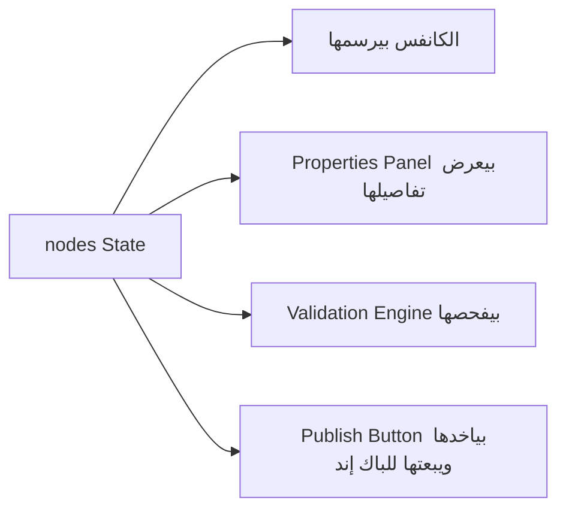
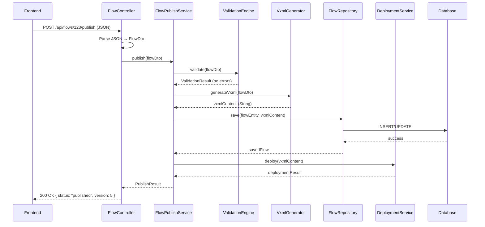
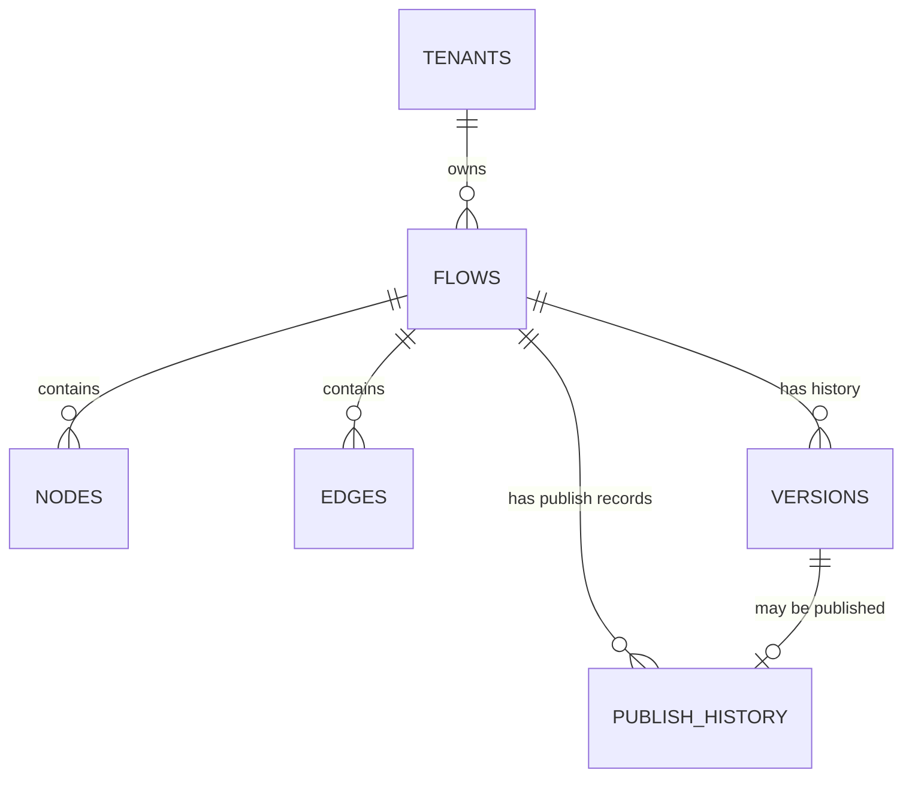

# 🎓 NexusIVR — دليل تعليمي كامل لبناء الـ Backend من الصفر

> الدليل ده معمول عشانك إنت بالذات، يا مهندس الـ Backend الجديد في مشروع NexusIVR. الفرونت إند خلص، وإنت دلوقتي قدام تحدي إنك تبني الـ Backend اللي هيوصل كل حاجة ببعض. هنشرح كل حاجة من الصفر: إزاي الفرونت والباك بيتكلموا، إزاي الـ JSON بيتصمم، إزاي بتحوّل الفلو لـ VXML، وإزاي تبني الـ Architecture بطريقة احترافية. خد وقتك وانت بتقرا، وده مش مقال هتقراه مرة وخلاص — ده مرجع هترجعله كل ما تتوه.

---

## 📑 جدول المحتويات

1. إزاي الفرونت إند والباك إند بيتكلموا مع بعض
2. إيه اللي فعليًا موجود جوه تطبيق الـ React
3. الـ JSON — أهم فصل في الدليل ده
4. إزاي تصمم الـ JSON بنفسك
5. الـ API Contract
6. إيه اللي بيحصل بعد ما تدوس Publish
7. Backend Architecture
8. إزاي الـ Backend بيقرا الـ JSON
9. الـ Validation
10. VXML Generator
11. تصميم الداتابيز
12. خارطة الطريق (Roadmap)
13. إزاي الشركات فعليًا بتبني أنظمة زي دي
14. Best Practices
15. الخلاصة النهائية — رحلة كاملة End-to-End

---

## 1. إزاي الفرونت إند والباك إند بيتكلموا مع بعض

### 1.1 الفكرة الأساسية ببساطة شديدة

تخيل معايا إنك في مطعم. إنت (Frontend) بتقعد على الترابيزة وبتطلب أكل من الجرسون. الجرسون (API) بياخد طلبك ويوديه للمطبخ (Backend). المطبخ بيجهز الأكل (Processing) وبيرجعه للجرسون، والجرسون بيرجعلك بيه على الترابيزة.

- إنت (الفرونت إند) **متعرفش** إيه اللي بيحصل جوه المطبخ بالظبط.
- المطبخ (الباك إند) **متعرفش** إنت قاعد فين بالظبط في الصالة، هو بس بياخد الطلب ويرجع الأكل.
- الجرسون (الـ API) هو الوسيط الوحيد اللي بيربط الاتنين، وعنده "قايمة طلبات" ثابتة (Endpoints) إنت بس تقدر تطلب منها.

ده بالظبط اللي بيحصل بين React (الفرونت) وأي Backend (Java/Node/Python...) — الاتنين عمليتين منفصلتين تمامًا، بيتكلموا مع بعض بس عن طريق الشبكة (Network)، باستخدام بروتوكول اسمه **HTTP**.

### 1.2 إيه هو الـ API؟

**API** = Application Programming Interface. هو ببساطة **مجموعة قواعد وعناوين (URLs)** الباك إند بيحطها عشان الفرونت إند يقدر يتكلم معاه بيها. كل عنوان (Endpoint) بيمثل "خدمة" معينة.

مثال بسيط:

| العنوان (Endpoint) | الغرض |
|---|---|
| `POST /api/flows` | إنشاء فلو IVR جديد |
| `GET /api/flows/123` | جيب بيانات الفلو رقم 123 |
| `PUT /api/flows/123` | عدّل الفلو رقم 123 |
| `DELETE /api/flows/123` | امسح الفلو رقم 123 |

الفرونت إند مبيعرفش ولا لازم يعرف إزاي الباك إند بيخزن الداتا (SQL؟ NoSQL؟ ملف؟)؛ هو بس عارف إن لو بعت Request للعنوان ده، هياخد Response معين. ده اسمه **Separation of Concerns** — كل طرف مسؤول عن شغله بس.

### 1.3 HTTP Request / Response ببساطة

كل تواصل بين الفرونت والباك بيتم عن طريق **رسالة طالبة (Request)** ورد عليها **رسالة راد (Response)**.

```
┌─────────────┐                              ┌─────────────┐
│  Frontend    │  ────────  Request  ────────▶│  Backend    │
│  (React)     │                              │  (API)      │
│              │◀─────────  Response  ─────────│              │
└─────────────┘                              └─────────────┘
```

**الـ Request بيتكون من:**
1. **Method** — نوع العملية (GET/POST/PUT/DELETE — هنشرحهم دلوقتي)
2. **URL** — العنوان اللي بتبعت عليه (زي `/api/flows/123`)
3. **Headers** — معلومات إضافية (زي "أنا بابعت JSON"، أو "التوكن بتاعي كذا")
4. **Body** — الداتا الفعلية (غالبًا JSON) — موجودة بس في POST/PUT

**الـ Response بيتكون من:**
1. **Status Code** — رقم بيقول نجحت العملية ولا لأ (200 = تمام، 404 = مش موجود، 500 = مشكلة في السيرفر)
2. **Headers**
3. **Body** — الرد الفعلي (غالبًا JSON برضو)

### 1.4 الأربع أفعال الأساسية: GET, POST, PUT, DELETE

فكّر فيهم زي أفعال الكلام العادية:

| Method | زي إيه في الكلام العادي | مثال في NexusIVR |
|---|---|---|
| **GET** | "وريني" — بتطلب داتا بس، مبتغيّرش حاجة | `GET /api/flows/123` → هات لي بيانات الفلو |
| **POST** | "أنشئ لي" — بتبعت داتا جديدة عشان تتخلق | `POST /api/flows` → أنشئ فلو جديد بالكامل |
| **PUT** | "عدّل ده بالكامل" — بتستبدل حاجة موجودة بحاجة جديدة | `PUT /api/flows/123` → استبدل الفلو 123 بنسخة معدّلة |
| **DELETE** | "امسح ده" | `DELETE /api/flows/123` → امسح الفلو |

> 💡 ملاحظة: فيه كمان `PATCH` (تعديل جزئي بس مش كل الحاجة) لكن مش هنركز عليه دلوقتي، الأربعة دول كفاية تبدأ بيهم.

### 1.5 إيه اللي بيحصل من لحظة الضغط على Publish لحد ما الباك إند يستلم الداتا؟

خلينا نتخيل السيناريو كامل خطوة بخطوة، زي فيلم بطيء (Slow Motion):

```
[1] المستخدم بيضغط زرار "Publish" في IVR Builder
        │
        ▼
[2] الكود جوه React (event handler) بيتفعّل — onClick function
        │
        ▼
[3] الكود بياخد الـ State الحالي (nodes[] و edges[]) من الذاكرة
        │
        ▼
[4] React بيحوّل الـ State ده لـ JavaScript Object منظم
        │
        ▼
[5] الـ Object ده بيتحول لـ JSON string عن طريق JSON.stringify()
        │
        ▼
[6] React بيستخدم fetch() أو axios عشان يبعت HTTP POST Request
        │      - الـ URL: https://api.nexusivr.com/api/flows/123/publish
        │      - الـ Header: Content-Type: application/json
        │      - الـ Body: الـ JSON string اللي عملناه فوق
        ▼
[7] الـ Request بيسافر عبر الإنترنت (شبكة TCP/IP، غالبًا HTTPS مشفّر)
        │
        ▼
[8] السيرفر بتاع الباك إند بيستقبل الـ Request على البورت اللي شغّال عليه
        │
        ▼
[9] الـ Web Framework (زي Spring Boot في Java) بيوجّه الـ Request
        للـ Controller المسؤول عن /api/flows/{id}/publish
        │
        ▼
[10] الـ Controller بياخد الـ JSON Body ويحوّله لـ Java Object (DTO)
        │
        ▼
[11] الباك إند دلوقتي عنده الداتا بشكل Object جاهز للمعالجة
```

ده بالظبط اللي بنسميه **رحلة الـ Request** — من ضغطة زرار لحد ما تبقى Object جاهز جوه سيرفر تاني، وممكن يكون على بعد آلاف الكيلومترات!

---

## 2. إيه اللي فعليًا موجود جوه تطبيق الـ React

### 2.1 إيه هو الـ State؟

الـ **State** هو "ذاكرة مؤقتة" جوه الكومبوننت بتحتفظ بأي داتا ممكن تتغيّر أثناء استخدام التطبيق. في React بتعرّفه بـ `useState`.

فكّر في الـ State زي **لوحة رسم (Whiteboard)** — أي حاجة تكتبها عليها بتفضل ظاهرة وتقدر تتغيّر، لكن لو قفلت الصفحة أو عملت Refresh، اللوحة **بتتمسح** لأن الداتا كانت في الـ RAM بس (الذاكرة المؤقتة)، مش متخزنة في مكان دائم.

في IVR Builder، أهم اتنين State هما:

```javascript
const [nodes, setNodes] = useState([...]);   // كل الـ Nodes الموجودة على الكانفس
const [edges, setEdges] = useState([...]);   // كل التوصيلات بين الـ Nodes
```

### 2.2 إيه هو الـ Node؟

الـ **Node** هو تمثيل لكل "بلوكة" على الكانفس — زي بلوكة Greeting أو بلوكة Queue. كل Node بيتمثل في الذاكرة كـ Object فيه:

- **id** — رقم/كود مميز للـ Node ده (زي `node-1`, `node-2`)
- **type** — نوع الـ Node (`start`, `greeting`, `queue`...)
- **position** — إحداثياته على الكانفس (`x`, `y`) — ده بس للعرض البصري، مالوش علاقة بمنطق المكالمة
- **data** — كل الإعدادات الخاصة بالنوع ده (زي اسم ملف الصوت لو Node من نوع Greeting)

### 2.3 إيه هو الـ Edge؟

الـ **Edge** هو الخط اللي بيوصل بين Node ومخرجه (Output) و Node تاني (Input بتاعه). كل Edge بيحتوي على:

- **id** — كود مميز للتوصيلة
- **source** — الـ id بتاع الـ Node اللي طالع منه الخط
- **sourceHandle** — أي Output بالظبط لو الـ Node عنده أكتر من مخرج (زي "Key 1" أو "Timeout")
- **target** — الـ id بتاع الـ Node اللي الخط داخل عليه

### 2.4 إيه هو React Flow؟

**React Flow** هي مكتبة (Library) جاهزة بتساعدك تبني محررات فلو بصرية (Node-based editors) زي اللي عندنا. هي اللي مسؤولة عن رسم الـ Nodes والـ Edges على الشاشة، والسماح بالسحب والتوصيل. لكن المهم إنك تفهم: **React Flow مش بتخزن حاجة على السيرفر** — هي بس بترسم الداتا الموجودة في الـ State المحلي (نفس الفكرة بتاعة `nodes[]` و `edges[]` اللي شرحناها فوق).

### 2.5 ليه الفلو أصلاً "موجود في الذاكرة"؟

لما المستخدم يسحب Node جديد على الكانفس، إيه اللي بيحصل تقنيًا؟

```
[المستخدم يسحب Node "Greeting" من المكتبة]
        │
        ▼
[React بينفّذ setNodes([...nodes, newNode])]
        │
        ▼
[الـ State بيتحدث بـ Node جديد]
        │
        ▼
[React بيعمل Re-render — يرسم الشاشة تاني]
        │
        ▼
[الـ Node الجديد بيظهر بصريًا على الكانفس]
```

كل ده بيحصل **جوه المتصفح بس** (Client-side)، من غير أي اتصال بالإنترنت أو بالسيرفر. الفلو "موجود" بس في الـ RAM بتاعة المتصفح لحد ما إحنا (الباك إند) نستقبله ونخزّنه بشكل دائم.

### 2.6 إزاي الفرونت إند "عارف" كل Node وكل توصيلة؟

بسيط: لأن الـ Array بتاعة `nodes[]` و `edges[]` **هي المصدر الوحيد للحقيقة (Single Source of Truth)**. أي حاجة بتتعرض على الشاشة (الكانفس، الـ Properties Panel، الـ Validation) بتقرا من نفس الـ State ده. مفيش داتا "مخبية" في مكان تاني — لو الـ Node مش موجود في `nodes[]`، هو ببساطة مش موجود في التطبيق كله.



> 🎯 **الدرس المهم هنا**: قبل ما تيجي تفكر في الباك إند خالص، لازم تستوعب إن كل حاجة شفتها في الفرونت إند (Nodes, Edges) هي مجرد Array of Objects عادية جدًا جوه الذاكرة — مفيش سحر، هي بس JavaScript عادي.

---

## 3. الـ JSON — أهم فصل في الدليل ده

### 3.1 إيه هو الـ JSON؟

**JSON** = JavaScript Object Notation. هو ببساطة **صيغة نصية (Text Format)** لتمثيل الداتا، بتتكون من:

- **Objects**: `{ "key": "value" }`
- **Arrays**: `[1, 2, 3]`
- **Strings**: `"hello"`
- **Numbers**: `42`
- **Booleans**: `true` / `false`
- **null**

فكّر في الـ JSON زي **جواب امتحان مكتوب بخط واضح ومنظم**، بحيث أي حد (حتى لو بيتكلم لغة برمجة مختلفة تمامًا زي Java أو Python) يقدر يقراه ويفهمه بنفس الطريقة بالظبط.

### 3.2 ليه بنستخدم الـ JSON بالذات؟

عشان الفرونت إند (JavaScript/TypeScript) والباك إند (ممكن يكون Java, Python, C#, Node...) لغتين مختلفتين تمامًا، ومش هيقدروا "يتبادلوا Objects" مباشرة زي ما بيحصل جوه نفس اللغة. محتاجين **لغة وسيطة محايدة** الاتنين يفهموها. الـ JSON بقى المعيار العالمي لده لأنه:

1. **بسيط وسهل القراءة** — حتى إنسان عادي يقدر يفهمه
2. **خفيف** — مش زي XML اللي فيه Tags كتير زيادة
3. **مدعوم في كل لغات البرمجة تقريبًا** — كل لغة عندها مكتبة تقرا/تكتب JSON
4. **هو أصلاً جزء من JavaScript** فبيتوافق طبيعي جدًا مع الفرونت إند

### 3.3 الفرق بين JavaScript Object و JSON

ده أكتر حاجة بتلخبط المبتدئين، فخلينا نوضحها كويس بمثال.

**JavaScript Object** (موجود جوه الكود، حي، جزء من البرنامج):

```javascript
const node = {
  id: "node-1",
  type: "greeting",
  data: {
    audioFile: "welcome.wav"
  },
  sayHello: function() {   // ✅ ممكن يحتوي Functions
    console.log("hi");
  }
};
```

**JSON** (نص ثابت، مش حي، مجرد Data):

```json
{
  "id": "node-1",
  "type": "greeting",
  "data": {
    "audioFile": "welcome.wav"
  }
}
```

| الفرق | JavaScript Object | JSON |
|---|---|---|
| النوع | جزء حي من الكود (In-memory) | نص (String) بس |
| ممكن يحتوي Functions؟ | ✅ أيوه | ❌ لأ خالص |
| الـ Keys لازم تتحط بين علامات تنصيص؟ | ❌ اختياري (`id:` أو `"id":`) | ✅ إجباري (`"id":`) |
| ممكن تستخدمه مباشرة؟ | ✅ أيوه، هو جزء من اللغة | ❌ لازم "تفكّه" الأول (Parse) قبل ما تستخدمه كـ Object |
| بيتنقل عبر الشبكة؟ | ❌ مستحيل، هو مرتبط باللغة | ✅ أيوه، ده أصلاً غرضه |

> 🎯 **خلاصة**: الـ JavaScript Object هو "الشيء نفسه" وهو شغال جوه المتصفح. الـ JSON هو "صورة نصية" من الشيء ده جاهزة للسفر عبر الإنترنت. لما توصل للباك إند، الباك إند بيحوّل الصورة النصية دي لـ Object في لغته هو (Java Object مثلاً).

### 3.4 JSON.stringify() — تحويل Object لـ JSON

دالة `JSON.stringify()` بتاخد أي JavaScript Object وتحوّله لنص JSON عشان تقدر تبعته عبر الشبكة.

**مثال بمنطق IVR:**

```javascript
// عندي Node موجود في الذاكرة كـ JavaScript Object
const greetingNode = {
  id: "node-2",
  type: "greeting",
  data: { audioFile: "welcome.wav" }
};

// أحوله لـ JSON string عشان أقدر أبعته للباك إند
const jsonString = JSON.stringify(greetingNode);

console.log(jsonString);
// الناتج: '{"id":"node-2","type":"greeting","data":{"audioFile":"welcome.wav"}}'
// ده بقى STRING عادي مش Object، حتى لو شكله زي الـ Object
```

بالظبط ده اللي بيحصل جوه زرار Publish — كل الـ `nodes[]` و `edges[]` بيتحولوا لـ JSON string واحد كبير قبل ما يتبعتوا في الـ Request Body.

### 3.5 JSON.parse() — تحويل JSON لـ Object تاني

العملية العكسية. لو استقبلت JSON string (من الباك إند مثلاً كرد على Request)، لازم "تفكه" تاني عشان تقدر تستخدمه كـ JavaScript Object عادي.

```javascript
const jsonFromServer = '{"id":"node-2","type":"greeting","data":{"audioFile":"welcome.wav"}}';

const nodeObject = JSON.parse(jsonFromServer);

console.log(nodeObject.type);       // "greeting"
console.log(nodeObject.data.audioFile);  // "welcome.wav"
// دلوقتي نقدر نستخدمه زي أي Object عادي — نوصل لخصائصه بالـ dot notation
```

### 3.6 ملخص بصري للرحلة الكاملة

```
[JavaScript Object في الذاكرة]
        │  JSON.stringify()
        ▼
[JSON String — جاهز للسفر عبر الشبكة]
        │  HTTP POST Request Body
        ▼
[الشبكة/الإنترنت]
        │
        ▼
[الباك إند بيستقبل الـ JSON String]
        │  Jackson/Gson (في Java) — هنشرحها بعدين بالتفصيل
        ▼
[Java Object جاهز يتعامل معاه الباك إند]
```

> 💡 **تشبيه أخير يثبت الفكرة**: الـ JavaScript Object زي أكل ساخن على طبق جوه بيتك (مش ممكن تاخده معاك كده في السفر). الـ JSON زي لما تحط الأكل ده في تابروير (Container) مقفول عشان تاخده معاك في رحلة. لما توصل، بتفتح التابروير (Parse) وتاكل الأكل تاني (تستخدم الـ Object).

---

## 4. إزاي تصمم الـ JSON بنفسك

### 4.1 عملية التفكير (Thinking Process) قبل ما تكتب أي Schema

قبل ما تحط أي property جوه الـ JSON، اسأل نفسك 3 أسئلة لكل خاصية:

1. **الخاصية دي بتوصف "شكل" الـ Node ولا "سلوك" الـ Node؟**
   - "شكل" = إحداثيات، لون، نوع → دي بتتحط **برّه** `data` (على مستوى الـ Node نفسه)
   - "سلوك" = إعدادات المستخدم الخاصة بالنوع ده (زي اسم ملف الصوت) → دي بتتحط **جوه** `data`

2. **الخاصية دي لازمة لكل أنواع الـ Nodes ولا خاصة بنوع معين بس؟**
   - لو لازمة للكل (زي `id`, `type`, `position`) → تتحط في المستوى العلوي (Top-Level)
   - لو خاصة بنوع معين (زي `audioFile` في Greeting) → تتحط جوه `data`

3. **هل محتاج أعرف "مين المتصل بيه" من غير ما أفتح الـ Node؟**
   - لو أيوه (زي رسم الخطوط بين الـ Nodes) → محتاج `edges` منفصلة، مش جوه الـ Node نفسه

### 4.2 القاعدة الذهبية: `data` هي "صندوق الإعدادات الخاص بالنوع"

كل Node بيبقى بالشكل العام ده:

```json
{
  "id": "...",
  "type": "...",
  "position": { "x": 0, "y": 0 },
  "data": { /* هنا بس الحاجات الخاصة بالنوع ده */ }
}
```

الحاجات اللي **برّه** `data` بتكون موحّدة لكل الـ Nodes (زي بطاقة هوية عامة). الحاجات اللي **جوه** `data` بتختلف من نوع لنوع (زي محتوى الشنطة اللي كل شخص بيحملها مختلف).

### 4.3 تصميم كل نوع Node — خطوة بخطوة

#### 🟢 Start
**التفكير**: الـ Start مالوش إعدادات فعلية، هو بس نقطة بداية. مفيش داتا نحتاجها منه غير معرفته.

```json
{
  "id": "node-start",
  "type": "start",
  "position": { "x": 100, "y": 100 },
  "data": {}
}
```

*ليه `data` فاضية؟* لأن مفيش "سلوك" نحتاج نخزنه — الـ Start بس بيقول "من هنا نبدأ".

#### 🔵 Greeting
**التفكير**: المستخدم لازم يختار ملف صوتي. ده "سلوك" خاص بالنوع ده، فبيروح جوه `data`.

```json
{
  "id": "node-greeting-1",
  "type": "greeting",
  "position": { "x": 250, "y": 100 },
  "data": {
    "audioFileId": "audio-welcome-hospital",
    "audioFileName": "welcome_hospital.wav"
  }
}
```

*ليه فيه `audioFileId` و `audioFileName` مع بعض؟* لأن الـ `id` هو المرجع الحقيقي (Foreign Key) اللي الباك إند هيستخدمه، والـ `name` بس عشان الفرونت إند يعرضه للمستخدم من غير ما يعمل Request زيادة.

#### 🟠 Business Hours
**التفكير**: عايزين نعرف الجدول الزمني، بس الأفضل معماريًا إننا **منكررش** الجدول في كل Node — أحسن حل إننا نشاور بس على إعدادات الشركة المركزية (اللي مخزّنة في Settings). ليه؟ لأن لو الشركة غيّرت ساعات العمل، عايزينها تتغير في كل مكان تلقائيًا من غير ما نعدّل كل Node.

```json
{
  "id": "node-hours-1",
  "type": "business_hours",
  "position": { "x": 400, "y": 100 },
  "data": {
    "useTenantDefault": true,
    "customSchedule": null
  }
}
```

*ليه فيه `customSchedule`؟* عشان لو المستخدم عايز الـ Node ده بالذات يستخدم جدول مختلف عن الافتراضي (استثناء)، يقدر يحطه هنا بدل ما يغيّر إعدادات الشركة كلها.

#### 🟣 DTMF Menu
**التفكير**: هنا التصميم بيبقى أعقد شوية، لأن الـ Node ده عنده **عدة مخارج ديناميكية** (كل مفتاح بيوديك لمكان مختلف). لازم نفكر: المخارج دي هل تتحط جوه `data` ولا في `edges` المنفصلة؟

الإجابة: **الاتنين مع بعض، بغرض مختلف**:
- جوه `data` → بنحط **تعريف** المفاتيح (اسم كل مفتاح ووصفه)
- في `edges` المنفصلة → بنحط **الوجهة الفعلية** (أي Node تاني هيتوصل)

```json
{
  "id": "node-menu-1",
  "type": "dtmf_menu",
  "position": { "x": 550, "y": 100 },
  "data": {
    "promptAudioId": "audio-menu-main",
    "maxRetries": 3,
    "timeoutSeconds": 5,
    "options": [
      { "key": "1", "label": "Appointments" },
      { "key": "2", "label": "Emergency" },
      { "key": "0", "label": "Agent" }
    ]
  }
}
```

*ليه فصلنا الـ key/label عن الـ edge؟* عشان الـ Validation Engine يقدر يتأكد إن كل key معرّف في `data.options` عنده Edge فعلي متوصل بيه في `edges[]` — لو لقى key من غير edge، ده Warning.

#### 🟠 Queue
**التفكير**: هنا محتاجين **مرجع (Reference)** لطابور موجود فعلًا في قاعدة البيانات، مش نص حر.

```json
{
  "id": "node-queue-1",
  "type": "queue",
  "position": { "x": 700, "y": 100 },
  "data": {
    "queueId": "queue-appointments",
    "maxWaitSeconds": 300,
    "musicOnHoldId": "moh-default",
    "announcePosition": true
  }
}
```

*ليه `queueId` بس مش تفاصيل الطابور كاملة؟* عشان **Single Source of Truth** — تفاصيل الطابور (عدد الأعضاء، الاستراتيجية) بتتغيّر باستمرار من صفحة Queue Management، فمنعرفهاش تتكرر هنا؛ الـ Node بس بيشاور على الطابور بالـ ID.

#### 🔵 Agent Transfer
**التفكير**: هنا محتاجين نحدد **الوجهة** (رقم/امتداد) ونحدد **نوع التحويل**.

```json
{
  "id": "node-transfer-1",
  "type": "agent_transfer",
  "position": { "x": 850, "y": 100 },
  "data": {
    "targetType": "extension",
    "targetValue": "911",
    "transferMode": "blind",
    "ringTimeoutSeconds": 20
  }
}
```

*ليه فيه `targetType`؟* عشان الوجهة ممكن تكون Extension داخلي أو رقم خارجي (Outbound Number) — الحقل ده بيوضح إزاي نفسر `targetValue`.

#### 🩵 API Request
**التفكير**: أعقد Node من ناحية التصميم، لأنه بيحتاج يمثل Request كامل بكل تفاصيله.

```json
{
  "id": "node-api-1",
  "type": "api_request",
  "position": { "x": 1000, "y": 100 },
  "data": {
    "method": "POST",
    "url": "https://api.meridian.io/check-patient",
    "authType": "bearer",
    "authTokenRef": "secret-meridian-token",
    "headers": { "Content-Type": "application/json" },
    "bodyTemplate": { "patientId": "{{caller.input}}" },
    "timeoutSeconds": 10,
    "responseMapping": {
      "patientName": "$.data.name",
      "patientBalance": "$.data.balance"
    }
  }
}
```

*ليه `authTokenRef` مش `authToken` مباشرة؟* عشان **الأمان** — التوكن الحقيقي (Secret) لازم يتخزن مشفّر في مكان تاني (Vault أو جدول Secrets)، والـ Node بس بيشاور على اسمه (Reference)، مش بيحمله كنص صريح جوه JSON الفلو (اللي ممكن يتصدّر أو يتشارك).

*إيه فايدة `responseMapping`؟* بيوضح للباك إند إزاي يستخرج قيم معينة من رد الـ API ويحطها في Flow Variables عشان تستخدم في Nodes تانية.

#### ⚪ Database Lookup
**التفكير**: شبيه بـ API Request بس بدل URL خارجي، بنحدد مصدر داخلي.

```json
{
  "id": "node-db-1",
  "type": "database_lookup",
  "position": { "x": 1150, "y": 100 },
  "data": {
    "dataSource": "patients_table",
    "queryField": "phone_number",
    "queryValueSource": "caller.number",
    "outputVariables": ["patient_name", "patient_id"]
  }
}
```

*ليه `queryValueSource` نص زي `"caller.number"` مش القيمة نفسها؟* لأن القيمة **مش معروفة وقت تصميم الفلو** — هي هتتحدد وقت المكالمة الفعلية (رقم المتصل الحقيقي)؛ فبنخزن بس "من فين نجيبها" مش "قيمتها".

#### 🟪 AI Assistant
**التفكير**: هنا الإعدادات كتير ومتنوعة، فبقسمها منطقيًا جوه `data`.

```json
{
  "id": "node-ai-1",
  "type": "ai_assistant",
  "position": { "x": 1300, "y": 100 },
  "data": {
    "model": "gpt-4o",
    "systemPrompt": "You are a hospital support assistant.",
    "maxTurns": 5,
    "sentimentAnalysis": true,
    "autoEscalateOnFrustration": true
  }
}
```

#### 🔴 Recording (Record Call)
**التفكير**: بسيط نسبيًا، بس فيه اعتبار قانوني مهم.

```json
{
  "id": "node-record-1",
  "type": "recording",
  "position": { "x": 1450, "y": 100 },
  "data": {
    "announceRecording": true,
    "announcementAudioId": "audio-recording-notice",
    "storageRetentionDays": 90
  }
}
```

*ليه `announceRecording`؟* عشان في بعض الدول (والقطاع الصحي خصوصًا) لازم قانونيًا تقول للمتصل "المكالمة بتتسجل" قبل ما تبدأ التسجيل.

#### ⛔ End Call
**التفكير**: زي الـ Start، مفيش سلوك حقيقي، بس ممكن تضيف رسالة وداع اختيارية.

```json
{
  "id": "node-end-1",
  "type": "end_call",
  "position": { "x": 1600, "y": 100 },
  "data": {
    "farewellAudioId": null
  }
}
```

### 4.4 تصميم الـ Edges

```json
{
  "id": "edge-1",
  "source": "node-menu-1",
  "sourceHandle": "key_1",
  "target": "node-queue-1",
  "targetHandle": "input"
}
```

*ليه فيه `sourceHandle`؟* لأن بعض الـ Nodes (زي DTMF Menu) عندها أكتر من مخرج، فلازم نحدد **أي مخرج بالظبط** بيتوصل بالـ Edge ده.

### 4.5 الـ Schema الكامل للفلو كله

دلوقتي نجمّع كل حاجة في هيكل واحد شامل يمثل الفلو بالكامل:

```json
{
  "flowId": "flow-hospital-main",
  "flowName": "Hospital Main IVR",
  "version": 4,
  "status": "draft",
  "tenantId": "tenant-meridian-health",
  "nodes": [
    { "id": "node-start", "type": "start", "position": {"x":100,"y":100}, "data": {} },
    { "id": "node-greeting-1", "type": "greeting", "position": {"x":250,"y":100}, "data": { "audioFileId": "audio-welcome" } },
    { "id": "node-menu-1", "type": "dtmf_menu", "position": {"x":400,"y":100}, "data": { "options": [ {"key":"1","label":"Appointments"} ] } }
  ],
  "edges": [
    { "id": "edge-1", "source": "node-start", "sourceHandle": "out", "target": "node-greeting-1", "targetHandle": "input" },
    { "id": "edge-2", "source": "node-greeting-1", "sourceHandle": "out", "target": "node-menu-1", "targetHandle": "input" }
  ],
  "metadata": {
    "createdBy": "user-123",
    "createdAt": "2026-07-01T10:00:00Z",
    "updatedAt": "2026-07-20T14:30:00Z"
  }
}
```

> 🎯 **الفكرة اللي لازم تفضل معاك**: الـ JSON مش بس "نقل داتا" — هو **قرار معماري**. كل مرة تحط property هتسأل نفسك "ده هيتغيّر وقت التنفيذ ولا ثابت وقت التصميم؟ ده مشترك ولا خاص بالنوع؟ ده حساس أمنيًا ولا عادي؟" — الأسئلة دي هي اللي بتفرق بين Schema كويس وSchema هيسبب مشاكل بعد 6 شهور.

---

## 5. الـ API Contract

### 5.1 إيه هو الـ API Contract؟

الـ **API Contract** هو "اتفاقية مكتوبة" بين الفرونت إند والباك إند بتحدد **بالظبط**:
- إيه الـ Endpoints المتاحة (URLs)
- إيه شكل الـ JSON اللي المفروض يتبعت (Request Shape)
- إيه شكل الـ JSON اللي المفروض يترجع (Response Shape)
- إيه الـ Status Codes الممكنة ومعناها

فكّر فيه زي **عقد إيجار شقة** — قبل ما تدخل تعيش فيها، إنت والمالك بتتفقوا على كل التفاصيل مكتوبة (الإيجار، المدة، مين مسؤول عن الصيانة). لو حد غيّر شرط من غير ما يقول للتاني، هتحصل مشكلة.

### 5.2 ليه لازم الفرونت والباك يتفقوا على نفس الـ JSON؟

لأن لو الفرونت إند بعت:
```json
{ "audioFile": "welcome.wav" }
```
والباك إند كان مستنى:
```json
{ "audio_file_id": "welcome.wav" }
```

الباك إند مش هيفهم الداتا خالص، وهيرجّع خطأ (أو أسوأ، هيقبلها بس يخزنها غلط من غير ما حد يلاحظ). الـ Contract بيمنع الكارثة دي **قبل** ما حد يكتب سطر كود واحد.

### 5.3 إزاي الشركات بتصمم الـ Contract قبل ما تكتب كود

الترتيب المعتاد في شركات حقيقية:

```
[1] الفريقين (Frontend + Backend) بيقعدوا مع بعض
        │
        ▼
[2] بيحددوا كل الـ Endpoints المطلوبة (List of Features)
        │
        ▼
[3] بيكتبوا الـ Contract في ملف موحّد (زي OpenAPI/Swagger أو Postman Collection)
        │
        ▼
[4] الفريقين بيراجعوا الملف ويتفقوا عليه (Review + Sign-off)
        │
        ▼
[5] الفرونت إند يبدأ يبني على أساس "Mock Data" مطابقة للـ Contract
        │
        ▼
[6] الباك إند يبدأ يبني الـ Endpoints الحقيقية بنفس الـ Contract بالظبط
        │
        ▼
[7] لما الاتنين يخلصوا، بيتوصلوا ببعض (Integration) — ومن المفروض تشتغل مباشرة
    لأن الاتنين بنوا على نفس الاتفاق
```

في مشروعك إنت، بما إن الفرونت إند خلص خالص، الطريقة العكسية هتحصل: هتقرا الفرونت إند (زي ما عملنا في الفصل اللي فات) وتستنتج منه الـ Contract اللي المفروض تلتزم بيه، بدل ما تصمّمه من الصفر مع فريق.

### 5.4 مثال مصغّر لـ API Contract حقيقي

```
Endpoint:    POST /api/flows/{flowId}/publish
Description: نشر فلو IVR وتحويله من Draft لـ Published

Request Headers:
  Authorization: Bearer {token}
  Content-Type:  application/json

Request Body:
{
  "flowId": "string",
  "nodes": [ {...} ],
  "edges": [ {...} ]
}

Success Response (200 OK):
{
  "status": "published",
  "version": 5,
  "publishedAt": "2026-07-21T10:00:00Z"
}

Error Response (400 Bad Request):
{
  "status": "error",
  "errors": [
    { "code": "MISSING_START_NODE", "message": "Flow must have a Start node" }
  ]
}
```

هنا كل حاجة موضحة: العنوان، الميثود، شكل الـ Request، وكل الـ Responses الممكنة (النجاح والفشل). ده اللي هيوفّرلك أسابيع من الـ Debugging لو اتبعته من الأول.

---

## 6. إيه اللي بيحصل بعد ما تدوس Publish (Full Lifecycle)

### 6.1 الرحلة الكاملة بخطوة واحدة شاملة

```
┌──────────────────────┐
│  1. User Clicks       │   المستخدم بيدوس زرار "Publish"
│     "Publish"         │
└──────────┬────────────┘
           │
           ▼
┌──────────────────────┐
│  2. React State        │   nodes[] و edges[] الموجودين في الذاكرة
│     (nodes, edges)      │
└──────────┬────────────┘
           │
           ▼
┌──────────────────────┐
│  3. Create Object       │   React بيبني Object واحد شامل يمثل الفلو كله
│     { flowId, nodes,    │   (الشكل اللي شرحناه في الفصل 4.5)
│       edges, metadata } │
└──────────┬────────────┘
           │
           ▼
┌──────────────────────┐
│  4. Convert to JSON     │   JSON.stringify(flowObject)
└──────────┬────────────┘
           │
           ▼
┌──────────────────────┐
│  5. HTTP POST           │   fetch('/api/flows/{id}/publish', {
│                          │     method: 'POST',
│                          │     body: jsonString
│                          │   })
└──────────┬────────────┘
           │  (يسافر عبر الإنترنت)
           ▼
┌──────────────────────┐
│  6. Backend Controller  │   بيستقبل الـ Request، بيحوّل الـ JSON
│                          │   لـ Java Object (DTO)
└──────────┬────────────┘
           │
           ▼
┌──────────────────────┐
│  7. Service Layer        │   المنطق الأساسي: "انشر الفلو ده"
└──────────┬────────────┘
           │
           ▼
┌──────────────────────┐
│  8. Validation           │   فحص شامل: فيه Start؟ فيه Nodes معلّقة؟
│                          │   لو فيه أخطاء → توقف هنا وترجع Error Response
└──────────┬────────────┘
           │  (Validation Passed ✅)
           ▼
┌──────────────────────┐
│  9. Generate VXML         │   تحويل الـ Nodes/Edges لملف VXML قابل للتنفيذ
└──────────┬────────────┘
           │
           ▼
┌──────────────────────┐
│ 10. Save Database         │   حفظ الفلو + الـ VXML + نسخة جديدة (Version)
└──────────┬────────────┘
           │
           ▼
┌──────────────────────┐
│ 11. Deploy                │   رفع ملف الـ VXML لمكان الـ IVR Runtime
│                          │   بيقراه فعليًا وقت المكالمات الحقيقية
└──────────┬────────────┘
           │
           ▼
┌──────────────────────┐
│ 12. Response back          │   الباك إند بيرجّع {status:"published", version:5}
│     to Frontend             │   للفرونت إند، اللي بيعرض Toast "Published!"
└──────────────────────┘
```

### 6.2 شرح كل خطوة بالتفصيل

| # | الخطوة | مين المسؤول | إيه اللي بيحصل فعليًا |
|---|---|---|---|
| 1 | User Clicks Publish | Frontend (UI Event) | `onClick` handler بيتفعّل |
| 2 | React State | Frontend (Memory) | قراءة `nodes` و `edges` من الـ State الحالي |
| 3 | Create Object | Frontend (Logic) | تجميع كل حاجة في Object واحد منظم حسب الـ Contract |
| 4 | Convert to JSON | Frontend (Serialization) | `JSON.stringify()` |
| 5 | HTTP POST | Frontend → Network | إرسال الـ Request عبر الإنترنت |
| 6 | Backend Controller | Backend (Entry Point) | استقبال الـ Request، تحويل الـ JSON لـ DTO |
| 7 | Service | Backend (Business Logic) | تنسيق العملية بالكامل (استدعاء Validation ثم Generator ثم Repository) |
| 8 | Validation | Backend (Rules Engine) | التأكد إن الفلو منطقي وسليم قبل أي حفظ |
| 9 | Generate VXML | Backend (Compiler) | تحويل الـ Nodes/Edges لملف XML قابل للتنفيذ من الـ IVR Runtime |
| 10 | Save Database | Backend (Persistence) | تخزين دائم للفلو، الإصدار، وملف الـ VXML |
| 11 | Deploy | Backend (Infra) | نقل ملف الـ VXML لمكان التشغيل الفعلي (زي سيرفر Asterisk أو خدمة VXML Hosting) |
| 12 | Response | Backend → Frontend | تأكيد النجاح (أو رسالة خطأ لو فشل أي جزء) |

> ⚠️ **ملاحظة مهمة**: لو أي خطوة من 8 لـ 11 فشلت، لازم الـ Response يرجع بوضوح إيه اللي حصل، وأي خطوات قبلها اتنفذت لازم تتراجع (Rollback) — مثلاً لو الـ Validation عدّت بس الـ VXML Generation فشل، متسيبش الداتابيز فيها فلو "منشور" بملف VXML مكسور أو ناقص.

---

## 7. Backend Architecture

### 7.1 ليه محتاجين Architecture أصلاً؟

ممكن تكتب كل حاجة في ملف واحد كبير وتشتغل. بس تخيل بعد 6 شهور، الملف بقى 5000 سطر ومحدش عارف فين المنطق بتاع إيه. الـ **Layered Architecture** (معمارية الطبقات) بتحل المشكلة دي عن طريق **فصل المسؤوليات (Separation of Concerns)** — كل طبقة ليها شغلانة واحدة بس.

### 7.2 الطبقات المقترحة لمشروع NexusIVR

```
┌─────────────────────────────────────────────┐
│  Controller Layer                              │
│  "بيستقبل الـ HTTP Requests ويرجّع Responses"    │
└──────────────────┬──────────────────────────┘
                    │
                    ▼
┌─────────────────────────────────────────────┐
│  Service Layer                                  │
│  "المنطق الأساسي (Business Logic)"               │
└──────────────────┬──────────────────────────┘
                    │
        ┌───────────┼────────────┐
        ▼           ▼            ▼
┌───────────┐ ┌───────────┐ ┌─────────────┐
│ Repository  │ │ Validation │ │ VXML         │
│ Layer       │ │ Engine     │ │ Generator     │
│ "التعامل    │ │ "فحص       │ │ "تحويل الفلو  │
│  مع الداتابيز│ │ صحة الفلو"  │ │ لملف تنفيذي" │
└─────┬──────┘ └────────────┘ └──────┬──────┘
      │                              │
      ▼                              ▼
┌───────────┐                ┌──────────────┐
│ Database   │                │ Deployment    │
│ (PostgreSQL)│               │ Service        │
└───────────┘                └──────────────┘
```

### 7.3 مسؤوليات كل طبقة بالتفصيل

#### Controller Layer
- **الشغلانة**: نقطة الدخول الوحيدة للـ Requests. بياخد الـ HTTP Request، يتأكد من صحة شكله الأساسي (زي: هل فيه Body أصلاً؟)، يحوّله لـ DTO، وبعدين **يمرره للـ Service فورًا**.
- **ممنوع يحصل هنا**: أي منطق حقيقي (Business Logic)، أو أي تعامل مباشر مع الداتابيز.
- **مثال مسؤوليات**: `PublishFlowController` بيستقبل `POST /api/flows/{id}/publish` بس.

#### Service Layer
- **الشغلانة**: "المخ" بتاع العملية. هو اللي بيقرر: "أول حاجة أعمل Validation، لو نجحت أعمل VXML Generation، بعدين أحفظ في الداتابيز، وبعدين أعمل Deploy".
- **مثال مسؤوليات**: `FlowPublishService.publish(flowDto)` بينسق كل الخطوات دي مع بعض.

#### Repository Layer
- **الشغلانة**: التعامل مع الداتابيز بس — Save, Find, Update, Delete. مفيش أي منطق هنا غير الاستعلامات.
- **مثال مسؤوليات**: `FlowRepository.save(flowEntity)`, `FlowRepository.findById(id)`.

#### Validation Engine
- **الشغلانة**: فحص شامل لصحة الفلو قبل أي حفظ أو نشر. بيرجّع قائمة أخطاء/تحذيرات.
- **مثال مسؤوليات**: `FlowValidator.validate(flowDto)` → `ValidationResult { errors: [...], warnings: [...] }`.

#### VXML Generator
- **الشغلانة**: تحويل الـ Nodes/Edges لملف VXML فعلي قابل للتنفيذ.
- **مثال مسؤوليات**: `VxmlGenerator.generate(flowDto)` → String (محتوى ملف الـ XML).

#### Deployment Service
- **الشغلانة**: نقل ملف الـ VXML المُولّد لمكان التشغيل الفعلي (سيرفر الـ IVR Runtime).
- **مثال مسؤوليات**: `DeploymentService.deploy(vxmlContent, phoneNumberId)`.

### 7.4 مثال بصري لتدفق طلب Publish عبر الطبقات



### 7.5 ليه الترتيب ده بالذات مهم؟

لاحظ إن الـ Validation بتحصل **قبل** أي حاجة تانية (قبل حتى نولّد VXML). ده مقصود — مفيش داعي نضيّع وقت في توليد ملف أو حفظ في الداتابيز لفلو أصلاً غلط. القاعدة العامة: **افشل بأسرع ما يمكن (Fail Fast)**.

---

## 8. إزاي الـ Backend بيقرا الـ JSON

### 8.1 إزاي Java بيستقبل JSON؟

لما الفرونت إند يبعت JSON في جسم الـ HTTP Request، الباك إند (لو Java + Spring Boot مثلاً) بيستخدم مكتبة اسمها **Jackson** عشان تحوّل النص ده (JSON) تلقائيًا لـ Java Object.

الفكرة بسيطة: إنت بتعرّف **شكل (Class)** بيمثل الداتا اللي متوقع تيجي، والمكتبة بتـ"تطابق" كل key في الـ JSON مع خاصية (field) في الـ Class بنفس الاسم.

### 8.2 إيه هو الـ DTO ولية موجود؟

**DTO** = Data Transfer Object. هو Class بسيط جدًا، غرضه الوحيد إنه **يمثل شكل الداتا اللي بتتنقل بين الفرونت والباك** — مفيهوش أي منطق (Logic)، بس خصائص (Fields) وGetters/Setters.

```
مثال تصوري (بدون كتابة كود كامل):

class FlowNodeDto {
    String id;
    String type;
    PositionDto position;
    Map<String, Object> data;
}

class PositionDto {
    int x;
    int y;
}
```

**ليه محتاجين DTO منفصل عن الـ Entity (الكلاس اللي بيتخزن في الداتابيز)؟**

| DTO | Entity |
|---|---|
| بيمثل شكل الداتا اللي جاية من/رايحة للفرونت إند | بيمثل شكل الداتا اللي متخزنة في الداتابيز |
| ممكن يحتوي حقول مؤقتة مش موجودة في الداتابيز | مرتبط مباشرة بجدول/أعمدة الداتابيز |
| بيتغيّر حسب احتياجات الـ API | بيتغيّر حسب تصميم الداتابيز |

لو استخدمت نفس الـ Class للاتنين، أي تعديل بسيط في الداتابيز (زي إضافة عمود داخلي) هيأثر مباشرة على شكل الـ API اللي الفرونت إند شغال عليه — وده خطر جدًا. الفصل بينهم بيحميك من المشكلة دي.

### 8.3 إزاي Jackson بيشتغل؟

```
[JSON String يوصل في HTTP Request Body]
        │
        ▼
[Spring Boot يشوف @RequestBody في الـ Controller method]
        │
        ▼
[Jackson بيقرأ كل "key" في الـ JSON]
        │
        ▼
[بيدور على field بنفس الاسم في الـ DTO Class]
        │
        ▼
[بيملأ الـ field ده بالقيمة المطابقة]
        │
        ▼
[لما يخلص كل الـ keys، يكون عنده Java Object كامل جاهز]
```

مثال تصوري لتعريف الـ Controller (توضيحي، مش المطلوب هنا كود كامل):

```
@PostMapping("/api/flows/{id}/publish")
public ResponseEntity<?> publish(@RequestBody FlowDto flowDto) {
    // flowDto دلوقتي Java Object كامل، Jackson عمل كل الشغل ده تلقائيًا
}
```

### 8.4 إزاي الـ Nested Objects بتتربط؟

الفلو بتاعنا فيه Objects جوه Objects جوه Arrays (Nodes جوه Flow، Data جوه كل Node). Jackson بيتعامل مع الطبقات دي **تلقائيًا وبشكل متداخل (Recursive)**:

```
FlowDto
 ├── List<FlowNodeDto> nodes
 │     └── FlowNodeDto
 │           ├── String id
 │           ├── String type
 │           ├── PositionDto position
 │           │     ├── int x
 │           │     └── int y
 │           └── Map<String, Object> data
 └── List<FlowEdgeDto> edges
       └── FlowEdgeDto
             ├── String id
             ├── String source
             └── String target
```

كل مستوى بيتحول لـ Class منفصل، وJackson بيربطهم ببعض تلقائيًا لو الأسماء متطابقة. **أهم نقطة هنا**: لو اسم الـ key في الـ JSON مش مطابق لاسم الـ field في الـ Java Class، Jackson مش هيعرف يربطهم (إلا لو استخدمت Annotations زي `@JsonProperty` لتحديد التطابق يدويًا).

> 🎯 **خلاصة الفصل ده**: DTO = "قالب" بيوصف شكل الداتا. Jackson = "الآلة" اللي بتحوّل النص لـ Object باستخدام القالب ده. الفصل بين DTO و Entity = حماية معمارية أساسية.

---

## 9. الـ Validation

### 9.1 ليه الـ Validation في الباك إند مش بس الفرونت إند؟

الفرونت إند ممكن يعمل فحص أولي (زي ما شفنا في الدليل السابق — تبويب "Validate")، بس **أبدًا ما تثق في الفرونت إند كمصدر وحيد للحماية**. أي حد يقدر يبعت Request مباشرة للـ API (عن طريق Postman مثلاً) من غير ما يمر بالفرونت إند خالص. الباك إند هو "خط الدفاع الأخير" اللي لازم يتأكد إن أي داتا بتتخزن أو تتحول لـ VXML سليمة 100%.

### 9.2 قائمة قواعد الـ Validation المطلوبة

| # | القاعدة | النوع | الشرح |
|---|---|---|---|
| 1 | **Missing Start Node** | Error | لازم يكون فيه Node واحد بالظبط من نوع `start` |
| 2 | **Multiple Start Nodes** | Error | لو لقينا أكتر من `start` واحد، الفلو غامض — من أنهي واحد يبدأ؟ |
| 3 | **Disconnected Nodes** | Error/Warning | Node موجود على الكانفس بس مالوش أي Edge داخل عليه (Unreachable) — مش هيتنفذ أبدًا |
| 4 | **Menu Without Options** | Error | DTMF Menu من غير أي مفتاح معرّف — عديم الفائدة |
| 5 | **Infinite Loops** | Error/Warning | مسار بيرجع لنفسه بدون أي مخرج فعلي (زي Condition → Condition → نفس الأول) |
| 6 | **Invalid Connections** | Error | Edge بيوصل مخرج مش موجود أصلاً في تعريف الـ Node (زي edge بيقول "key_5" بس القائمة لغاية "key_3" بس) |
| 7 | **Missing Prompt** | Error | Node من نوع Greeting/Playback من غير ملف صوتي مختار |
| 8 | **Duplicate IDs** | Error | Node أو Edge بنفس الـ `id` بيتكرر مرتين — يعني تلخبط في البيانات |
| 9 | **Invalid Business Hours** | Error | وقت الفتح بعد وقت القفل، أو Timezone مش محدد |
| 10 | **Orphan Edge** | Error | Edge بيشاور على `source` أو `target` مش موجود أصلاً في `nodes[]` |
| 11 | **Dead-End Path** | Warning | مسار بينتهي من غير End Call ولا Voicemail — المكالمة هتفضل معلّقة |
| 12 | **Missing Required Field** | Error | أي حقل إجباري في `data` (زي `queueId` في نود Queue) فاضي أو `null` |

### 9.3 مثال لخوارزمية بسيطة للتحقق من "Disconnected Nodes"

```
[1] اعمل Set فاضي اسمه "reachable" وحط فيه الـ Start Node id
        │
        ▼
[2] كرر (Loop) على كل الـ edges، ولو الـ source موجود في "reachable"،
    ضيف الـ target كمان لـ "reachable"
        │
        ▼
[3] كرر الخطوة دي لحد ما محدش يتضاف جديد (Fixed Point / BFS كامل)
        │
        ▼
[4] قارن كل الـ nodes الموجودين في الفلو مع الـ "reachable" set
        │
        ▼
[5] أي Node موجود في الفلو بس مش موجود في "reachable" = Disconnected/Unreachable
```

ده مثال على خوارزمية **BFS (Breadth-First Search)** بسيطة، وهي فعليًا نفس الفكرة اللي هتستخدمها كمان في اكتشاف الـ Infinite Loops (لو رجعت لنفس Node اتزار قبل كده في نفس المسار من غير Exit، يبقى فيه Loop).

### 9.4 مثال شكل الـ Response لما الـ Validation تفشل

```json
{
  "status": "invalid",
  "errors": [
    {
      "code": "MISSING_START_NODE",
      "message": "The flow must contain exactly one Start node.",
      "nodeId": null
    },
    {
      "code": "MISSING_PROMPT",
      "message": "Greeting node has no audio file selected.",
      "nodeId": "node-greeting-1"
    }
  ],
  "warnings": [
    {
      "code": "DEAD_END_PATH",
      "message": "Path from 'node-queue-1' does not lead to an End Call node.",
      "nodeId": "node-queue-1"
    }
  ]
}
```

> 🎯 **قاعدة أساسية**: الـ Errors بتمنع الـ Publish خالص. الـ Warnings بتسمح بالنشر لكن بتنبّه المستخدم إن فيه حاجة يستحسن يراجعها.

---

## 10. VXML Generator

### 10.1 إيه هو الـ VXML أصلاً؟

**VXML** (VoiceXML) هي لغة (زي HTML بس للصوت) بتوصف "إيه اللي المفروض يحصل صوتيًا أثناء مكالمة" — تشغيل صوت، انتظار DTMF، تحويل مكالمة... إلخ. أي IVR Runtime (زي Asterisk مع VXML Interpreter، أو خدمات سحابية مخصصة) بيقرا ملف VXML وينفذه حرفيًا.

الفكرة إن الـ Backend بتاعنا بيبقى زي **"مترجم" (Compiler)** — بياخد تمثيل بصري (Nodes/Edges) ويحوّله لتمثيل تنفيذي (VXML) قادر يشتغل على مكالمة حقيقية.

### 10.2 خوارزمية توليد الـ VXML (الأهم من الناتج النهائي نفسه)

```
[1] Loop through Nodes
    كرر على كل الـ Nodes في الفلو (بالترتيب المنطقي، مش أي ترتيب عشوائي)
        │
        ▼
[2] Read Type
    لكل Node، افحص خاصية `type` بتاعته
        │
        ▼
[3] Generate XML Fragment
    استخدم Strategy مختلفة لكل نوع — كل نوع له "مولّد" (Generator) خاص بيه
    مثال: NodeType.GREETING → GreetingVxmlGenerator
          NodeType.QUEUE    → QueueVxmlGenerator
        │
        ▼
[4] Connect Fragments
    اربط كل XML Fragment بالـ Fragment اللي بعده حسب الـ Edges
    (يعني لو Node A متوصل بـ Node B، الـ VXML بتاع A لازم "يوجّه"
    التنفيذ لـ VXML بتاع B لما يخلص)
        │
        ▼
[5] Save XML
    اجمع كل الـ Fragments في ملف واحد كامل واحفظه
```

### 10.3 لماذا نستخدم Strategy Pattern هنا؟

بدل ما تكتب `if/else` ضخم بيتعامل مع كل الـ 20 نوع Node في نفس الدالة، الأفضل معماريًا إنك تعمل **مولّد منفصل لكل نوع (Generator per Node Type)**، وكلهم بيلتزموا بنفس "الشكل العام" (Interface موحّد). كده:
- سهل تضيف نوع جديد (Node جديد) من غير ما تلمس الكود القديم
- كل مولّد مسؤول عن نوعه بس، سهل تتابعه وتختبره لوحده

```
تصور معماري (بدون كود كامل):

interface NodeVxmlGenerator {
    generate(node: FlowNodeDto): String    // بيرجع XML Fragment
}

GreetingVxmlGenerator implements NodeVxmlGenerator
QueueVxmlGenerator     implements NodeVxmlGenerator
MenuVxmlGenerator       implements NodeVxmlGenerator
...

VxmlGeneratorFactory:
    given a node.type → returns the correct Generator instance
```

### 10.4 مثال (توضيحي فقط) لكيفية ربط Fragment بـ Fragment

تخيل عندنا فلو بسيط: `Start → Greeting → End Call`.

```
[Fragment من Start]     →  مفيهوش صوت، بس بيوجّه فورًا للي بعده
[Fragment من Greeting]  →  <block> شغّل الصوت </block> ثم روح لـ Fragment اللي بعده
[Fragment من End Call]  →  <exit/>  (إنهاء التنفيذ)
```

المولّد بيحتاج يعرف، لكل Node، **مين اللي بعده** (باستخدام الـ Edges)، عشان يقدر يحط "جسر" (Transition/Goto) بين كل جزء والتاني في الملف الناتج.

### 10.5 خطوات معمارية لبناء الـ Generator بشكل منظم

1. **ترتيب الـ Nodes منطقيًا** (Topological Order بادئ من الـ Start) — مش بالضرورة نفس الترتيب اللي موجود في الـ Array.
2. **بناء خريطة (Map) من كل Node لكل الـ Edges الخارجة منه** — عشان تعرف بسرعة "بعد الـ Node ده أروح فين؟"
3. **استدعاء المولّد المناسب لكل Node على حدة**.
4. **دمج الأجزاء مع بعض** باستخدام الـ Map اللي بنيناها، مع مراعاة الحالات المتفرعة (زي DTMF Menu اللي عنده أكتر من "بعد" حسب المفتاح).
5. **حفظ الناتج النهائي** كملف VXML واحد مرتبط بالفلو والإصدار (Version) ده بالذات.

> 💡 **ملحوظة مهمة للمبتدئين**: متحاولش تكتب الـ Generator ده كـ "دالة واحدة كبيرة". فكر فيه من الأول كـ **مجموعة قطع صغيرة قابلة للتجميع (Composable Pieces)** — ده هيوفرلك وقت رهيب لما تحتاج تضيف Node جديد بعد كده.

---

## 11. تصميم الداتابيز

### 11.1 إيه اللي المفروض يتخزن؟

خلينا نفكر منطقيًا: إيه أهم "الحقائق" اللي محتاجين نحتفظ بيها دائمًا؟



### 11.2 جدول `tenants`
كل شركة مشتركة في المنصة.
| العمود | النوع | ملاحظات |
|---|---|---|
| id | UUID | Primary Key |
| name | VARCHAR | اسم الشركة |
| created_at | TIMESTAMP | |

### 11.3 جدول `flows`
كل فلو IVR مستقل.
| العمود | النوع | ملاحظات |
|---|---|---|
| id | UUID | Primary Key |
| tenant_id | UUID | FK → tenants |
| name | VARCHAR | اسم الفلو |
| status | VARCHAR | `draft` / `published` / `archived` |
| current_version_id | UUID | FK → versions (النسخة النشطة حاليًا) |
| created_at | TIMESTAMP | |
| updated_at | TIMESTAMP | |

### 11.4 جدول `nodes`
كل Node منفصل داخل فلو معين — لاحظ إننا بنخزّنه **مفكك (Normalized)** مش كـ JSON واحد كبير، عشان نقدر نستعلم عليه بسهولة (مثلاً: "هاتلي كل الفلوهات اللي فيها Node من نوع AI Assistant").
| العمود | النوع | ملاحظات |
|---|---|---|
| id | VARCHAR | نفس الـ id بتاع الفرونت إند (زي `node-greeting-1`) |
| flow_id | UUID | FK → flows |
| type | VARCHAR | `greeting`, `queue`, `dtmf_menu`... |
| position_x | INT | |
| position_y | INT | |
| data | JSONB | كل الإعدادات الخاصة بالنوع — مرن جدًا |

> 💡 **ليه `data` هنا JSONB مش أعمدة منفصلة؟** لأن كل نوع Node له حقول مختلفة تمامًا (زي ما شفنا في الفصل 4). عمل عمود منفصل لكل حقل ممكن يبقى في نوع واحد بس هيخلق مئات الأعمدة الفاضية لباقي الأنواع. الـ JSONB بيدّي مرونة، وPostgreSQL بيدعم فهرسة (GIN Index) عليه لو احتجنا نبحث جواه.

### 11.5 جدول `edges`
| العمود | النوع | ملاحظات |
|---|---|---|
| id | VARCHAR | |
| flow_id | UUID | FK → flows |
| source_node_id | VARCHAR | FK → nodes.id |
| source_handle | VARCHAR | أي مخرج بالظبط (`key_1`, `success`, `out`...) |
| target_node_id | VARCHAR | FK → nodes.id |
| target_handle | VARCHAR | افتراضيًا `input` |

### 11.6 جدول `versions`
كل مرة تتحفظ نسخة من الفلو (Draft جديد أو نشر)، بننشئ Snapshot كامل.
| العمود | النوع | ملاحظات |
|---|---|---|
| id | UUID | Primary Key |
| flow_id | UUID | FK → flows |
| version_number | INT | 1, 2, 3... |
| snapshot_json | JSONB | نسخة كاملة من الـ nodes+edges وقت الحفظ ده |
| status | VARCHAR | `draft` / `published` / `archived` |
| created_by | UUID | FK → users |
| created_at | TIMESTAMP | |

### 11.7 جدول `publish_history`
سجل كل مرة اتنشر فيها فلو، مع الـ VXML الناتج.
| العمود | النوع | ملاحظات |
|---|---|---|
| id | UUID | Primary Key |
| flow_id | UUID | FK → flows |
| version_id | UUID | FK → versions |
| vxml_content | TEXT | محتوى ملف الـ VXML كامل |
| published_by | UUID | FK → users |
| published_at | TIMESTAMP | |
| deployment_status | VARCHAR | `success` / `failed` |

### 11.8 ليه فصلنا `versions` عن `publish_history`؟

ممكن تعمل نسخة (Version) وتحفظها كـ Draft من غير ما تنشرها أبدًا. لكن أي **Publish** لازم يكون مرتبط بنسخة معينة بالظبط، ومحتفظ بملف الـ VXML الناتج منها وقتها. الفصل ده بيخليك تقدر:
- تشوف تاريخ كل النسخ (حتى اللي متنشرتش)
- تشوف تاريخ كل مرة نشرت فيها فعليًا (مع الـ VXML بالظبط اللي كان شغال وقتها)
- لو احتجت "ترجع" فلو لنسخة قديمة، تعرف بالظبط أنهي VXML كان متفعّل وقتها

---

## 12. خارطة الطريق (Development Roadmap)

خطة عملية تقدر تمشي عليها من النهاردة لحد ما الباك إند يبقى متكامل بالكامل مع الفرونت إند.

### Phase 1 — استقبال الـ JSON بس
**الهدف**: أول Endpoint شغال، حتى لو مش بيعمل حاجة حقيقية.
- ابني Controller بسيط `POST /api/flows/{id}/publish`
- استقبل الـ JSON وحوّله لـ DTO (Jackson)
- اطبع الداتا في الـ Console (Log) بس، والتأكد إنك فاهمها صح
- ✅ **علامة نجاح المرحلة**: الفرونت إند يبعت Request، والباك إند يستقبله من غير Error 400/500.

### Phase 2 — حفظ الـ JSON
**الهدف**: تخزين الفلو فعليًا.
- اربط قاعدة بيانات (PostgreSQL محليًا كبداية)
- ابني جداول `flows`, `nodes`, `edges` (زي الفصل 11)
- ابني Repository Layer بسيط يعمل Save
- ✅ **علامة نجاح المرحلة**: تقدر تبعت فلو وتلاقيه فعليًا مخزّن في الداتابيز.

### Phase 3 — Validation
**الهدف**: منع أي فلو غلط من إنه يتخزن أو يتنشر.
- ابني Validation Engine بالقواعد اللي شرحناها في الفصل 9 (ابدأ بأهم 4-5 قواعد بس، Start Node وDisconnected Nodes مثلًا)
- ارجع Error Response واضح لو الفلو مش سليم
- ✅ **علامة نجاح المرحلة**: فلو ناقص Start Node يترفض بوضوح.

### Phase 4 — توليد VXML
**الهدف**: تحويل الفلو المخزّن لملف تنفيذي حقيقي.
- ابني VXML Generator بأبسط شكل ممكن (Greeting + End Call بس في الأول)
- زوّد نوع نوع لحد ما تغطي كل الـ 20 Node
- ✅ **علامة نجاح المرحلة**: فلو بسيط (Start → Greeting → End) بيولّد ملف VXML صحيح تقدر تفتحه وتقرأه.

### Phase 5 — Deploy
**الهدف**: ملف الـ VXML يوصل فعليًا لمكان التشغيل.
- ابني Deployment Service بسيط (حتى لو أول حاجة تعمل بس "احفظ الملف في مجلد معين")
- بعدين طوّرها لترفع الملف فعليًا للـ IVR Runtime أو Storage اللي هيقرا منه
- ✅ **علامة نجاح المرحلة**: بعد الـ Publish، تقدر تلاقي ملف VXML فعلي جاهز للتشغيل.

### Phase 6 — Versioning
**الهدف**: القدرة على الرجوع لنسخة قديمة.
- ابني جدول `versions` وربطه بالـ Publish flow
- ابني Endpoint للـ Restore
- ✅ **علامة نجاح المرحلة**: تقدر تنشر نسخة، تعدّل، تنشر تاني، وترجع للنسخة الأولى وقتما تحب.

### Phase 7 — Execution Logs
**الهدف**: تتبع إيه اللي بيحصل فعليًا وقت المكالمات.
- سجّل كل حدث تنفيذي (بدء مكالمة، Node اتنفذ، مكالمة انتهت)
- اربط اللوجز دي بالفلو والنسخة اللي كانت شغالة وقتها
- ✅ **علامة نجاح المرحلة**: تقدر تتبع مكالمة حقيقية من الأول للآخر.

### Phase 8 — Monitoring
**الهدف**: رؤية شاملة وتنبيهات فورية.
- ابني Dashboard بيعرض حالة كل الفلوهات الشغالة
- ابني تنبيهات لو فيه Deployment فشل أو Node بيرجع أخطاء كتير
- ✅ **علامة نجاح المرحلة**: تقدر تكتشف مشكلة قبل ما العميل يشتكي.

### 12.1 ملخص بصري للـ Roadmap

```
Phase 1: Receive JSON  ──▶  Phase 2: Save JSON  ──▶  Phase 3: Validation
                                                              │
                                                              ▼
Phase 6: Versioning  ◀──  Phase 5: Deploy  ◀──  Phase 4: Generate VXML
      │
      ▼
Phase 7: Execution Logs  ──▶  Phase 8: Monitoring
```

> 🎯 **نصيحة**: متحاولش تعمل كل المراحل مرة واحدة. كل Phase لوحدها لازم "تشتغل بجد" قبل ما تنتقل للي بعدها. ده هيخليك تتأكد إن الأساس سليم قبل ما تبني فوقه.

---

## 13. إزاي الشركات فعليًا بتبني أنظمة زي دي

### 13.1 مين بيبدأ الأول؟

مفيش إجابة واحدة ثابتة، بس فيه نمط شائع في الشركات الاحترافية:

```
[1] Product/Business Requirements
    "إيه اللي عايزين نبنيه ولية؟" — مش كود خالص، ده تحديد المشكلة
        │
        ▼
[2] API Contract Design (مع بعض، Frontend + Backend)
    الفريقين بيقعدوا مع بعض ويتفقوا على شكل الـ Endpoints والـ JSON
    (زي ما شرحنا في الفصل 5)
        │
        ▼
[3] Database Design (Backend Team)
    بالتوازي مع تصميم الـ Contract، فريق الباك إند بيبدأ يفكر في الجداول
        │
        ▼
[4] Frontend + Backend يشتغلوا بالتوازي (Parallel Development)
    الفرونت إند بيبني على Mock Data مطابقة للـ Contract
    الباك إند بيبني الـ Endpoints الحقيقية
        │
        ▼
[5] Integration
    لما الاتنين يخلصوا، بيتوصلوا ببعض ويشتغلوا سوا
```

### 13.2 في حالتك إنت بالذات

بما إن الفرونت إند خلص خالص من غير Contract مكتوب مسبقًا، دورك دلوقتي هو **الاستنتاج العكسي (Reverse Engineering)**:

```
[1] اقرا الفرونت إند بالكامل (زي ما عملنا في الدليل السابق)
        │
        ▼
[2] استنتج شكل الداتا اللي محتاجها كل صفحة/كل زرار
        │
        ▼
[3] صمم الـ JSON Schema بنفسك (الفصل 4 في الدليل ده)
        │
        ▼
[4] اكتب الـ Contract بشكل رسمي (زي الفصل 5) — حتى لو إنت اللي هتلتزم بيه
        │
        ▼
[5] ابدأ تبني الباك إند مرحلة مرحلة (الروادماب في الفصل 12)
```

ده وضع شائع جدًا في مشاريع التخرج والـ Startups الصغيرة — مش دايمًا الفريقين بيبدأوا مع بعض من نفس اليوم.

### 13.3 إزاي الفرق الكبيرة بتشتغل مع بعض عمليًا؟

- **Daily Standups**: اجتماع قصير يومي، كل حد بيقول عامل إيه أمبارح وهيعمل إيه النهاردة.
- **API Documentation Tools**: زي Swagger/OpenAPI بيوثقوا الـ Contract بشكل قابل للتفاعل (تقدر تجرب الـ Endpoints مباشرة من المتصفح).
- **Version Control (Git)**: كل تغيير في الكود بيتتبع، والفريقين بيشتغلوا على Branches منفصلة وبعدين بيدمجوها.
- **Code Review**: قبل ما أي كود يتضم للمشروع، حد تاني بيراجعه.
- **CI/CD Pipelines**: كل مرة تعمل push للكود، فيه نظام آلي بيختبره وينشره تلقائيًا.

---

## 14. Best Practices

### 14.1 Naming Conventions
| العنصر | الأسلوب المتعارف عليه | مثال |
|---|---|---|
| Java Class Names | PascalCase | `FlowPublishService` |
| Java Methods/Variables | camelCase | `generateVxml()`, `flowId` |
| Database Tables/Columns | snake_case | `flow_nodes`, `created_at` |
| JSON Keys | camelCase (متوافق مع JavaScript) | `flowId`, `audioFileId` |
| REST Endpoints | kebab-case في الـ URL | `/api/flows/{id}/publish-history` |

### 14.2 هيكل مجلدات مقترح (Folder Structure)

```
backend/
├── controller/
│   ├── FlowController.java
│   └── PublishController.java
├── service/
│   ├── FlowPublishService.java
│   └── VxmlGeneratorService.java
├── repository/
│   ├── FlowRepository.java
│   └── NodeRepository.java
├── dto/
│   ├── FlowDto.java
│   ├── FlowNodeDto.java
│   └── FlowEdgeDto.java
├── entity/
│   ├── FlowEntity.java
│   └── NodeEntity.java
├── validation/
│   ├── FlowValidator.java
│   └── rules/
│       ├── StartNodeRule.java
│       └── DisconnectedNodeRule.java
├── vxml/
│   ├── VxmlGeneratorFactory.java
│   └── generators/
│       ├── GreetingVxmlGenerator.java
│       └── QueueVxmlGenerator.java
└── config/
    └── SecurityConfig.java
```

### 14.3 DTOs — التزام دائم
كل ما يدخل أو يخرج من الـ API لازم يمر عبر DTO، مش عبر الـ Entity مباشرة. ده بيحميك من "تسريب" تفاصيل الداتابيز الداخلية للفرونت إند بالغلط.

### 14.4 Service Layer — قاعدة ذهبية
الـ Controller **ممنوع** يحتوي منطق. لو لقيت نفسك بتكتب `if/else` أو Loop جوه Controller method، ده معناه المكان ده غلط والمفروض ينتقل لـ Service.

### 14.5 Repository Pattern
كل تعامل مع الداتابيز بيمر عبر Repository. ميه بالميه من الفايدة: لو قررت تغيّر نوع الداتابيز بعدين (من PostgreSQL لحاجة تانية)، التغيير هيبقى محصور في الـ Repository Layer بس، مش منتشر في كل حتة في الكود.

### 14.6 Versioning (نسخ الـ API نفسها)
لما تعمل تغيير كبير في شكل الـ API (Breaking Change)، متعدلش على الـ Endpoint القديم مباشرة — اعمل نسخة جديدة (`/api/v2/flows`) واسيب القديمة شغالة لحد ما كل حد ينتقل. ده مهم جدًا لو عندك أكتر من نسخة فرونت إند شغالة في نفس الوقت.

### 14.7 Error Handling
- استخدم Status Codes صحيحة ومعبّرة (`400` لأخطاء المستخدم، `404` لو مش موجود، `500` لمشاكل السيرفر).
- ارجع رسائل خطأ **واضحة ومهيكلة** (زي مثال الفصل 9.4)، مش مجرد "Something went wrong".
- استخدم Global Exception Handler (في Spring: `@ControllerAdvice`) عشان تتعامل مع كل الأخطاء بشكل موحّد بدل ما تكرر `try/catch` في كل Controller.

### 14.8 Logging
- سجّل كل عملية مهمة (Publish, Validation Failure, Deployment) بتفاصيل كافية (مين عملها، إمتى، على أنهي فلو).
- استخدم مستويات لوج مختلفة (`INFO` للعمليات العادية، `WARN` للتحذيرات، `ERROR` للمشاكل الحقيقية).
- متسجّلش بيانات حساسة (زي API Keys أو كلمات سر) في اللوجز.

### 14.9 Scalability (قابلية التوسع)
- خلي الـ VXML Generation والـ Deployment عمليات **Async** (غير متزامنة) لو ممكن، خصوصًا لو الفلو كبير — منعرفش المستخدم يستنى تجميد الشاشة.
- فكر بدري في الـ Caching (زي Redis) للبيانات اللي بتتقرا كتير وبتتغيّر قليل (زي إعدادات الشركة).
- صمم الـ Database Schema بحيث يدعم Multi-Tenancy بأمان (Row-Level Security بناءً على `tenant_id`) من الأول، مش تضيفها متأخر.

---

## 15. الخلاصة النهائية — رحلة كاملة End-to-End

خلينا نلخص الدليل كله برحلة واحدة متكاملة، من لحظة ما المستخدم بيبني فلو لحد ما عميل حقيقي يكلّم النظام.

```
┌────────────────────────────────────────────────────────────┐
│  1. User builds flow                                          │
│     المستخدم بيسحب Nodes (Start, Greeting, Menu, Queue...)     │
│     ويوصّلهم ببعض على الكانفس                                  │
└──────────────────────────┬───────────────────────────────┘
                            ▼
┌────────────────────────────────────────────────────────────┐
│  2. GUI stores nodes                                          │
│     الفرونت إند بيحتفظ بيهم في React State (nodes[], edges[])   │
│     كله في الذاكرة، لسه مفيش أي اتصال بالباك إند                │
└──────────────────────────┬───────────────────────────────┘
                            ▼
┌────────────────────────────────────────────────────────────┐
│  3. Publish                                                    │
│     المستخدم بيدوس زرار Publish                                │
└──────────────────────────┬───────────────────────────────┘
                            ▼
┌────────────────────────────────────────────────────────────┐
│  4. JSON                                                        │
│     الـ State بيتحول لـ Object منظم، وبعدين لـ JSON String        │
│     عن طريق JSON.stringify()، وبيتبعت في HTTP POST Request      │
└──────────────────────────┬───────────────────────────────┘
                            ▼
┌────────────────────────────────────────────────────────────┐
│  5. Backend                                                     │
│     Controller بيستقبل الـ JSON، Jackson بيحوّله لـ DTO           │
│     Service بينسق العملية كلها                                  │
└──────────────────────────┬───────────────────────────────┘
                            ▼
┌────────────────────────────────────────────────────────────┐
│  6. Validation                                                   │
│     فحص شامل: Start موجود؟ مفيش Nodes معلّقة؟ كل الحقول          │
│     الإجبارية متملية؟ — لو فيه خطأ، توقف هنا وارجع Error          │
└──────────────────────────┬───────────────────────────────┘
                            ▼  (نجح الفحص ✅)
┌────────────────────────────────────────────────────────────┐
│  7. VXML                                                          │
│     الـ Generator بيلف على كل Node، يحوّله لـ XML Fragment،        │
│     ويربطهم ببعض حسب الـ Edges → ملف VXML كامل                    │
└──────────────────────────┬───────────────────────────────┘
                            ▼
┌────────────────────────────────────────────────────────────┐
│  8. Save & Deploy                                                │
│     الفلو + النسخة + ملف الـ VXML بيتخزنوا في الداتابيز،          │
│     وملف الـ VXML بينتقل لمكان التشغيل (IVR Runtime)              │
└──────────────────────────┬───────────────────────────────┘
                            ▼
┌────────────────────────────────────────────────────────────┐
│  9. IVR Runtime                                                   │
│     النظام دلوقتي "حي" — أي مكالمة توصل على الرقم المرتبط          │
│     هتتنفذ حسب الملف ده بالظبط                                     │
└──────────────────────────┬───────────────────────────────┘
                            ▼
┌────────────────────────────────────────────────────────────┐
│  10. Customer Call                                                │
│      عميل حقيقي بيتصل، بيسمع الـ Greeting، بيضغط رقم من            │
│      DTMF Menu، بيتحول لطابور، وفي الآخر بيتكلم مع موظف            │
│      أو يتقفل بأدب — كل ده تنفيذ حقيقي لنفس الفلو اللي              │
│      المستخدم صممه بصريًا على الكانفس                              │
└────────────────────────────────────────────────────────────┘
```

### 15.1 آخر كلمة

الرحلة اللي شرحناها من الفصل 1 لحد هنا هي أساسًا **رحلة تحويل داتا (Data Transformation Journey)**:

```
"شكل بصري على الشاشة" (Nodes + Edges)
              ↓
"Object جوه الذاكرة" (React State)
              ↓
"نص قياسي قابل للنقل" (JSON)
              ↓
"Object تاني في لغة تانية" (Java DTO)
              ↓
"سجل دائم" (Database Rows)
              ↓
"لغة تنفيذية للصوت" (VXML)
              ↓
"تجربة صوتية حقيقية" (مكالمة تليفون فعلية)
```

كل فصل من الفصول اللي فاتت كان بيشرح **مرحلة واحدة** من التحويلات دي. لو فهمت الرحلة دي كويس، تقدر تبني أي جزء من الباك إند وإنت واعي بالظبط "فين موقعه في الصورة الكبيرة".

بالتوفيق في مشروع التخرج! 🎓📞
