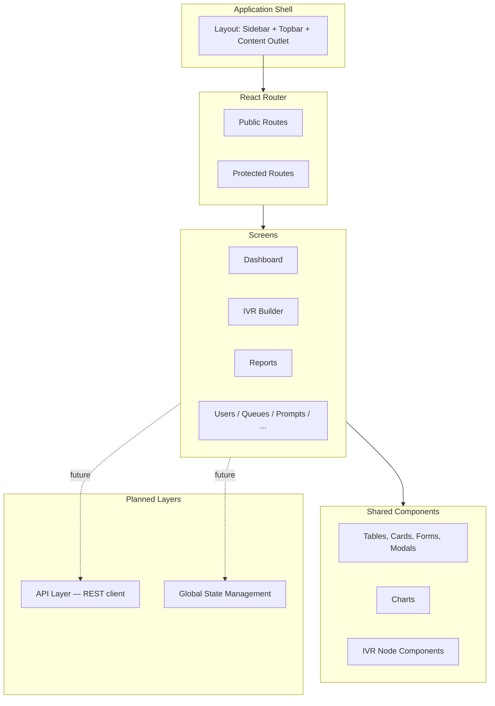
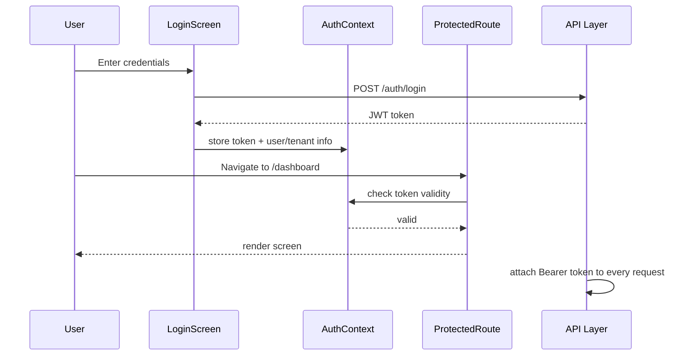
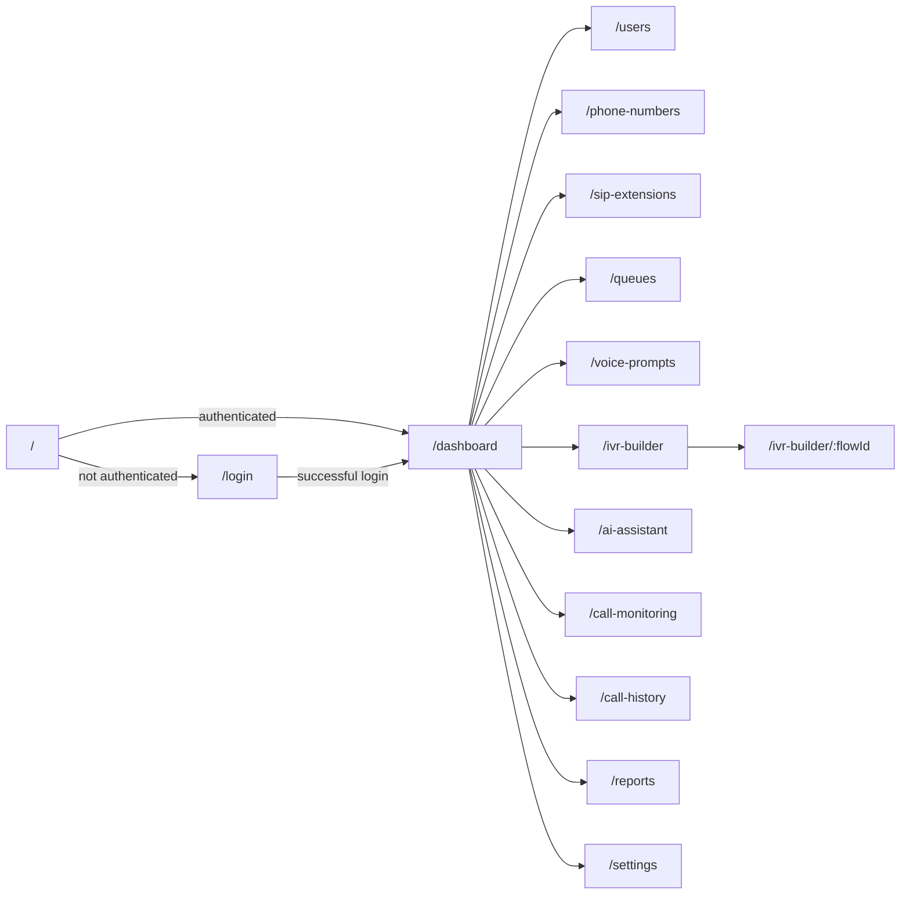

<div align="center">

# 🎛️ NexusIVR Frontend
### AI-Powered Multi-Tenant IVR Platform — Frontend

**The enterprise React dashboard for designing, deploying, and monitoring AI-powered IVR call flows — no code required.**

[](#-frontend-technology)
[](#-frontend-technology)
[](#-frontend-technology)
[](#-license)
[](#-current-project-status)

</div>

---

> ⚠️ **This repository contains the frontend (GUI) only.** The backend — a Core Java / Servlets / JDBC REST API — is developed and versioned separately. This README describes the frontend's structure, screens, and design system; it deliberately does not describe backend implementation, REST API internals, or database schema. Where a screen depends on a backend capability, this document names the *expected* API group only, for integration-planning purposes.

## 📑 Table of Contents

1. [Overview](#-overview)
2. [Features](#-features)
3. [Screens](#-screens)
4. [UI Architecture](#-ui-architecture)
5. [Project Structure](#-project-structure)
6. [IVR Builder](#-ivr-builder)
7. [Design System](#-design-system)
8. [Current Project Status](#-current-project-status)
9. [Installation](#-installation)
10. [Environment Variables](#-environment-variables)
11. [Routing](#-routing)
12. [Future Improvements](#-future-improvements)
13. [Screenshots](#-screenshots)
14. [Development Roadmap](#-development-roadmap)
15. [Contributing](#-contributing)
16. [License](#-license)
17. [Author](#-author)

---

## 🎯 Overview

**NexusIVR Frontend** is the enterprise dashboard for NexusIVR — a multi-tenant SaaS platform that lets companies build AI-assisted IVR (Interactive Voice Response) call flows visually, without writing code. This repository is purely the **presentation layer**: every screen, interaction, and visual workflow a user sees, built with React and TypeScript.

### Who Uses It

| Role | What they see and do |
|---|---|
| **Super Admin** | Platform-wide oversight — tenant approvals, platform health, cross-tenant administration |
| **Tenant Admin** | Full control of their company's account — IVR flows, users, queues, prompts, reports |
| **Manager** | Department/queue-level visibility and reporting |
| **Agent** | Live call handling view and personal queue status |

### How It Connects to the Backend

This frontend is a pure **REST API client**. It holds no business logic of its own — every action (creating a user, publishing a flow, fetching a report) is a call to the backend's REST API, authenticated via a JWT obtained at login. The frontend's job is to render state cleanly, validate input before sending it, and present backend responses (including errors) in a way that makes sense to the person using it. The backend's internal implementation, database schema, and API contracts are intentionally out of scope for this document — see the backend repository for that.

---

## ✨ Features

<details>
<summary><b>🔐 Authentication</b></summary>

- Login screen with email/password
- Token-based session handling (JWT expected from backend)
- Route protection based on authentication state

</details>

<details>
<summary><b>👑 Super Admin Dashboard</b></summary>

- Platform-wide tenant overview
- Tenant approval / suspension actions
- High-level platform health indicators

</details>

<details>
<summary><b>🏢 Tenant Dashboard</b></summary>

- Company-scoped summary: active calls, queue status, recent activity
- Quick links into every major module

</details>

<details>
<summary><b>👥 User Management</b></summary>

- User list, creation, and role assignment
- Role-based visibility of management actions

</details>

<details>
<summary><b>🏬 Company Management</b></summary>

- Tenant profile, branding, and configuration overview (Super Admin / Tenant Admin views)

</details>

<details>
<summary><b>☎️ Phone Numbers</b></summary>

- DID inventory list
- Assignment status per number

</details>

<details>
<summary><b>📞 SIP Extensions</b></summary>

- Extension list with registration status
- Assignment to employees

</details>

<details>
<summary><b>🗂️ Queue Management</b></summary>

- Queue configuration UI (strategy, SLA, overflow behavior)
- Membership management with drag-orderable priority

</details>

<details>
<summary><b>🔊 Voice Prompts</b></summary>

- Prompt library with playback preview
- Upload and (planned) AI-generation entry points

</details>

<details>
<summary><b>🧩 Visual IVR Builder</b></summary>

- Drag-and-drop canvas (React Flow) for authoring call flows
- Full node library and configurable connections

</details>

<details>
<summary><b>🤖 AI Assistant</b></summary>

- Conversational panel for flow generation and improvement requests
- Conversation history view

</details>

<details>
<summary><b>📡 Live Call Monitoring</b></summary>

- Real-time-style view of in-progress calls and queue occupancy

</details>

<details>
<summary><b>📜 Call History</b></summary>

- Searchable, filterable historical call list

</details>

<details>
<summary><b>📊 Reports</b></summary>

- Chart-based analytics (Recharts) — call volume, agent utilization, flow performance

</details>

<details>
<summary><b>⚙️ Settings</b></summary>

- Tenant-level configuration screens

</details>

<details>
<summary><b>📱 Responsive UI</b></summary>

- Enterprise dashboard layout adapting from desktop down to tablet breakpoints

</details>

<details>
<summary><b>🧭 Role-Based Navigation</b></summary>

- Sidebar and route access adapt to the logged-in user's role

</details>

---

## 🖥️ Screens

Each screen below is described by its purpose, its main components, what a user can do on it today, and which backend API group it is expected to integrate with once wired up.

### Login

- **Purpose:** authenticate a user and establish a session.
- **Main Components:** credential form, validation messaging, branding panel.
- **Available Actions:** submit credentials, view validation errors.
- **Expected Backend APIs:** Authentication (`/auth/login`).
- **Current Status:** ✅ UI complete — submits to a placeholder handler pending API integration.

### Super Admin Dashboard

- **Purpose:** platform-wide operational overview for the Super Admin role.
- **Main Components:** tenant summary cards, pending-approval list, platform health widgets.
- **Available Actions:** approve/suspend a tenant, drill into a tenant's summary.
- **Expected Backend APIs:** Companies (Tenants), Monitoring.
- **Current Status:** ✅ UI complete — populated with placeholder data.

### Tenant Dashboard

- **Purpose:** company-scoped landing page for Tenant Admins and Managers.
- **Main Components:** activity summary cards, queue status widget, quick-navigation tiles.
- **Available Actions:** navigate into any module; view at-a-glance metrics.
- **Expected Backend APIs:** Companies, Reports, Call Monitoring.
- **Current Status:** ✅ UI complete.

### Users

- **Purpose:** manage the tenant's user accounts and role assignments.
- **Main Components:** user table, create/edit user modal, role selector.
- **Available Actions:** create, edit, deactivate a user; assign roles.
- **Expected Backend APIs:** Users, Roles.
- **Current Status:** ✅ UI complete — CRUD actions are placeholder handlers.

### Phone Numbers

- **Purpose:** manage the tenant's DID inventory.
- **Main Components:** number table, assignment status badges, add-number form.
- **Available Actions:** view, add, and release numbers.
- **Expected Backend APIs:** Phone Numbers.
- **Current Status:** ✅ UI complete.

### SIP Extensions

- **Purpose:** manage per-employee telephony endpoints.
- **Main Components:** extension table, registration status indicator, employee assignment selector.
- **Available Actions:** create, assign, and deactivate an extension.
- **Expected Backend APIs:** SIP Extensions, Employees.
- **Current Status:** ✅ UI complete.

### Queues

- **Purpose:** configure call queues and their membership.
- **Main Components:** queue list, strategy/SLA configuration form, member priority list.
- **Available Actions:** create/edit a queue, add/remove/reorder members.
- **Expected Backend APIs:** Queues.
- **Current Status:** ✅ UI complete.

### Voice Prompts

- **Purpose:** manage the audio prompt library.
- **Main Components:** prompt grid with inline audio preview, upload dialog, AI-generation entry point.
- **Available Actions:** upload, preview, archive a prompt; request AI generation (UI only, pending AI integration).
- **Expected Backend APIs:** Voice Prompts, AI.
- **Current Status:** ✅ UI complete.

### IVR Builder

- **Purpose:** visually author, validate, and publish IVR call flows.
- **Main Components:** canvas, node palette, properties panel, version/publish controls. See [IVR Builder](#-ivr-builder) for full detail.
- **Available Actions:** add/connect/configure nodes, save draft, request validation, publish.
- **Expected Backend APIs:** IVR (Flows, Versions, Nodes, Connections), Deployment.
- **Current Status:** ✅ UI complete — flow persistence and validation are currently local/mocked.

### AI Assistant

- **Purpose:** conversational interface for AI-assisted flow and prompt generation.
- **Main Components:** chat panel, conversation history list, "insert into Builder" action.
- **Available Actions:** submit a prompt, view AI-generated output, send output to the IVR Builder as a draft.
- **Expected Backend APIs:** AI.
- **Current Status:** ✅ UI complete — responses are currently mocked.

### Call Monitoring

- **Purpose:** real-time-style visibility into calls currently in progress.
- **Main Components:** live call list, queue occupancy widget, per-call node position indicator.
- **Available Actions:** view live call state (no control actions from this screen).
- **Expected Backend APIs:** Call Sessions (planned WebSocket/real-time channel).
- **Current Status:** ✅ UI complete — awaiting real-time data source.

### Call History

- **Purpose:** browse and search completed calls.
- **Main Components:** filterable/searchable call table, call detail drawer, recording playback link.
- **Available Actions:** filter by date/queue/agent/disposition; open call detail.
- **Expected Backend APIs:** Call History (CDRs).
- **Current Status:** ✅ UI complete.

### Reports

- **Purpose:** visual analytics over historical call and flow performance data.
- **Main Components:** chart widgets (Recharts), date-range selector, export controls.
- **Available Actions:** select report type/range, view charts, export.
- **Expected Backend APIs:** Reports.
- **Current Status:** ✅ UI complete — charts render against placeholder data.

### Settings

- **Purpose:** tenant-level configuration.
- **Main Components:** timezone/branding/retention forms.
- **Available Actions:** view and edit tenant settings.
- **Expected Backend APIs:** Settings.
- **Current Status:** ✅ UI complete.

---

## 🏗️ UI Architecture



- **Layouts** define the persistent chrome (sidebar navigation, top bar, content outlet) shared across all authenticated screens.
- **Components** are small, reusable presentation building blocks (buttons, cards, tables, form fields) with no screen-specific logic.
- **Screens** compose Layouts + shared Components + screen-specific logic into a full page, one per route.
- **Shared Components** include the design-system primitives (see [Design System](#-design-system)) and the IVR node components used specifically by the Builder.
- **Routing** is handled by React Router, with a route-guard pattern separating public routes (Login) from protected, role-aware routes (everything else).
- **State Management (future):** the project currently uses local component state and prop drilling where needed; a global state layer (e.g., React Context or a dedicated state library) is planned once real API data replaces placeholder data — see [Future Improvements](#-future-improvements).
- **API Layer (future):** a dedicated `services/` layer is scaffolded to house REST client calls, but currently returns mocked responses; see [Current Project Status](#-current-project-status).
- **Authentication Flow:** Login submits credentials → (future) receives a JWT → token is held in memory/storage → protected routes check for a valid token before rendering → API layer attaches the token to every outgoing request.

### Authentication Flow (Planned)



---

## 📁 Project Structure

```text
src/
├── components/          # Reusable, presentation-only UI building blocks
│   ├── ui/               # Buttons, Cards, Tables, Modals, Form fields
│   ├── charts/            # Recharts wrapper components
│   ├── layout/             # Sidebar, Topbar, PageContainer
│   └── navigation/          # Role-aware nav menu
│
├── screens/              # One folder per route/page — composes components + logic
│   ├── auth/
│   ├── dashboard/
│   ├── users/
│   ├── phone-numbers/
│   ├── sip-extensions/
│   ├── queues/
│   ├── voice-prompts/
│   ├── ai-assistant/
│   ├── call-monitoring/
│   ├── call-history/
│   ├── reports/
│   └── settings/
│
├── ivr/                  # Everything specific to the IVR Builder
│   ├── canvas/             # React Flow canvas wrapper & viewport controls
│   ├── nodes/               # One component per node type (Greeting, Menu, Queue, ...)
│   ├── connections/          # Custom edge rendering & connection validation
│   ├── properties-panel/      # Node configuration forms
│   └── toolbar/               # Save / Validate / Publish controls
│
├── hooks/                 # Reusable React hooks (e.g., useAuth, useDebounce, useFlowGraph)
│
├── services/               # API client layer (currently mocked; see Current Project Status)
│   ├── api-client.ts         # Base fetch/axios wrapper — auth header injection point
│   └── <resource>Service.ts  # One per backend resource group
│
├── types/                   # Shared TypeScript types/interfaces (mirrors backend DTO shapes)
│
├── assets/                   # Static assets — icons, images, fonts
│
├── utils/                     # Pure helper functions (formatting, validation, constants)
│
├── App.tsx                     # Root component — router + global providers
└── main.tsx                     # Application entry point
```

| Folder | Purpose |
|---|---|
| `components/` | Generic, reusable UI pieces with zero business meaning of their own |
| `screens/` | One folder per page; the only place screen-specific logic and layout composition live |
| `ivr/` | Fully isolated module for the IVR Builder — kept separate because of its size and unique canvas/graph logic |
| `hooks/` | Cross-cutting reusable logic extracted out of screens/components |
| `services/` | The single boundary where the frontend will eventually talk to the backend REST API |
| `types/` | Keeps TypeScript types for API payloads in one place, so a backend contract change touches one file, not twenty |
| `assets/` | Static, non-code files |
| `utils/` | Small, dependency-free helper functions |

---

## 🧩 IVR Builder

The IVR Builder is the flagship screen of the platform — where a non-technical user visually assembles a call flow.

| Concept | Description |
|---|---|
| **Canvas** | An infinite, pannable and zoomable workspace built on **React Flow**, where nodes are placed and wired together. |
| **Drag & Drop** | Node types are dragged from a palette onto the canvas; React Flow handles placement, and custom logic snaps/validates the drop target. |
| **Node Library** | A palette of available node types (Greeting, Menu, Queue, Transfer, Business Hours, Voice Prompt, Play Audio, Record, Hangup, HTTP Request, AI Node, Condition, Database Lookup, Webhook), each rendered as a custom React Flow node component with its own icon and summary preview. |
| **Connections** | Directed edges between nodes, drawn by dragging from one node's output handle to another's input handle; some node types (e.g., Menu) expose multiple labeled output handles (one per digit/outcome). |
| **Properties Panel** | A contextual side panel that opens when a node is selected, exposing a form tailored to that node type's configuration (e.g., a Menu node's digit map, a Queue node's target queue selector). |
| **Flow Editing** | Standard graph editing affordances — add, delete, reconnect, and reposition nodes; undo/redo is planned. |
| **Publish Flow** | A toolbar action that (once backend-integrated) will submit the current graph for server-side validation and, if valid, publish it as an immutable version. |
| **Future Backend Integration** | Currently, flow state lives entirely in local component state and is not persisted. Backend integration will introduce: loading an existing flow graph from the API, auto-saving drafts, real validation feedback rendered inline on the canvas, and a real publish/deploy action. |

---

## 🎨 Design System

| Element | Approach |
|---|---|
| **Typography** | A single system font stack for performance, with a clear size/weight scale distinguishing page titles, section headers, body text, and metadata/labels. |
| **Spacing** | A consistent spacing scale (based on a 4px/8px unit) applied uniformly across cards, forms, and layout gaps, to keep density predictable across 14+ distinct screens. |
| **Cards** | The primary content container across dashboards and list screens — consistent padding, radius, and elevation. |
| **Buttons** | A small set of variants (primary, secondary, destructive, ghost) with consistent sizing, used identically across every screen. |
| **Tables** | A shared table component used for every list screen (Users, Phone Numbers, Queues, Call History, etc.), with consistent header styling, row hover states, and pagination controls. |
| **Forms** | Shared form field components (input, select, toggle, textarea) with consistent label placement and validation-error styling. |
| **Icons** | **Lucide Icons** used consistently across navigation, buttons, and status indicators. |
| **Charts** | **Recharts** used for all Reports and Dashboard visualizations, styled to match the rest of the design system rather than using library defaults. |
| **Responsive Design** | Layouts adapt from a full desktop sidebar/content layout down to a collapsible-sidebar tablet layout; mobile-phone optimization is a [future improvement](#-future-improvements). |
| **Dark/Light Mode (future)** | Not yet implemented — the design tokens are structured so a theme layer can be introduced without a full rebuild of every screen. |

---

## 📌 Current Project Status

The frontend UI is **mostly complete** — the project currently contains approximately **14 enterprise pages**, covering every major module of the platform end to end from a UI perspective. Navigation, layouts, forms, tables, and the IVR Builder canvas are all functional as a standalone interface.

**What remains before the frontend is a fully working application:**

| Area | Status |
|---|---|
| Backend Integration | ⬜ Not started — screens currently use placeholder/mocked data |
| REST API Layer | ⬜ `services/` is scaffolded but not connected to a live backend |
| Authentication | ⬜ Login UI complete; real token issuance/verification pending |
| CRUD Operations | ⬜ Forms and tables complete; create/update/delete actions are placeholder handlers |
| Real-time Updates | ⬜ Call Monitoring UI complete; live data source not yet connected |
| WebSocket Integration | ⬜ Not started |
| AI Integration | ⬜ AI Assistant UI complete; responses currently mocked |

---

## 🚀 Installation

### Requirements

- Node.js ≥ 18.x
- npm ≥ 9.x

### Clone

```bash
git clone https://github.com/<your-org>/nexusivr-frontend.git
cd nexusivr-frontend
```

### Install

```bash
npm install
```

### Run Development Server

```bash
npm run dev
```

### Build

```bash
npm run build
```

### Preview (production build)

```bash
npm run preview
```

---

## 🔑 Environment Variables

Create a `.env` file at the project root:

```env
# Base URL of the backend REST API
VITE_API_BASE_URL=http://localhost:8080/api

# Application environment
VITE_APP_ENV=development

# Feature flags (frontend-only, for staged rollout of unfinished integrations)
VITE_ENABLE_AI_ASSISTANT=true
VITE_ENABLE_LIVE_MONITORING=false
```

---

## 🧭 Routing

| Route | Screen | Access |
|---|---|---|
| `/` | Redirect to `/login` or `/dashboard` depending on auth state | Public |
| `/login` | Login | Public |
| `/dashboard` | Super Admin Dashboard or Tenant Dashboard (role-dependent) | Protected |
| `/users` | Users | Protected — Admin/Manager |
| `/companies` | Company Management | Protected — Super Admin |
| `/phone-numbers` | Phone Numbers | Protected — Admin |
| `/sip-extensions` | SIP Extensions | Protected — Admin |
| `/queues` | Queues | Protected — Admin/Manager |
| `/voice-prompts` | Voice Prompts | Protected — Admin |
| `/ivr-builder` | IVR Builder | Protected — Admin |
| `/ivr-builder/:flowId` | IVR Builder (editing a specific flow) | Protected — Admin |
| `/ai-assistant` | AI Assistant | Protected — Admin |
| `/call-monitoring` | Live Call Monitoring | Protected — Admin/Manager/Agent |
| `/call-history` | Call History | Protected — Admin/Manager |
| `/reports` | Reports | Protected — Admin/Manager |
| `/settings` | Settings | Protected — Admin |



---

## 🔮 Future Improvements

- **State Management** — introduce a global state layer (React Context or a dedicated library) once real API data replaces mocked data
- **API Integration** — connect the scaffolded `services/` layer to the live backend REST API
- **WebSocket** — real-time push updates for Live Call Monitoring and queue occupancy
- **Notifications** — in-app toast/notification system for background events
- **Internationalization (i18n)** — multi-language support for both UI chrome and tenant-facing prompt authoring
- **Theme Switching** — Dark/Light mode built on top of the existing design token structure
- **Accessibility** — full keyboard navigation and screen-reader support audit across all 14 screens
- **Unit Testing** — component and hook-level test coverage
- **Performance Optimization** — code-splitting per route and virtualization for large tables (Call History, Audit Logs)


---

## 🗺️ Development Roadmap

- [x] Login Page
- [x] Super Admin Dashboard
- [x] Tenant Dashboard
- [x] User Management
- [x] Company Management
- [x] Phone Numbers
- [x] SIP Extensions
- [x] Queue Management
- [x] Voice Prompts
- [x] IVR Builder (canvas, nodes, connections, properties panel)
- [x] AI Assistant (UI)
- [x] Live Call Monitoring (UI)
- [x] Call History
- [x] Reports
- [x] Settings
- [ ] Backend Integration
- [ ] API Layer (live REST client)
- [ ] Authentication (real JWT flow)
- [ ] WebSocket Integration
- [ ] AI Integration (live responses)
- [ ] Global State Management
- [ ] Unit & Integration Testing
- [ ] Accessibility Audit
- [ ] Production Deployment

---

## 🤝 Contributing

Contributions are welcome! To contribute:

1. **Fork** the repository and create a feature branch: `git checkout -b feature/your-feature-name`
2. **Follow the existing structure** — new screens go under `screens/`, new shared UI primitives go under `components/ui/`, and anything IVR-Builder-specific stays inside `ivr/`.
3. **Match the design system** described in [Design System](#-design-system) rather than introducing one-off styles.
4. **Type everything** — this is a TypeScript project; avoid `any` where a real type is knowable.
5. **Open a Pull Request** with a clear description of the change and, where visual, a before/after screenshot.
6. Be respectful and constructive in code review — this is a learning-oriented graduation project, and clarity matters as much as polish.

---

## 📄 License

This project is licensed under the **ITI License** — see the [`LICENSE`](LICENSE) file for details.

---

## 👤 Author

**Graduation Project**
**ITI — Telecom Applications Track**

<div align="center">

---

**NexusIVR Frontend** — the visual face of an enterprise-grade, AI-powered, multi-tenant IVR platform.

</div>
