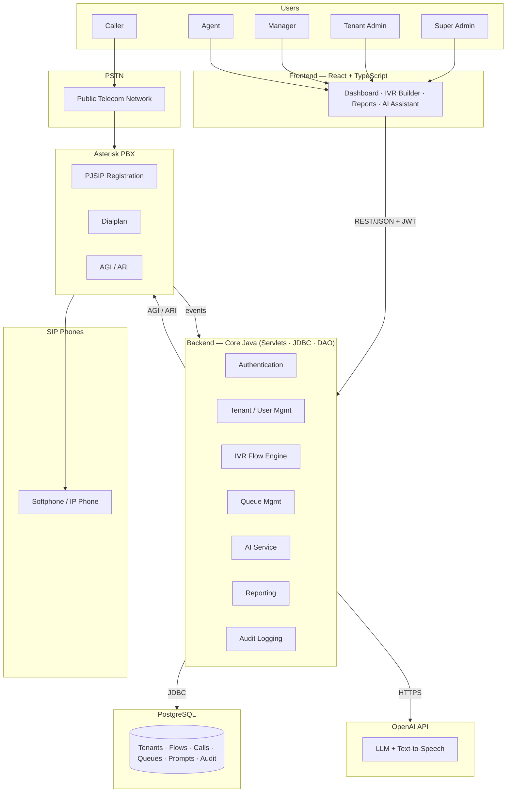
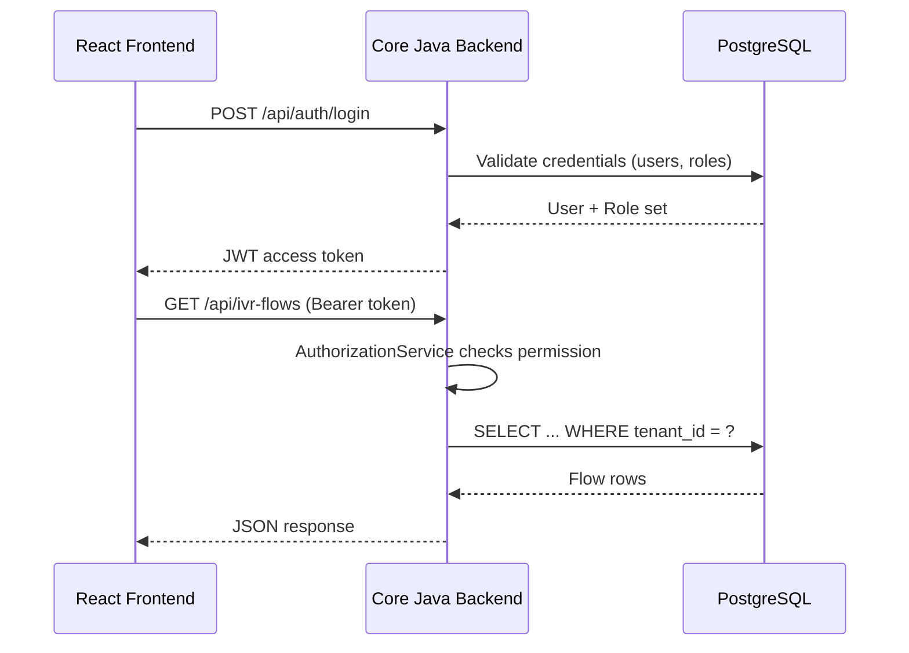
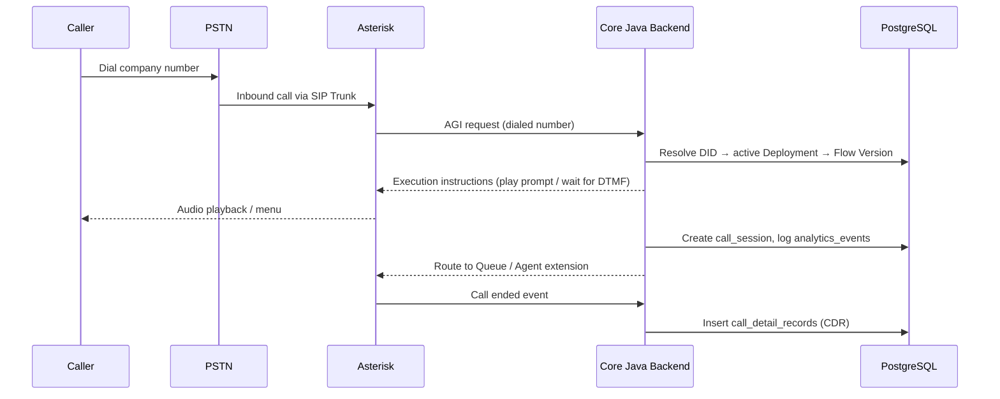

<div align="center">

# 🧠 NexusIVR
### AI-Powered Multi-Tenant IVR Platform

**An enterprise-grade, self-hostable Contact Center / IVR platform that lets any company design, deploy, and improve AI-assisted call flows with a visual drag-and-drop builder — no code required.**

*Inspired by the product experience of Twilio Flex, Twilio Studio, Amazon Connect, Genesys Cloud, Cisco Contact Center, 3CX, and Freshdesk Contact Center.*

[](#-technology-stack)
[](#-technology-stack)
[](#-technology-stack)
[](#-database)
[](#-technology-stack)
[](#-ai-features)
[](#-deployment)
[](#-license)
[](#)

</div>

---

## 📑 Table of Contents

1. [Project Overview](#-project-overview)
2. [Features](#-features)
3. [Architecture](#-architecture)
4. [Technology Stack](#-technology-stack)
5. [Project Structure](#-project-structure)
6. [Database](#-database)
7. [Main Modules](#-main-modules)
8. [IVR Builder](#-ivr-builder)
9. [AI Features](#-ai-features)
10. [Installation](#-installation)
11. [Environment Variables](#-environment-variables)
12. [Backend Setup](#-backend-setup)
13. [API Documentation](#-api-documentation)
14. [Database ERD](#-database-erd)
15. [Flow Diagram](#-flow-diagram)
16. [SRS (Software Requirements Specification)](#-srs-software-requirements-specification)
17. [Future Improvements](#-future-improvements)
18. [Deployment](#-deployment)
19. [Security](#-security)
20. [Testing](#-testing)
21. [Roadmap](#-roadmap)
22. [Contributing](#-contributing)
23. [License](#-license)
24. [Authors](#-authors)
25. [Acknowledgements](#-acknowledgements)

---

## 🎯 Project Overview

**NexusIVR** is a **multi-tenant SaaS platform** that lets any company — a clinic, a bank, a restaurant, a telecom operator — build and run its own **Interactive Voice Response (IVR)** system without owning telephony infrastructure or writing a single line of dialplan code.

### The Problem

Traditional IVR systems are built on a per-company basis: dedicated PBX servers, hand-written Asterisk dialplans, and a telecom engineer on standby for every small change. That means:

- **High cost** — every company pays for its own infrastructure, even small ones.
- **Slow iteration** — changing "press 1 for sales" to "press 1 for support" can take days.
- **No intelligence** — flows and voice prompts are built entirely by hand.
- **No safe experimentation** — there's rarely a safe way to test a change before it goes live.

### The Solution

NexusIVR solves this by being **multi-tenant from the ground up**: one shared platform, one shared Asterisk/PostgreSQL backbone, serving thousands of companies (*tenants*) simultaneously — each one fully isolated from the others at every layer, from the database row up to the live call. On top of that shared foundation, every tenant gets:

- A **visual, drag-and-drop IVR Builder** — no code, no dialplan knowledge required.
- An **AI Assistant** that can generate a full call flow from a plain-language description, generate voice prompts via text-to-speech, and suggest improvements based on real call analytics.
- **Draft → Validate → Publish → Deploy** lifecycle with immutable, versioned flows, so live calls are never affected by an in-progress edit.

### Why Multi-Tenant?

A shared platform means infrastructure and maintenance costs are spread across every customer instead of duplicated per customer, new tenants onboard in minutes instead of requiring a fresh deployment, and every tenant benefits from platform-wide improvements instantly. The trade-off this design has to earn is **strict tenant isolation** — every table, every query, and every AI request is scoped to a `tenant_id`, enforced at the database, DAO, and row-security levels (see [Security](#-security)).

### Why AI?

AI isn't cosmetic here — it removes the two biggest barriers to building a good IVR: technical skill and time. A non-technical admin can type *"I need an IVR for a dental clinic with reception, appointments, and emergencies"* and get a working draft flow in seconds, plus natural-sounding voice prompts without hiring a voice actor. Crucially, **AI output is always a draft** — it never touches a live, published flow without explicit human review and approval.

### Who Uses It?

| Role | What they do |
|---|---|
| **Super Admin** | Operates the platform itself — approves new tenants, monitors platform health |
| **Tenant Admin** | Owns a company's account — builds IVR flows, manages users, reviews reports |
| **Manager** | Oversees a department or queue — reviews team performance |
| **Agent** | Handles live calls routed from a queue |
| **Caller** | The end customer dialing in — never logs in, just interacts by voice/DTMF |

---

## ✨ Features

<details>
<summary><b>👑 Super Admin</b></summary>

- Tenant onboarding & approval workflow
- Platform-wide health monitoring (`system_metrics`, `health_checks`, `alert_rules`)
- Shared SIP Trunk administration
- Platform-level audit visibility
- Cross-tenant billing oversight

</details>

<details>
<summary><b>🏢 Tenant Admin</b></summary>

- Full IVR Flow lifecycle: draft, validate, publish, deploy, rollback
- User, Role & Department management
- SIP Extension provisioning
- Queue configuration & routing strategy selection
- Voice Prompt library management (upload or AI-generate)
- Access to tenant-scoped reports and analytics

</details>

<details>
<summary><b>🎧 Agent</b></summary>

- Real-time presence control (Available / Busy / Offline)
- Live call handling via SIP softphone or IP phone
- Voicemail inbox for assigned messages
- Personal performance view

</details>

<details>
<summary><b>🤖 AI Assistant</b></summary>

- Natural-language IVR flow generation
- AI-generated voice prompts (Text-to-Speech)
- Data-driven flow improvement suggestions
- AI-assisted report summarization

</details>

<details>
<summary><b>🧩 IVR Builder</b></summary>

- Visual drag-and-drop canvas
- Typed nodes (Greeting, Menu, Queue, API Request, Agent Transfer, Recording, Voicemail, Hangup…)
- Conditional connections (DTMF digit, success/failure outcomes)
- Built-in flow validation before publish
- Full version history — every publish creates a new immutable version

</details>

<details>
<summary><b>📊 Reporting</b></summary>

- Call volume, agent utilization, and flow performance reports
- Exportable as Dashboard / CSV / PDF
- Tenant-scoped, never cross-tenant

</details>

<details>
<summary><b>📞 Call Monitoring</b></summary>

- Live view of in-progress calls
- Per-node execution telemetry via analytics events
- Real-time queue wait-time visibility

</details>

<details>
<summary><b>🗂️ Queue Management</b></summary>

- Multiple routing strategies: Round Robin, Longest Idle, Skills-Based
- Configurable SLA (max wait time) and overflow action
- Per-queue membership with priority weighting

</details>

<details>
<summary><b>🔊 Voice Prompts</b></summary>

- Upload existing audio files
- Generate prompts from text via AI Text-to-Speech
- Locale-aware prompt library

</details>

<details>
<summary><b>☎️ SIP Extensions</b></summary>

- Per-employee SIP credential provisioning
- Live registration status tracking
- Automatic release on employee offboarding

</details>

<details>
<summary><b>🔐 Authentication & Authorization</b></summary>

- JWT-based session authentication
- Role-Based Access Control (RBAC) with a granular permission catalog
- API Key support for external system integration

</details>

<details>
<summary><b>📝 Audit Logs</b></summary>

- Append-only, tamper-evident log of every mutating action
- Before/after snapshots for every tracked change
- Actor, timestamp, and target entity captured for every entry

</details>

<details>
<summary><b>📈 Analytics</b></summary>

- Node-level drop-off and completion-time metrics
- Aggregated, tenant-scoped telemetry powering both Reporting and AI suggestions

</details>

---
## 🔄 Flow Diagram


---

## 🏗️ Architecture

NexusIVR is organized as a layered system: a React frontend talks to a Core Java backend over REST, the backend owns all access to PostgreSQL and orchestrates both Asterisk (for telephony) and the OpenAI API (for AI features).

### High-Level Architecture



### Request Flow (Frontend ↔ Backend ↔ Database)



### Inbound Call Flow (Asterisk ↔ Backend)



---

## 🛠️ Technology Stack

| Layer | Technology |
|---|---|
| **Frontend** | React, TypeScript, Drag-and-Drop Canvas (Flow Builder) |
| **Backend** | Core Java, Java Servlets, JDBC, DAO Pattern |
| **Database** | PostgreSQL (UUID keys, JSONB, Partitioning, Row-Level Security) |
| **AI** | OpenAI API (LLM for flow generation, Text-to-Speech for voice prompts) |
| **Telephony** | Asterisk PBX, PJSIP, AGI / ARI |
| **Authentication** | JWT (JSON Web Tokens), Role-Based Access Control |
| **Deployment** | Docker, Docker Compose |
| **Development Tools** | npm, Maven/Gradle (Java build), Git, ESLint/Prettier |

> **A note on framework choice:** the backend is intentionally implemented in **Core Java with Servlets and hand-rolled JDBC/DAO** rather than a framework like Spring Boot. This was a deliberate decision for this project — it keeps every layer of the request lifecycle (routing, connection pooling, transaction boundaries) explicit and auditable rather than hidden behind framework magic, which matters both for the academic goals of this project and for full-stack transparency.

---

## 📁 Project Structure

```text
nexusivr/
├── src/
│   ├── frontend/                  # React + TypeScript application
│   │   ├── components/
│   │   │   ├── ivr-builder/       # Drag & drop canvas, node palette, properties panel
│   │   │   ├── dashboard/
│   │   │   ├── reports/
│   │   │   └── ai-assistant/
│   │   ├── pages/
│   │   ├── services/               # API client layer
│   │   ├── hooks/
│   │   └── types/
│   │
│   └── backend/                    # Core Java application
│       ├── servlets/                # HTTP entry points (one per resource group)
│       ├── services/                # Business logic (Authentication, FlowValidation,
│       │                            #   ExecutionEngine, QueueRouting, AIOrchestration…)
│       ├── dao/                     # One DAO per Aggregate Root
│       ├── model/                   # Entity classes mirroring database tables
│       ├── dto/                     # Request/response contracts
│       ├── util/                    # JWT, password hashing, validation helpers
│       └── config/                  # Datasource / connection pool configuration
│
├── database/
│   ├── migrations/                  # Versioned schema migration scripts
│   └── seed/                        # Lookup table seed data
│
├── docker/
│   ├── backend.Dockerfile
│   ├── frontend.Dockerfile
│   └── docker-compose.yml
│
├── docs/
│   ├── SRS/                         # Software Requirements Specification
│   ├── database/                    # ERD.png, Logical & Physical Database Design docs
│   ├── diagrams/                    # system-flow.png and other architecture diagrams
│   └── screenshots/                 # Application screenshots
│
├── .env.example
└── README.md
```

---

## 🗄️ Database

NexusIVR runs on **PostgreSQL**, chosen specifically for the guarantees this platform depends on:

- **Multi-Tenant by design** — nearly every table carries a `tenant_id` foreign key, and it is the leading column on every tenant-facing index.
- **UUID Primary Keys** — every business entity uses a non-enumerable UUID as its primary key (with a `BIGINT` identity exception for the highest-volume, insert-only tables such as analytics events and audit logs).
- **Foreign Keys everywhere** — relationships between entities (Tenant → User, Flow → Version → Node → Connection, Queue → Membership → Employee, etc.) are enforced at the database level, not just in application code.
- **JSONB** — used deliberately for genuinely variable-shape data, most notably each IVR node's type-specific configuration payload, so new node types can be added without a schema migration.
- **Lookup tables instead of native `ENUM` types** — every status/type/category field (call disposition, flow status, queue strategy, etc.) is a foreign key into a small reference table rather than a native PostgreSQL `ENUM`. This trades a marginal amount of raw lookup speed for the ability to add a new value with a plain `INSERT` instead of a schema migration — important for a platform meant to stay extensible over its lifetime.
- **Indexes** — tenant-scoped composite indexes, partial unique indexes (e.g., enforcing "exactly one active Deployment per phone number"), and GIN indexes for JSONB/fuzzy search.
- **Constraints** — primary keys, unique constraints, check constraints, and foreign keys are used throughout to make invariants (such as "a Voicemail has exactly one recipient") enforceable by the database itself, not just by application discipline.
- **Audit Logs** — a dedicated, append-only `audit_log_entries` table captures every mutating action platform-wide, with before/after snapshots.

The full **Entity-Relationship Diagram**, the **Logical Database Design**, and the **Physical PostgreSQL Database Design** documents are included in this repository under [`docs/database/`](docs/database/).

---

## 🧩 Main Modules

| Module | Responsibility |
|---|---|
| **Authentication** | Login, session/token issuance, MFA, API key management |
| **Companies (Tenants)** | Tenant registration, approval, subscription/plan entitlement |
| **Users** | Platform user accounts, role assignment, department membership |
| **Phone Numbers** | DID inventory and assignment per tenant |
| **SIP Extensions** | Per-employee telephony endpoint provisioning and registration |
| **Queues** | Queue configuration, routing strategy, membership management |
| **Voice Prompts** | Audio asset library — uploaded or AI-generated |
| **IVR Builder** | Visual flow design, validation, versioning, publishing |
| **AI Assistant** | Flow generation, prompt generation, improvement suggestions |
| **Call Monitoring** | Live view of in-progress calls and queue state |
| **Call History** | Historical Call Detail Records (CDRs) and recordings |
| **Reports** | Aggregated analytics and exportable reports |
| **Settings** | Tenant-level configuration — timezone, branding, retention policy |
| **Audit Logs** | Full traceability of configuration and data changes |

---

## 🎨 IVR Builder

The IVR Builder is the centerpiece of the product experience — it's what lets a non-technical admin build a working call flow in minutes.

- **Canvas** — an infinite, pannable/zoomable workspace where the flow graph is laid out visually.
- **Nodes** — each node represents one step in the call (Greeting, Menu, Queue, API Request, Agent Transfer, Recording, Voicemail, Hangup, and more). Node types are data-driven (backed by a lookup table), so new types can be introduced without a frontend or database migration.
- **Connections** — directed, optionally-conditioned edges between nodes (e.g., "if caller presses 2 → go to Sales Menu"). Every non-terminal node must have at least one outgoing connection for the flow to pass validation.
- **Drag & Drop** — nodes are dragged from a palette onto the canvas and wired together by drawing connections between their ports.
- **Properties Panel** — selecting a node opens a contextual panel exposing its type-specific configuration (prompt selection, menu digit map, queue target, API endpoint, etc.).
- **Flow Execution** — once a flow passes validation and is published, it becomes an **immutable Flow Version**. Deploying that version to a phone number is what makes it live; a call that starts on a given version stays bound to it for its entire duration, even if a newer version is published mid-call.

---

## 🤖 AI Features

| Capability | Description |
|---|---|
| **Flow Generation** | Generates a complete draft IVR flow (nodes + connections) from a natural-language description of the desired call experience. |
| **Prompt Generation** | Converts a text script into a natural-sounding voice prompt via Text-to-Speech, in the tenant's chosen locale. |
| **Voice Prompt Suggestions** | Suggests wording/tone improvements for existing prompts based on best practices and flow context. |
| **Improvement Suggestions** | Analyzes aggregated call analytics (drop-off points, completion time) and proposes flow changes to reduce friction. |
| **Conversation History** | Every AI interaction — input, output, status, and cost/token usage — is logged for traceability, review, and usage-based billing. |

**AI Providers:** currently integrated with the **OpenAI API** for both language generation and text-to-speech. The integration layer is provider-agnostic by design, so additional providers can be added without touching the rest of the platform.

**Important design guarantee:** the AI never modifies a live, published flow directly. Every AI output is created as a **draft** that requires explicit human review and approval before it can be published and deployed — the same rule that applies to any manually-created draft.

### Future AI Roadmap
- Multi-turn AI conversation for iterative flow refinement
- AI-powered call transcript summarization
- Sentiment analysis on recorded/transcribed calls
- Voice cloning for brand-consistent prompts (subject to consent and compliance review)

---

## 🚀 Installation

### Requirements

- Node.js ≥ 18.x and npm ≥ 9.x
- JDK 17+ (Core Java backend)
- PostgreSQL ≥ 14
- Asterisk ≥ 18 (for full telephony functionality)
- Docker & Docker Compose (recommended for local development)

### Clone

```bash
git clone https://github.com/<your-org>/nexusivr.git
cd nexusivr
```

### Install (Frontend)

```bash
cd src/frontend
npm install
```

### Run (Frontend, development mode)

```bash
npm run dev
```

### Build (Frontend, production)

```bash
npm run build
```

### Preview (Frontend, production build)

```bash
npm run preview
```

> Backend build and run instructions are covered separately in [Backend Setup](#-backend-setup).

---

## 🔑 Environment Variables

Create a `.env` file at the project root (see `.env.example` for the full reference):

```env
# --- Application ---
APP_ENV=development
APP_PORT=8080

# --- Database ---
DB_HOST=localhost
DB_PORT=5432
DB_NAME=nexusivr
DB_USER=nexusivr_app
DB_PASSWORD=changeme

# --- Authentication ---
JWT_SECRET=replace_with_a_long_random_secret
JWT_EXPIRY_MINUTES=60

# --- AI / OpenAI ---
OPENAI_API_KEY=sk-your-key-here
OPENAI_MODEL=gpt-4o
OPENAI_TTS_MODEL=tts-1

# --- Asterisk ---
ASTERISK_HOST=localhost
ASTERISK_AGI_PORT=4573
ASTERISK_ARI_URL=http://localhost:8088/ari
ASTERISK_ARI_USER=nexusivr
ASTERISK_ARI_PASSWORD=changeme

# --- Frontend ---
VITE_API_BASE_URL=http://localhost:8080/api
```

---

## ⚙️ Backend Setup

The backend is a **Core Java** application built on **Servlets**, **JDBC**, and the **DAO pattern** — no application framework is used, by design (see [Technology Stack](#-technology-stack)).

1. **Configure the database connection** in `src/backend/config/` (host, port, credentials, connection pool size), matching the values in your `.env` file.
2. **Run database migrations** from `database/migrations/` against your PostgreSQL instance to create the schema, then load `database/seed/` to populate the lookup tables (statuses, node types, queue strategies, etc.).
3. **Build the backend** using your configured build tool (Maven or Gradle), producing a deployable WAR/JAR artifact.
4. **Run the backend** on a Servlet container (e.g., Apache Tomcat) configured to serve the built artifact, or via the provided Docker image (see [Deployment](#-deployment)).
5. **Verify connectivity** by hitting the health-check endpoint and confirming a successful database round trip.

---

## 📡 API Documentation

All endpoints are versioned REST/JSON APIs, authenticated via a `Bearer` JWT (except `/auth/login` and `/auth/register`). Every authenticated request is scoped to the caller's `tenant_id` server-side — a client can never request another tenant's data by manipulating a request.

| Group | Example Endpoints | Description |
|---|---|---|
| **Authentication** | `POST /api/auth/login`, `POST /api/auth/logout`, `POST /api/auth/refresh` | Session issuance and revocation |
| **Companies** | `GET/POST /api/tenants`, `POST /api/tenants/{id}/approve` | Tenant registration and lifecycle |
| **Users** | `GET/POST /api/users`, `PUT /api/users/{id}/roles` | User accounts and role assignment |
| **Queues** | `GET/POST /api/queues`, `POST /api/queues/{id}/members` | Queue configuration and membership |
| **IVR** | `GET/POST /api/ivr-flows`, `POST /api/ivr-flows/{id}/versions`, `POST /api/ivr-flows/{id}/versions/{v}/publish` | Flow authoring, validation, and publishing |
| **Voice Prompts** | `GET/POST /api/voice-prompts`, `POST /api/voice-prompts/generate` | Prompt library and AI generation |
| **Calls** | `GET /api/call-sessions`, `GET /api/call-detail-records` | Live call state and historical records |
| **Reports** | `GET /api/reports`, `POST /api/reports/generate` | Analytics and report generation |
| **AI** | `POST /api/ai/generate-flow`, `POST /api/ai/generate-prompt`, `POST /api/ai/improve-flow` | AI-assisted authoring |
| **Settings** | `GET/PUT /api/tenants/{id}/settings` | Tenant-level configuration |

> Detailed request/response contracts (OpenAPI/Swagger specification) are maintained separately from this README and are not reproduced here to avoid drift between documentation and implementation. Refer to the API specification file in the repository once published.

---

## 🗺️ Database ERD

The full Entity-Relationship Diagram for NexusIVR is maintained at:

```
docs/database/ERD.png
```

It documents every entity, relationship, and cardinality in the schema — including tenant-scoping foreign keys, the design-time vs. run-time IVR seam (`IVRFlow` → `FlowVersion` → `Deployment` → `CallSession`), and the associative tables that resolve every many-to-many relationship in the platform (`user_roles`, `role_permissions`, `employee_departments`, `queue_memberships`, and others). The companion **Logical** and **Physical Database Design** documents in the same folder explain the reasoning behind every relationship, key strategy, and index.

---

## 🔄 Flow Diagram

The end-to-end system flow diagram is maintained at:

```
docs/diagrams/system-flow.png
```

At a high level, it traces a call from the **Caller**, through the **PSTN**, into **Asterisk**, resolved against a **Phone Number (DID)**, routed through the **IVR Flow** and its **Nodes**, optionally into a **Queue** and to an **Agent**, ending in a **CDR** written back to the **Database** — the same journey detailed in the [Architecture](#-architecture) sequence diagrams above.

---

## 📋 SRS (Software Requirements Specification)

The complete Software Requirements Specification for NexusIVR is maintained at:

```
docs/SRS/
```

It documents the full set of business requirements, functional requirements (per module), non-functional requirements (performance, security, scalability, availability, maintainability, extensibility, reliability), actor definitions, and use cases that this platform was designed against. This README summarizes the resulting system; the SRS is the authoritative requirements source.

---

## 🔮 Future Improvements

- **WebRTC** — in-browser calling without a SIP softphone
- **WebSocket** — real-time push updates for live call/queue dashboards
- **AI Voice Bots** — fully conversational, AI-driven call handling beyond menu-based IVR
- **Speech Recognition** — natural speech input as an alternative to DTMF
- **Speech-to-Text** — automatic call transcription for search and AI analysis
- **Text-to-Speech** — expanded voice/locale coverage beyond current prompt generation
- **Billing** — full usage-based invoicing lifecycle (metering is already modeled; invoicing UI is planned)
- **Multi-Region** — geographically distributed deployments for latency and data-residency requirements
- **Kubernetes** — container orchestration for production-scale deployments
- **CI/CD** — automated build, test, and deployment pipelines
- **Monitoring** — deeper operational observability
- **Prometheus** — metrics collection
- **Grafana** — operational dashboards

---

## 🐳 Deployment

### Docker

Each component (frontend, backend, PostgreSQL, Asterisk) ships with its own Dockerfile under `docker/`, so the entire stack can be built and run in isolated, reproducible containers.

### Docker Compose

For local development and demos, `docker/docker-compose.yml` brings up the full stack — frontend, backend, database, and Asterisk — with a single command:

```bash
cd docker
docker compose up --build
```

### Production Deployment

For production, each container is deployed independently (or via an orchestrator such as Kubernetes — see [Future Improvements](#-future-improvements)), with the database and Asterisk run as durable, persistent services rather than ephemeral containers.

### Reverse Proxy

A reverse proxy (e.g., Nginx) sits in front of the frontend and backend containers, handling routing, static asset serving, and load distribution across backend instances.

### HTTPS

All external traffic is terminated over **HTTPS/TLS** at the reverse proxy layer; internal service-to-service traffic (backend ↔ database, backend ↔ Asterisk) stays within the private Docker network.

---

## 🔒 Security

| Concern | Approach |
|---|---|
| **JWT** | Stateless, signed session tokens carrying user and tenant identity, verified on every request |
| **Password Hashing** | Passwords are never stored in plaintext — hashed with a modern algorithm (Argon2id/bcrypt) before persistence |
| **RBAC** | Role-Based Access Control with a granular permission catalog; every protected action is checked server-side |
| **Tenant Isolation** | Enforced at three layers: `tenant_id` foreign keys/indexes on nearly every table, mandatory tenant scoping in the DAO layer, and PostgreSQL Row-Level Security as a database-enforced backstop |
| **HTTPS** | All client-facing traffic is encrypted in transit |
| **Audit Logs** | Every mutating action is recorded in an append-only audit log with before/after snapshots and actor identity |
| **Encryption** | Sensitive fields (e.g., SIP credentials, API key secrets) are hashed or encrypted at rest; recordings and voice files live in encrypted, tenant-partitioned blob storage, never as raw bytes in the database |

---

## 🧪 Testing

| Layer | Approach |
|---|---|
| **Frontend** | Component and interaction testing for the IVR Builder canvas, forms, and dashboards |
| **Backend** | Unit tests for services (validation, routing, authorization logic) and DAO-level tests against a test database |
| **Integration** | End-to-end tests covering login → flow authoring → publish → deploy → simulated call |
| **API** | Contract-level tests validating request/response behavior and authorization enforcement per endpoint |
| **Performance** | Load testing focused on the highest-volume paths — call session creation and analytics event ingestion |

---

## 🗺️ Roadmap

- [x] Business Analysis & SRS
- [x] Domain-Driven Design (DDD) & Aggregate Modeling
- [x] Logical Database Design
- [x] Physical PostgreSQL Database Design
- [x] System Architecture Diagram
- [ ] Core Java Backend — Authentication & Tenant Management
- [ ] Core Java Backend — IVR Flow Engine
- [ ] Core Java Backend — Queue & Call Routing
- [ ] React Frontend — IVR Builder (Drag & Drop)
- [ ] React Frontend — Dashboard & Reports
- [ ] Asterisk Integration (PJSIP, AGI, Dialplan)
- [ ] AI Service Integration (OpenAI)
- [ ] Docker Compose Local Environment
- [ ] End-to-End Testing Suite
- [ ] CI/CD Pipeline
- [ ] Production Deployment Guide
- [ ] WebRTC In-Browser Calling
- [ ] Speech-to-Text & Voice Bots

---

## 🤝 Contributing

Contributions are welcome! To contribute:

1. **Fork** the repository and create a feature branch: `git checkout -b feature/your-feature-name`
2. **Follow existing conventions** — module boundaries, DAO-per-aggregate discipline, and the lookup-table-over-ENUM pattern described in [Database](#-database) should be preserved.
3. **Write clear commit messages** describing the *why*, not just the *what*.
4. **Add or update tests** for any behavioral change.
5. **Open a Pull Request** with a description of the change, its motivation, and any relevant screenshots or test evidence.
6. Be respectful and constructive in code review — this is a learning-oriented, graduation project, and clarity matters as much as correctness.

---

## 📄 License

This project is licensed under the **ITI License** — see the [`LICENSE`](LICENSE) file for details.

---

## 👤 Authors

**Graduation Project**
**ITI — Telecom Applications Track**

---

## 🙏 Acknowledgements

This project draws product and architectural inspiration from industry-leading platforms and open-source technologies, including:

- [Twilio](https://www.twilio.com/) (Flex & Studio)
- [Amazon Connect](https://aws.amazon.com/connect/)
- [Genesys Cloud](https://www.genesys.com/)
- [Cisco Contact Center](https://www.cisco.com/)
- [OpenAI](https://openai.com/)
- [Asterisk](https://www.asterisk.org/)
- [PostgreSQL](https://www.postgresql.org/)
- [React](https://react.dev/)

<div align="center">

---

**NexusIVR** — Built as a graduation project to demonstrate enterprise SaaS architecture, multi-tenant system design, and AI-assisted product engineering, end to end.

</div>
